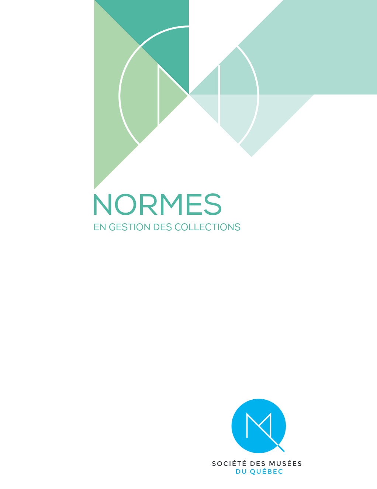
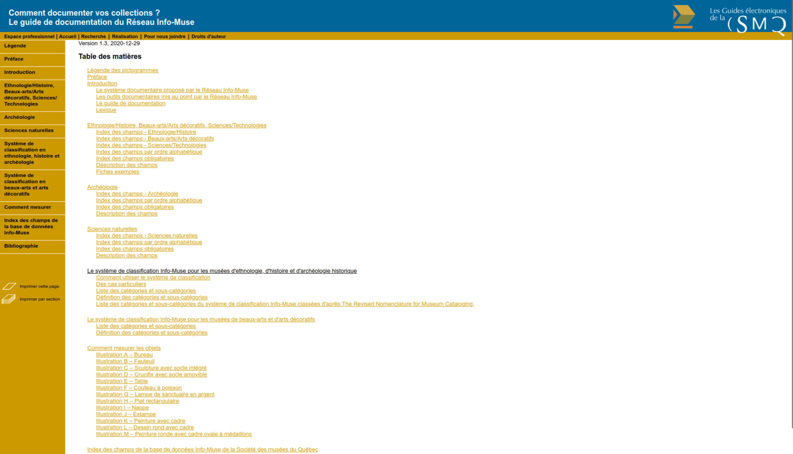
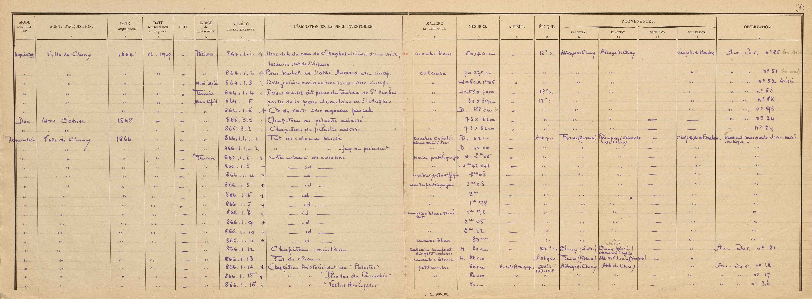

# Inventaire et traitement des données

### MSL6517 – automne 2026 

Zoë Renaudie

https://studium.umontreal.ca/course/view.php?id=351279

/** Notes **/
Contenu vient en partie du cours d'Emmanuel Château-Dutier

===vvvvvv===
<!-- .slide: class="text-small" -->
| Semaine  | Séance      | Thème                                                        | TP rendu                    |
| -------- | ----------- | ------------------------------------------------------------ | --------------------------- |
|          |             | ~~Introduction~~                                             | ~~Présentation → 14 sept.~~ |
| 14 sept. | S1          | ~~Présentation générale des enjeux numériques dans les musées~~ | ~~TP1 → 21 sept.~~          |
| 21 sept. | S2          | ~~La documentation muséale~~                                 | ~~TP2 → 28 sept.~~          |
| 28 sept. | S3          | La gestion de collection : inventaire, normes, modèles métiers | TP3 → 05 oct.               |
| 05 oct.  | S4 (async.) | Les interfaces publiques et catalogues en ligne              | TP4 → 12 oct.               |
| 12 oct.  | S5 (async.) | La notion de métadonnées                                     | TP5 → 26 oct.               |
| 19 oct.  |             | **Semaine de lecture**                                       |                             |
| 26 oct.  | S6          | Données structurées, langages documentaires et thesaurus     | TP6 → 02 nov.               |
| 02 nov.  | S7          | Open GLAM : Open data et Open Content                        | TP7 → 09 nov.               |
| 09 nov.  | S8          | Modélisation de données                                      | TP8 → 16 nov.               |
| 16 nov.  | S9          | Le modèle relationnel                                        | TP9 → 23 nov.               |
| 23 nov.  | S10         | Les ontologies dans le domaine patrimonial                   | TP10 → 30 nov.              |
| 30 nov.  | S11         | Éthique des données et pérennisation                         |                             |
| 07 déc.  | S12         | L'intelligence artificielle et les enjeux du traitement des données |                             |
| 21 déc.  |             | **Rendu du travail final**                                   |                             |

===vvvvvv===

# La gestion de collection

/** Notes **/

Inventaire et description des collections : cadres réglementaires et normes professionnelles qui encadrent ces activités. Présentation des modèles métiers et plus particulièrement de la norme **Spectrum**, norme de gestion des collections développée par le Collections Trust et traduite en français par le RCIP. Cette séance permet de situer Spectrum dans l'écosystème des standards de documentation muséale et de comprendre comment ses procédures s'articulent entre elles.

Activité en classe : 

- discussion sur lectures 
- présentation de la norme Spectrum
- acquisition et inventaire de la collection MSL6517

===vvvvvv===

## Contextes métiers et normatifs dans le monde muséal et patrimonial

/** Notes **/

Au Québec, les musées peuvent être classés en trois grandes catégories : ceux relevant du gouvernement fédéral, ceux relevant du gouvernement provincial, et les autres. Leurs statuts juridiques, la gestion de leurs collections et leurs obligations envers l'État varient en fonction de leur appartenance.

===vvvvvv===

## Musées nationaux du Canada (fédéraux)

- Musée de l’agriculture et de l’alimentation du Canada
- Musée de l’aviation et de l’espace du Canada
- Musée canadien de l’histoire
- Musée canadien pour les droits de la personne
- Musée canadien de l’immigration du Quai 21
- Musée canadien de la nature
- Musée des sciences et de la technologie du Canada
- Musée canadien de la guerre
- Musée des beaux-arts du Canada

/** Notes **/

Les 9 musées nationaux du Canada, tels que le Musée de l'histoire (Gatineau) ou le Musée des Beaux-Arts du Canada (Ottawa), sont des entités créées par le gouvernement fédéral en vertu de lois spécifiques. Ces musées sont constitués en tant que personnes morales, ce qui leur confère une capacité juridique semblable à celle d'une personne physique. Ils peuvent ainsi acquérir, conserver, prêter, exposer et se départir de leurs collections, sous réserve des lois applicables. 

Ils sont responsables de la préservation, de la conservation et de la documentation de leurs collections. Les objets peuvent être acquis par achat, don, échange ou legs, et peuvent être prêtés ou exposés à l'échelle nationale et internationale. 

Bien que dotés d'une certaine autonomie, ces musées doivent rendre compte de leur gestion au gouvernement fédéral. Ils doivent également se conformer aux politiques et directives émises par le ministère fédéral responsable du patrimoine.

===vvvvvv===

## Musées nationaux du Québec (provinciaux)

- **Musée de la civilisation** (Québec)
- **Musée national des beaux-arts du Québec (MNBAQ)** (Québec)
- **Musée d’art contemporain de Montréal (MAC)** (Montréal)
- **Musée national de l’histoire du Québec (NAT)** (Montréal)

/** Notes **/

Les quatre musées nationaux du Québec sont régis par la Loi sur les musées nationaux (L.R.Q., c. M-44). Cette loi définit leur statut juridique, encadre leur fonctionnement, ainsi que la gestion de leurs collections et leurs relations avec l’État québécois.

Les quatre musées nationaux du Québec sont :
Musée de la civilisation (Québec)
Musée national des beaux-arts du Québec (MNBAQ) (Québec)
Musée d’art contemporain de Montréal (MAC) (Montréal)
Musée national de l’histoire du Québec (NAT) (Montréal)

Trois des quatre musées nationaux (Musée de la civilisation, MNBAQ et NAT) sont des sociétés d’État, créées par des lois spécifiques adoptées par l’Assemblée nationale du Québec. Elles sont donc financées majoritairement par des crédits publics votés à l’Assemblée nationale.

Le MAC est un établissement public créé par la Loi sur le Musée d’art contemporain de Montréal (1964). Bien qu’il ne soit pas une société d’État, il est agréé d’office par le gouvernement du Québec, au même titre que les autres musées nationaux. Il bénéficie également d’un financement public.

Tous ces musées ont une mission nationale : ils représentent, conservent et diffusent le patrimoine ou la création artistique pour l’ensemble du Québec. En terme de gestion des collections : 
1. Politique générale de gestion des collections (art. 22.2)
Chaque musée national doit adopter une politique générale de gestion des collections, qui inclut :
- Les axes de développement liés à sa mission et à ses espaces d’exposition.
- Une politique d’acquisition (critères, processus, etc.).
- Une politique de gestion des espaces de réserves (conservation, sécurité, etc.).
Obligations :
- La politique doit être mise à jour au moins tous les cinq ans, sauf décision contraire du ministre.
- Une copie doit être transmise au ministre de la Culture et des Communications (MCC) dans les 15 jours suivant son adoption ou sa modification.
- Elle doit être publiée sur le site Internet du musée.

2. Règlements internes (art. 22.7 et 25)
Le conseil d’administration de chaque musée peut adopter des règlements pour encadrer :
- Les conditions d’acquisition, d’aliénation, de location, de prêt, d’emprunt, de donation ou d’échange des œuvres et des produits de la nature.
- Les normes de surveillance et de sécurité des biens.
- La conservation et la restauration des œuvres.

Les musées peuvent recevoir des dons et legs, à condition que les clauses qui les accompagnent soient compatibles avec leur mission (art. 25).

3. Autorisation gouvernementale (art. 26)
Une autorisation préalable du gouvernement est requise pour :
- L’achat ou la vente d’immeubles.
- Les baux de plus de deux ans.
- Les emprunts dépassant un certain plafond.
Exception :
L’aliénation d’œuvres (vente, don, échange) n’est pas soumise à cette autorisation, mais elle est strictement encadrée par les politiques internes de chaque musée.

4. Personne morale et mandataire de l’État (art. 4 et 5)
Chaque musée national est une personne morale et agit comme mandataire de l’État. Cela signifie que les biens des musées font partie du domaine de l’État.
Cependant, les œuvres et produits de la nature faisant partie des collections sont insaisissables par les créanciers.

5. Transfert de propriété (art. 42)
Depuis le 9 novembre 1984, le MNBAQ et le MAC sont devenus propriétaires des œuvres et produits de la nature de leurs collections, qui faisaient auparavant partie du domaine de l’État. Ce transfert a permis aux musées de gérer leurs collections de manière autonome, tout en restant soumis à des règles strictes de conservation et de gestion.

Politiques internes : 
Bien que la Loi sur les musées nationaux encadre la gestion des collections, les musées nationaux vont souvent au-delà des exigences légales pour adopter des règles plus strictes :
- Musée de la civilisation :
Interdiction totale de vendre des biens de collection.
Délai de 15 ans avant toute aliénation d’un don.
- Musée d’art contemporain de Montréal (MAC) :
Interdiction d’aliéner une œuvre dans les 25 premières années suivant son acquisition (sauf en cas d’aliénation involontaire, comme un vol ou une destruction).

Ces règles sont des choix institutionnels, et non des obligations légales imposées par la loi.

===vvvvvv===

## Musées provinciaux agréés du Québec

https://www.google.com/maps/d/u/1/viewer?ll=47.38606343007316%2C-74.44596230390626&z=5&mid=1kikvK8ZfA6YZ98v_8kQkFI0CqXyDGnSz

* Le Québec a un **programme d’agrément** des musées (ministère de la Culture et des Communications). Les musées agréés doivent respecter des normes reconnues quant aux pratiques muséales, la protection, la mise en valeur du patrimoine. ([Gouvernement du Québec][3])
* L’agrément fournit un “sceau de qualité” et donne accès à certains programmes de financement. L’inventaire fait partie des fonctions liées à la gestion des collections, donc est présumé dans les critères de bonnes pratiques. ([aim.formulaires.mcc.gouv.qc.ca][4])

/** Notes **/

Le Québec a aussi un programme d'agrément, administré par le ministère de la Culture et des Communications. Les musées agréés sont reconnus pour la qualité de leurs pratiques muséales et pour leur travail de protection et de mise en valeur du patrimoine. L'agrément agit comme un sceau de qualité et ouvre l'accès à certains programmes de financement. L'inventaire fait partie de la gestion des collections, il est donc considéré comme une bonne pratique attendue.

Ces musées ne sont pas des sociétés d'État. Il est exigé que ce soit une institution permanente à but non lucratif, ouverte au public depuis au moins trois ans pour pouvoir demandeer l'agrément au ministère. L'agrément n'est pas automatique. Il est accordé pour cinq ans, après évaluation. Le musée doit avoir une mission claire de conservation et de diffusion du patrimoine ou de l'art, une politique de gestion des collections, et garantir la conservation préventive, l'accessibilité et des pratiques professionnelles reconnues.

Ils ne relèvent pas de la Loi sur les musées nationaux. Leurs obligations viennent du Guide des exigences du MCC, qui est une condition d'agrément et non une loi. Le guide distingue la catégorie A (avec collection) et la catégorie B (sans collection), qui n'a aucune obligation de gestion de collection. La catégorie A comprend A1 (objets, spécimens non vivants, œuvres d'art), A2 (spécimens vivants) et A3 (immeubles patrimoniaux).

Pour toute la catégorie A, l'inventaire doit être tenu à jour, avec une préférence pour un format informatisé. Le guide exige aussi un état de situation des conditions de conservation, et il impose que la restauration soit confiée à une personne qualifiée et documentée.

En retour, seuls les musées agréés peuvent accéder à certains programmes du ministère : subventions au fonctionnement, aide à la conservation, financement d'infrastructures. L'agrément renforce aussi leur crédibilité auprès des bailleurs de fonds et du public.

Liste : 
https://www.google.com/maps/d/u/1/viewer?ll=47.38606343007316%2C-74.44596230390626&z=5&mid=1kikvK8ZfA6YZ98v_8kQkFI0CqXyDGnSz

Référence : Politique d’agrément des institutions muséales du MCC
Ministère de la Culture et des Communications. Agrément des musées.

===vvvvvv===

## Références

* [Loi sur les musées (L.C. 1990, ch. 3)](https://laws-lois.justice.gc.ca/fra/lois/M-13.4/index.html)
* [Loi sur les musées nationaux - Légis Québec (m-44)](https://www.legisquebec.gouv.qc.ca/fr/document/lc/M-44)
* [Loi sur le patrimoine culturel(P-9.002)](https://www.legisquebec.gouv.qc.ca/fr/document/lc/p-9.002/20121019)

/** Notes **/

Si vous voulez en savoir plus, les textes de loi sont en ligne et j'ai développé dans les notes les informations liées à chaque entité. 

Ces différences soulignent la dualité du système muséal canadien, où les musées fédéraux bénéficient d'une plus grande autonomie, tandis que ceux du Québec sont soumis à un cadre législatif provincial plus strict.

===vvvvvv===

## Pourquoi des cadres normatifs ?

/** Notes **/

Comme nous en avons parlé la semaine dernière, les musées ne peuvent se contenter de s’engager dans des activités tournées uniquement vers la réalisation de programmes d’exposition ou d’éducation, ils doivent également effectuer diverses tâches destinées à assurer leur continuité. Au nombre de ces tâches figurent l’inventaire et la documentation des collections qui sont, comme on l’a vu, non seulement fondamentales pour la conservation des collections mais aussi pour leur diffusion. Depuis quelques années, les politiques de numérisation patrimoniales sont venues renforcer ces exigences de documentation des collections car toute opération de numérisation recquiert la description préalable des collections : en amont pour préparer, réaliser et contrôler la numérisation, mais aussi en aval pour leur signalement sur le web.

Dans le monde muséal et patrimonial, la description des collections peut être soumise à des cadres réglementaires ou bien des normes professionnelles (normes métiers).

===vvvvvv===

## Pourquoi des cadres normatifs ?

* **Cadres réglementaires** = obligations légales (ex. *Loi sur le patrimoine culturel* au Québec) ou déontologique ( .
* **Normes métiers** = standards développés par la profession (ex. SPECTRUM, RCIP).

/** Notes **/

Il est important de distinguer deux niveaux de cadres normatifs :

- D’un côté, les **cadres réglementaire**, qui relèvent de l’obligation. Par exemple en terme d'obligation légale, au Québec, la *Loi sur le patrimoine culturel* impose certaines pratiques en matière d’inventaire et de conservation. Mais aussi les codes deontologiques qui sont des "textes réglementaires énonçant les règles de conduite professionnelle qui régissent l'exercice d'une profession ou d'une fonction et faisant état des devoirs, des obligations et des responsabilités auxquels sont soumis ceux qui l'exercent." https://vitrinelinguistique.oqlf.gouv.qc.ca/fiche-gdt/fiche/8364446/code-de-deontologie
- De l’autre, les **normes professionnelles**, qui ne sont pas obligatoires mais qui structurent la profession. Ce sont des standards largement reconnus, comme *Spectrum* ou les outils développés par le Répertoire canadien d’information sur le patrimoine (RCIP).

Mais le domaine de la documentation muséale est complexe. Il est marqué par une **grande diversité de modèles documentaires et de formats**. Cette diversité s’explique d’abord par l’hétérogénéité des artefacts collectés et des pratiques muséales, mais aussi par des **politiques nationales distinctes** qui ont parfois conduit à promouvoir des modèles concurrents.

Or, depuis quelques années, avec l’essor de l’interopérabilité et du web de données liées, on observe une tendance à l’**unification des pratiques** et à la **mutualisation des outils**. Un bon exemple est la traduction récente de la norme *Spectrum* par le RCIP, qui témoigne de cette volonté d’harmonisation. On voit aussi des avancées notables sur la prise en charge technique du multilinguisme.

En somme, il faut garder à l’esprit qu’on se trouve dans un **secteur en forte évolution**, avec de nombreuses innovations mais aussi des phénomènes d’obsolescence. Les outils et pratiques documentaires ne sont donc jamais figés : ils évoluent constamment, au rythme des transformations technologiques, sociales et politiques.

**Questions**: À votre avis, qu’est-ce qui distingue une **obligation légale** d’une **bonne pratique professionnelle** ?

===vvvvvv===

## Cadres réglementaires

### a) Québec et Canada

* Loi sur le patrimoine culturel (Québec)  
Cette loi est la pièce maîtresse de la législation québécoise concernant les biens patrimoniaux. Elle définit ce qui constitue un “bien patrimonial”, les pouvoirs du ministère de la Culture et des Communications (MCC), les responsabilités des municipalités, etc.
  
> "Il est tenu au ministère de la Culture et des Communications un registre dans lequel doivent être inscrits tous les éléments du patrimoine culturel désignés, classés, déclarés, identifiés ou cités conformément à la présente loi. Ce registre contient une description suffisante de ces éléments du patrimoine culturel."  
[5. (2011, c. 21, a. 5.)](https://www.legisquebec.gouv.qc.ca/fr/document/lc/p-9.002/20121019#se:5) 

/** Notes **/

Au Québec, la référence principale, c’est la **Loi sur le patrimoine culturel**.
Elle prévoit l’existence d’un **registre officiel** tenu par le ministère de la Culture et des Communications. Dans ce registre, doivent être inscrits tous les éléments du patrimoine qui sont désignés, classés, déclarés ou identifiés en vertu de la loi. On y trouve une description suffisante des biens, et pour les objets classés, le registre indique aussi le nom du propriétaire et les éventuelles aliénations.

Pour les musées, cette loi se traduit de manière très concrète : les institutions reconnues par le ministère ont l’obligation de se doter d’une **politique de gestion des collections**, et cette politique doit obligatoirement inclure un inventaire. Autrement dit, ce n’est pas seulement une bonne pratique : c’est une exigence légale.

Cependant la definition reste très vague. 

 ([mcc.gouv.qc.ca][1])

===vvvvvv===

## Cadres réglementaires

### a) Québec et Canada

* Loi sur le ministère du Patrimoine canadien (L.C. 1995, ch. 11) 

* [Société des Musées du Québec. *Code de déontologie muséale.* Société des musées du Québec, 2014 [1990]. ISBN : 978-2-89172-096-0](http://www.musees.qc.ca/fr/professionnel/pdf/2014_code_deontologie_smq.pdf)

* [Code de déontologie de l’Association des musées canadiens (AMC)](http://www.museums.ca/uploaded/web/docs_fr/principesdeontologiques.pdf)   

/** Notes **/

À l’échelle canadienne, la [Loi sur le ministère du Patrimoine canadien](http://laws-lois.justice.gc.ca/fra/lois/C-17.3/page-1.html) (L.C. 1995, ch. 11) confère au ministre des pouvoirs et des fonctions qui englobent le patrimoine culturel, les musées nationaux, les archives et les bibliothèques, ainsi que les politiques et les programmes visant à aider les établissements du patrimoine du Canada.

Aller plus loin : Paquette, Jonathan « Les politiques muséales au Québec : trajectoire historique et politique d’un service public ». *Politique et Sociétés* 38, no 3 (2019) : 129–146. https://doi.org/10.7202/1064733ar   

Je vous ai mis une liste de normes et codes déotologiques sur les musées et leur gestion en général que je vous insite à aller consulter. Mais prenom l'exemple du code de la SMQ

===vvvvvv===

## **Code de déontologie muséale de la Société des musées du Québec** SMQ

En matière de **gestion des collections** (section 3.2), le code de la SMQ insiste sur plusieurs points essentiels :

- Chaque musée doit adopter et mettre à jour une **politique de gestion des collections**, qui encadre l’acquisition comme l’aliénation (3.2.1).
- Il doit s’assurer de la **provenance des objets** avant toute acquisition (3.2.4) et éviter toute implication dans le **commerce illicite** (3.2.5).
- Le Code insiste aussi sur la **responsabilité de documenter les collections** (3.2.11) et de les **rendre accessibles avec leur documentation** au public, tout en respectant confidentialité, conservation et sécurité (3.2.14).

/** Notes **/

Le **Code de déontologie muséale de la Société des musées du Québec** établit les grandes obligations des institutions.
En matière de **gestion des collections** (section 3.2), il insiste sur plusieurs points essentiels :

- Chaque musée doit adopter et mettre à jour une **politique de gestion des collections**, qui encadre l’acquisition comme l’aliénation (3.2.1).
- Il doit s’assurer de la **provenance des objets** avant toute acquisition (3.2.4) et éviter toute implication dans le **commerce illicite** (3.2.5).
- Le Code insiste aussi sur la **responsabilité de documenter les collections** (3.2.11) et de les **rendre accessibles avec leur documentation** au public, tout en respectant confidentialité, conservation et sécurité (3.2.14).

Ces obligations sont complétées par d’autres volets :

- la **recherche** (section 3.3), qui doit respecter l’éthique de la recherche et les particularités culturelles des communautés ;
- et la **diffusion** (section 3.4), qui doit reposer sur des connaissances rigoureuses, favoriser l’accès virtuel et respecter droits d’auteur et dignité humaine.

Ces obligations sont complétées par d’autres volets :

- la **recherche** (section 3.3), qui doit respecter l’éthique de la recherche et les particularités culturelles des communautés ;
- et la **diffusion** (section 3.4), qui doit reposer sur des connaissances rigoureuses, favoriser l’accès virtuel et respecter droits d’auteur et dignité humaine.

===vvvvvv===

## Cadres réglementaires

### b) International

* **Convention UNESCO 1970** : oblige les États à lutter contre le trafic illicite → nécessite un inventaire fiable.
* **Convention UNESCO 1972** (Patrimoine mondial) : suppose la constitution d’inventaires nationaux.
* Code de déontologie de l’ICOM (2017) : inventaire et documentation « devoir fondamental » des musées.
* [Code de déontologie de l’American Alliance of Museums (AAM)](http://www.aam-us.org/resources/ethics-standards-and-best-practices/code-of-ethics)
* **France : Code du patrimoine (2004, art. L451-2)** : inventaire obligatoire, **récolement décennal** (décret 2002).

/** Notes **/

Sur le plan international, plusieurs textes sont essentiels.

D’abord, la **Convention de l’UNESCO de 1970**, qui engage les États à lutter contre le trafic illicite des biens culturels. Un des moyens fondamentaux pour y parvenir, c’est de tenir un inventaire fiable : sans inventaire, il est pratiquement impossible de prouver la provenance et la propriété d’un objet.

Deux ans plus tard, la **Convention du patrimoine mondial de 1972** impose aux États de constituer des inventaires nationaux de leur patrimoine culturel et naturel.

Du côté de la France, le **Code du patrimoine de 2004** précise que les musées de France doivent inventorier leurs collections. Et surtout, un décret de 2002 rend obligatoire le **récolement décennal** : tous les dix ans, les musées doivent vérifier la présence effective de chaque objet inscrit à l’inventaire. C’est un exemple de cadre réglementaire très strict. La grande différence avec ici, c'est qu'en france les biens patrimoniaux appartenenant à l'État sont inaliénables. 

L’**ICOM** a inscrit dans son **Code de déontologie** que l’inventaire et la documentation des collections sont un **devoir fondamental** pour les musées. Cela ne relève pas seulement de l’organisation interne, mais bien d’une responsabilité éthique vis-à-vis des publics et du patrimoine.

**Questions:**

* Pourquoi les États insistent-ils sur l’importance de l’inventaire dans la **lutte contre le trafic d’objets culturels** ?

Mais au-delà de cela, le **besoin de protéger la propriété culturelle contre le vol** a longtemps motivé la mise au point de **pratiques documentaires standardisées** dans les musées. L’UNESCO l’a souligné dès 1970, soulignant l’importance de la documentation pour la protection du patrimoine.

* Comment comparer l’approche québécoise (souple) et l’approche française (très contraignante) ?

===vvvvvv===

## Normes professionnelles et standards métiers

> Norme : Ensemble de **règles fonctionnelles** ou de prescriptions techniques relatives à des produits, **à des activités** ou à leurs résultats, établies par **consensus de spécialistes** et consignées dans un document produit par une autorité légitime. 
>
> ([*Le grand dictionnaire terminologique (GDT).* Office Québécois de la Langue Française, 2006](http://gdt.oqlf.gouv.qc.ca/ficheOqlf.aspx?Id_Fiche=2068440))

> **Standard : Le terme anglais standard est souvent utilisé dans les entreprises pour nommer des règles et des prescriptions qui sont en fait des normes techniques servant à fixer les caractéristiques d’un produit, d’une activité ou d’un processus.** C’est pour cette raison que l’emprunt à l’anglais standard n’a pas été retenu comme synonyme de norme ou de norme technique. 
>
> ([Office québécois de la langue française, 2006](http://gdt.oqlf.gouv.qc.ca/ficheOqlf.aspx?Id_Fiche=2068440))

/** Notes **/
Voila pour les cadres réglementaires, n'hésitez pas à aller voir dans les lois de différents pays ce qu'il en est. C'est très instructif. Passons maintenant aux normes et standards. Lire definitions. 

===vvvvvv===

## Normes professionnelles et standards métiers

### a) Normes de gestion des collections

* **Normes principales pour les musées canadiens (RCIP)** 
* **Normes en gestion des collections** de la Société des musées du Québec (SMQ) 2014. 
* **SPECTRUM (Collections Trust, UK)**
* **CIDOC CRM (ISO 21127)**

* **Guides pratiques** : réseau Info-Muse (historique) : comment documenter les collections muséales.

/** Notes **/

Comme on parle de documentation muséale, nous allons nous intéresser plus particulièrement aux **normes de gestion** qui encadrent les pratiques au quotidien.

===vvvvvv===
<!-- .slide: class="text-small" -->
#### RCIP

- **1972** : création du RCIP, avec une équipe qui rassemble à la fois des informaticiens et des spécialistes du patrimoine.
- **1975** : définition des premières zones d’information essentielles pour décrire les objets.
- **1978** : Nomenclature présentée par Robert G. Chenhall
- **1981** : développement du système **PARIS** (Pictorial and Artifact Retrieval and Information System), qui servira de base à la future base de données **Artefacts Canada**.
- **1982** : première version d’**Artefacts Canada**, née de la fusion des bases de données du Musée royal de l’Ontario et du Musée canadien des civilisations.
- **Années 1980-1990** : publication des premiers **dictionnaires de données** et guides de catalogage, largement inspirés des travaux du CIDOC.
- **1996** : révision des dictionnaires pour les aligner à Artefacts Canada.
- **2001 et 2009** : mises à jour majeures.
- **2007-2010** : intégration des règles du **CCO (Cataloguing Cultural Objects)**.
- **2010** : **Normes principales pour les musées canadiens** et **Nomenclature 3.0**
- **2015** : Nomenclature 4.0
- **2020** : Refonte site Artefact Canada pour le televersement.

/** Notes **/

Le Réseau canadien d’information sur le patrimoine (RCIP), créé en 1972 par le gouvernement canadien dans le cadre de la Politique nationale des musées, a pour mission d’accompagner les musées dans la documentation, la gestion et la diffusion de leurs collections à l’ère du numérique.

Le RCIP a joué un rôle fondamental dans la normalisation et la professionnalisation de la documentation muséale au Canada. En intégrant précocement les technologies numériques, il a permis aux musées de moderniser leur gestion des collections. Aujourd’hui, il reste un acteur clé à l’intersection du patrimoine et de l’innovation technologique.:

- Normes de documentation :
  Développement et diffusion d’outils comme le [Dictionnaire de données du RCIP](https://app.pch.gc.ca/application/ddrcip-chindd/description-about.app?lang=fr), qui définit les catégories et types d’informations structurant une base de données muséale.

- Vocabulaires contrôlés :
  Promotion de l’utilisation de références standardisées, notamment :
  - *Nomenclature pour le catalogage des objets de musée* ;
  - Les vocabulaires du Getty (AAT, ULAN, TGN) ;
  - La base *Artistes au Canada*.

- Normalisation internationale :
  Alignement avec des standards mondiaux comme le CIDOC CRM, Dublin Core, Object ID ou VRA Core, renforçant l’interopérabilité des données.

- Plateforme Artefacts Canada :
  Création d’un point d’accès en ligne aux collections canadiennes, offrant une visibilité nationale et internationale.

- Publications et cadre de référence
Le RCIP publie les [Normes principales pour les musées canadiens](https://page.nomenclature.info/apropos-about.app?lang=fr#Heading3-What), un cadre essentiel pour le secteur, bien que la dernière révision date des années 2010.

Évolutions récentes Artefact canada (années 2020)  :
- Recentrage thématique : Fermeture du volet Sciences naturelles pour se concentrer exclusivement sur le patrimoine humain.
- Refonte technique :
  Remplacement du système de téléversement par lots (lourd et complexe) par une interface de contribution en temps réel, permettant aux musées de mettre à jour leurs inventaires de manière volontaire et instantanée.

Projet phare (2026-2027) :
  Construction d’un complexe national de 18 000 m² à Gatineau, dédié aux Sciences du patrimoine culturel (SPC). Ce site regroupera l’Institut canadien de conservation (ICC) et le RCIP (gestionnaire d’Artefacts Canada)

https://page.nomenclature.info/apropos-about.app?lang=fr#Heading3-What

===vvvvvv===

## Normes en gestion des collections de la Société des musées du Québec (SMQ) 2014
  

/** Notes **/
https://numerique.banq.qc.ca/patrimoine/details/52327/4126063

En parallèle du Code de déontologie muséale de la Société des musées du Québec, la SMQ a publié des **Normes en gestion des collections** (2014). 17 pages : une série de normes / buts à atteindre pour la bonne gestion des collections.  

Celles-ci détaillent les bonnes pratiques :

- tenir un **inventaire précis et à jour**,
- **documenter chaque objet** dans un système centralisé, en respectant des standards reconnus,
- conserver un **fonds documentaire fiable et accessible**.

Ces normes n’ont pas de valeur légale contraignante, mais elles jouent un rôle crucial dans la **professionnalisation du milieu muséal** : elles fixent des standards de qualité partagés et renforcent la crédibilité et la responsabilité publique des musées.

Enfin, la SMQ diffuse aussi des outils pratiques, comme :

- le guide *Élaborer une politique de gestion des collections*,
- le *Dictionnaire de compétences en gestion des collections*,

===vvvvvv===

#### Info-Muse

/** Notes **/

mais aussi le guide du Réseau Info-Muse *Comment documenter vos collections ?*.

C'est un guide de documentation et des systèmes de classification pour organiser les objets selon leur fonction d'origine ou leur type de discipline. 
Beaucoup de musée Qubecois se base sur ce guide puisque la smq offrait une base de données en ligne avec. Ce n'est plus le cas, fusion avec Artefacts Canada.

#sujetArticle : est-ce que le guide Infomuse est toujours d'actualité ? Ou comment le mettre à jour. 

1978 : Publication de la première Nomenclature de Chenhall aux États-Unis, qui sert de fondation théorique mondiale (classement des objets selon leur fonction d'origine).
1988 : Parution de la Revised Nomenclature, qui intègre de nouvelles structures de classification.
1992 (Lancement officiel) : Élaboration et publication du Système de classification Info-Muse. Le Guide de documentation du Réseau Info-Muse est introduit auprès des institutions québécoises.
Années 1990 - 2000 : Informatisation massive des musées québécois. Création de la Base de données collective Info-Muse, centralisant des centaines de milliers de fiches d'objets pour favoriser la recherche interinstitutionnelle et la lutte contre le trafic de biens culturels. N'est plus accessible, fusion avec Artefacts Canada. 
2012 : Révision majeure du système Info-Muse pour les musées d'ethnologie, d'histoire et d'archéologie. Cette mise à jour permet de s'arrimer aux modifications contemporaines apportées par Parcs Canada à son propre dictionnaire visuel.
2020 : Publication de la version 1.3 du guide électronique en ligne, consolidant l'accessibilité numérique pour les professionnels des musées.

https://guides.musees.qc.ca/guidesel/doccoll/fr/introduction/guidedocumentation.htm

===vvvvvv===

#### Spectrum

- 1991, début du travail
- 1994, première édition SPECTRUM 1
- 1997, SPECTRUM 2
- 2005, SECTRUM 3
- 2007, SPECTRUM 3.1
- 2009, SPECTRUM 3.2
- 2011, SPECTRUM 4
- 2017, SPECTRUM 5.1 

Un standard et une spécification maintenue par le Collections Trust (UK)
https://collectionstrust.org.uk/spectrum/

/** Notes **/

SPECTRUM, c’est aujourd’hui la norme internationale la plus reconnue en matière de documentation des collections muséales.
Elle a été développée au Royaume-Uni par le *Collections Trust* à partir de 1991, avec une première édition en 1994. Depuis, elle a beaucoup évolué et est aujourd’hui utilisée par une très large communauté, avec des traductions dans de nombreuses langues et des partenariats avec la plupart des éditeurs de logiciels de gestion de collections.

Concrètement, SPECTRUM propose un guide de bonnes pratiques qui décrit les procédures essentielles à la gestion des collections.
On y trouve 21 procédures, dont 8 sont dites “primaires”, c’est-à-dire absolument incontournables pour tout musée : l’acquisition, l’inventaire, le prêt, les mouvements, la conservation, etc.
Chaque procédure indique à la fois quelles informations doivent être documentées et comment les musées peuvent organiser leurs flux de travail.

L’idée, ce n’est pas d’imposer un modèle unique, mais de garantir une consistance, une traçabilité et un vocabulaire partagé entre institutions.

En ce sens, SPECTRUM est à la fois :

- une norme de métadonnées, parce qu’elle définit les informations minimales à enregistrer,
- et une norme de procédures, parce qu’elle décrit les étapes de gestion à suivre.

C’est une norme qui a beaucoup influencé le champ : elle a servi de base pour l’élaboration de standards comme LIDO ou CIDOC-CRM, qui sont aujourd’hui utilisés pour l’échange et l’interopérabilité des données muséales.

Enfin, SPECTRUM s’est aussi élargi aux enjeux actuels : on y trouve par exemple des modules sur la gestion des actifs numériques ou l’utilisation de la RFID pour le suivi des collections.

En résumé, SPECTRUM est à la fois :

- un cadre de référence commun,
- un outil de professionnalisation,
- et une passerelle vers l’international, grâce à ses liens avec les standards de l’ICOM et les pratiques de la communauté muséale mondiale.

===vvvvvv===

## Vos présentations de la norme Spectrum

/** Notes **/

Alejandro Cámez
Choix de procédure Spectrum : Assurance et indemnisation

Pascale Tétreault
Choix de procédure Spectrum : Emprunt d’objets

Marie-Hélène
Choix de procédure Spectrum : Prêt des objets

Sandrine Daignault 
Choix de procédure Spectrum : Utilisation des collections

Aziliz Pianezza
Dommages et pertes

Annabelle Fleury
Choix de procédure sur Spectrum : Constat d’état et analyse technique

Angie Charlebois
Choix de procédure Spectrum : Gestion des droits

Ilona Krasnova
Choix de procédure Spectrum : Entrée des objets
https://html-preview.github.io/?url=https%3A%2F%2Fgithub.com%2Filona-krasnova%2FMSL6517%2Fblob%2Fmain%2FTP3.html

Lise Gueibe
Procédure Spectrum : Évaluation

Anne-Sophie Desbiens
Choix de procédure Spectrum: Planification des mesures d’urgence pour les collections

Ariane Genet de Miomandre 
Choix de procédure Spectrum: Cataloguage (cataloguing) et les changements qui y ont été apportés.

===vvvvvv===

#### CIDOC

Modèle conceptuel de référence, qui est aujourd’hui une norme ISO (21127). 

Le CRM fournit un cadre sémantique, c'est une ontologie, permettant d’intégrer et d’échanger des données patrimoniales hétérogènes à l’échelle internationale.

Aller plus loin : Docam (frbr), Linked Art (cidoc-crm)

/** Notes **/

Un autre outil important, mais un peu différent dans son approche, c’est le CIDOC CRM, qui est une norme ISO (21127). Contrairement aux précédents, ce n’est pas une liste de procédures ou de champs, mais un modèle conceptuel. Il permet de structurer les données et de les rendre interopérables entre différentes bases. En d’autres termes, c’est une sorte de langage commun qui permet de faire dialoguer des systèmes très différents. 

Le groupe de recherche documentation de l'ICOM regroupe plus de 650 membres dans plus de 60 pays, parmi lesquels on trouve des documentalistes, des régisseurs, des informaticiens, des concepteurs de systèmes et aussi des formateurs. En bref, toute une communauté internationale qui travaille sur la documentation muséale.

Depuis les années 1970, le CIDOC s’est imposé comme un acteur central dans la mise au point de normes documentaires pour les musées. C’est dans ce cadre qu’ont été discutés les grands problèmes de normalisation dans notre secteur.

Une étape importante a eu lieu en 1978 à Julita, en Suède, où ont été présentées pour la première fois des catégories minimales d’information sur les objets de musée. Ces travaux ont ensuite été développés dans les années 1980 et 1990 par différents groupes de travail du CIDOC. Ils ont abouti, en 1995, à la publication des Recommandations internationales pour la documentation des objets muséaux. Celles-ci proposent une définition des catégories d’information à enregistrer, des règles de format pour leur saisie et des indications sur la terminologie.

Ces recommandations ont joué plusieurs rôles :

- elles ont servi de base à la normalisation internationale,
- elles ont permis de comparer les pratiques,
- elles ont guidé les concepteurs de logiciels de gestion de collections,
- et surtout, elles ont posé les bases du partage d’information entre institutions.

Parmi les catégories d’information, on retrouve par exemple celles qui concernent l’acquisition, l’état de conservation, les inscriptions, la production de l’objet ou encore son emplacement.

En résumé, le CIDOC a joué (et continue de jouer) un rôle déterminant dans la normalisation de la documentation muséale, en mettant au point des recommandations, des catégories d’information et des modèles conceptuels qui permettent de rendre les données comparables, interopérables et durables.

===vvvvvv===

### b) Référentiels terminologiques

* **Nomenclature for Museum Cataloging (RCIP)** : classification normalisée des objets (ethnographie, archéologie, histoire).
* **Getty Vocabularies** (Thésaurus de l’Art & Architecture AAT, ULAN, TGN).
* Outils pour assurer la **cohérence et l’interopérabilité** des données.

/** Notes **/

À côté des normes de gestion, il y a aussi les référentiels terminologiques, qui servent à décrire les objets de manière cohérente et normalisée.

Parmi eux, on retrouve la Nomenclature for Museum Cataloging, développée par le RCIP, qui est largement utilisée au Canada. Elle propose une classification normalisée des objets, particulièrement pour les collections d’ethnographie, d’archéologie et d’histoire.

Sur le plan international, on peut citer les Getty Vocabularies : le *Art & Architecture Thesaurus (AAT)*, l’*Union List of Artist Names (ULAN)*, ou encore le *Getty Thesaurus of Geographic Names (TGN)*.
 Ces vocabulaires jouent un rôle fondamental pour garantir que les données produites par les musées soient cohérentes et surtout interopérables : qu’elles puissent être partagées, comparées et comprises dans différents contextes linguistiques et culturels.

En résumé, ces normes et référentiels forment une boîte à outils commune qui permet aux musées de documenter leurs collections de façon rigoureuse, comparable et connectée à l’échelle internationale.

**Questions:**
* Pourquoi est-il essentiel que deux musées différents utilisent les mêmes référentiels (par ex. Nomenclature, AAT) ?
* Selon vous, quelle est la valeur ajoutée d’une norme internationale comme SPECTRUM par rapport à un règlement national ?

===vvvvvv===
<!-- .slide: class="text-small" -->
## Pratiques muséales

* **Collection muséale** = ensemble d’objets acquis, conservés en vue de l’étude, de la préservation, de l’exposition, ou de la médiation culturelle.
* **Patrimoine culturel** = ensemble des biens (matériels, bâtiments, archéologiques, culturels immatériels) qui ont une valeur historique, artistique, scientifique ou identitaire.
* **Inventaire** = enregistrement initial des biens.
* **Registre d'inventaire** = composé de l'information de base sur la gestion des collections au sujet de chaque objet, y compris les détails qui sont essentiels pour assurer la responsabilité et la sécurité ; (CIDOC 1995)
* **Chantier des collections** = mise en œuvre d'un programme muséologique pour l'étude systématique des collections d’un musée, la réalisation de récolements, d'inventaires précis et informatisés des objets du musée, leur prise de vue photographique et la mise en place de campagnes de restauration (nettoyage, traitements, voire décontaminations)
* **Récolement** = vérification périodique de la présence, de l’état et de la localisation des biens.
* **Catalogue** = registre descriptif plus complet des biens. 
* **Dossier d'oeuvre** = dossier rassemblant toute la documentation du bien culturel. 

### Rôles professionnels

* **Conservateur** : garantit la valeur scientifique et contextuelle.
* **Registrar/documentaliste** : responsabilité légale, suivi administratif et des mouvements.
* **Technicien.ne de collection/conservation** : gestion matérielle (numérotation, étiquetage, photos).

/** Notes **/

Il est important de distinguer plusieurs notions :

- **Le registre d'inventaire**, qui contient les informations de base nécessaires pour la gestion des collections et pour assurer la responsabilité et la sécurité. Un .red[inventaire] est composé de l’information de base sur la gestion des collections au sujet de chaque objet, y compris les détails qui sont essentiels pour assurer la responsabilité et la sécurité ; (CIDOC 1995)
- **Le catalogue**, qui est plus complet, avec des entrées supplémentaires sur la valeur historique des objets. Registre plus compréhensif avec des entrées supplémentaires sur la valeur historique des objets. (CIDOC 1995) Devenu outil de gestion.
- Dossier d'oeuvre : sensé être physique. Fichiers cachés

===vvvvvv===

## Les différents registres de gestion des collections

- Le registre des mouvements/registre des entrées et sorties
- Le registre des dépôts
- Le registre des cadavres d’espèces protégées
- Le registre des saisies de Douanes et de police
- Le registre d’inventaire des collections, cœur du musée

/** Notes **/
Au Québec, la réglementation concernant les registres muséaux n’est pas aussi précise qu’en France, où chaque type de registre est clairement défini. En France, ces registres jouent un rôle essentiel pour assurer la traçabilité, la légalité et la gestion rigoureuse des collections. Voici les cinq registres principaux qu’on retrouve dans un musée

1. Le registre des mouvements (ou registre des entrées et sorties)

Ce registre consigne tous les déplacements d’objets dans le musée. Que ce soit un prêt, un retour, un déplacement pour une exposition temporaire ou un chantier de collections, tout y est noté.
C’est généralement le régisseur (si le musée en a un) qui s’en occupe.
Imaginez un musée en pleine rénovation, avec des centaines d’objets déplacés d'une réserve à une autre. Sans ce registre, il serait impossible de savoir où se trouve chaque pièce. Dans les musées plus petits, une version simplifiée peut suffire, sous le nom de registre des entrées et sorties. Les mouvements sont souvent renseignés aussi dans les bases de données de gestion. 
2. Le registre des dépôts
Le registre des dépôts registre est séparé du registre d’inventaire, car il concerne les objets dont le musée n’est pas propriétaire. Par exemple, une œuvre mise en dépôt dans la collection par un collectionneur ou une institution. Attention, cela n'inclut généralement pas les prêts temporaires pour les expositions temporaires. 
Chaque objet déposé reçoit un numéro spécifique, précédé de la lettre « D » (pour « dépôt »). Ce numéro est ajouté au marquage original de l’objet.
3. Le registre des cadavres d’espèces protégées
Un registre un peu plus technique, mais crucial pour les muséums ou les musées travaillant avec des taxidermistes : le registre des cadavres d’espèces protégées. En France, ce registre est obligatoire pour le contrôle par des organismes comme l’Office français de la biodiversité (anciennement Office de la nature et de la faune sauvage).
Certaines espèces, comme le loup, l’ours arctique ou le lynx, ne peuvent être détenues qu’avec une autorisation nationale du ministère de l’Environnement. Cela permet de lutter contre le trafic illégal et de garantir que les spécimens sont acquis légalement.
4. Le registre des saisies de Douanes et de police
Autre registre spécifique : celui des saisies de Douanes et de police. Il recense les objets saisis (par exemple, des pièces en ivoire d’éléphant, interdites au commerce) et confiés au musée pour conservation ou expertise. Ces objets peuvent être des preuves dans des affaires judiciaires ou des éléments à restituer. Leur traçabilité est donc primordiale.
5. Le registre d’inventaire des collections : le cœur du musée
Enfin, le registre d’inventaire des collections est le plus important de tous.

**Questions:** Que se passe-t-il si une oeuvre en dépôt est finalement acquise par le musée ? 
https://encyclopedie.wikiterritorial.cnfpt.fr/xwiki/bin/view/fiches/La%20gestion%20des%20collections%20%3A%20inventaire%2C%20r%C3%A9colement%20et%20r%C3%A9gie/

===vvvvvv===

## L’inventaire

* La tenue d’un inventaire n’est pas seulement une pratique de gestion interne :
  * **Juridique** : prouver la propriété, prévenir les litiges, assurer la traçabilité en cas de vol.
  * **Scientifique** : décrire l’objet dans son contexte, soutenir la recherche et la médiation.
  * **Gestionnaire** : planifier conservation, prêts, mouvements, expositions.

> « Les musées doivent tenir un inventaire précis et complet de leurs collections. »
> *(ICOM, Code de déontologie, art. 2.20, 2017)*

/** Notes **/

La **tenue d’un inventaire** dans un musée dépasse largement la simple pratique administrative.

- Sur le plan **juridique**, il permet de prouver la propriété, de prévenir les litiges et d’assurer la traçabilité en cas de vol.
- Sur le plan **scientifique**, il sert à décrire les objets dans leur contexte, à soutenir la recherche et la médiation.
- Et sur le plan **gestionnaire**, il est essentiel pour planifier la conservation, les prêts, les mouvements et les expositions.

En fait, l’inventaire est le **premier acte officiel** qui fixe l’entrée d’un objet dans la collection. C’est la tâche première du conservateur : donner à l’objet une **identité administrative et légale**.

En France c'est en mars 1794 que l’ « instruction sur la manière d’inventorier et de conserver, dans toute l’étende de la République, tous les objets qui peuvent servir aux arts, aux sciences et à l’enseignement » décrit de manière très détaillée le travail d’inventaire et de classification des collections mais aussi de restauration, d’étiquetage et de transport. Le travail d’inventaire, mené localement par des érudits et sociétés savantes héritière des académies, devient un acte majeur pour enrichir les collections car il pointe les forces et les faiblesses des collections. Le travail d’inventaire des collections répond avant tout au besoin d’attester d’une présence, d’un état et d’un droit de propriété, comme lors des confiscations révolutionnaires. Les Normes techniques liées à la production de ce document de première importance sont déclinées dans l’arrêté du 25 mai 2004 fixant les normes techniques relatives à la tenue de l’inventaire. Autorisant l'utilisation d'outils numériques pour le réaliser. 

L'arrêté du 25 mai 2004 impose des règles de gestion strictes :
• Inviolabilité : Les registres papier doivent être cotés et paraphés. Si l'inventaire est informatisé, le
système doit offrir des garanties de sécurité empêchant toute modification ou suppression des
données après validation.
• Récolement décennal : Obligation de vérifier sur pièce et sur place la présence et l'état de
chaque objet au moins une fois tous les dix ans, sur la base de cet inventaire.
• Exemplaire de sauvegarde : Obligation de dupliquer et de conserver une copie de sécurité des
registres dans un lieu distinct du musée.

===vvvvvv===

## Le registre d'inventaire 18 colonnes

Exemple inventaire 18 colonnes du Musée de Cluny

/** Notes **/

Au Québec, l'inventaire doit obligatoirement identifier chaque objet, indiquer sa quantité exacte et préciser sa localisation actuelle (salle d'exposition ou réserve). Mais en France il doit contenir spécifiquement 18 colonnes pour renseigner les objets. Le registre en lui même contient des informations sur qui en est reponsable, à quelle date, qui y a apporté des nouvelles informations et quand (inscription ou radation...). 

Plus d'information : https://www.culture.gouv.fr/thematiques/musees/pour-les-professionnels/conserver-et-gerer-les-collections/informatiser-les-collections-d-un-musee-de-france/informatisation-reglementaire-des-collections-d-un-musee-de-france/mettre-en-aeuvre-l-edition-informatisee-reglementaire-des-registres-d-inventaire-et-de-depot-d-un-musee-de-france

===vvvvvv===
<!-- .slide: class="text-small" -->
## Le registre d'inventaire 18 colonnes

- numéro d’inventaire
- Le mode d’acquisition : don, leg, achat
- L’identité du donateur, testateur ou vendeur 
- La date d’acquisition (ou de dépôt) et d’affectation au musée 
- Le prix et la subvention publique alloués pour l’acquérir
- La date d’inscription à l’inventaire
- La description de l’objet, à savoir sa description usuelle puis la description des parties le composant et de toutes ses caractéristiques.
- La matière composant l’objet
- la technique utilisée pour le fabriquer
- La dimension
- L’auteur s’il s’agit d’une œuvre d’art,
- L’époque de réalisation de l’objet ou sa date de collecte
- La provenance de l’objet.
- Le numéro du catalogue du musée où il est publié
- Ses signes particuliers
- Son lieu de dépôt s’il n’est pas au musée
- La date de départ du musée pour un objet en dépôt (date de sortie).
- La rubrique « observations » 

/** Notes **/

Registre obligatoire pour les musées de France, en version papier, en deux exemplaires (un au musée, un aux archives).

- numéro d’inventaire
- Le mode d’acquisition : don, leg, achat
- L’identité du donateur, testateur ou vendeur (pour le registre des dépôts l’identité du déposant).
- La date d’acquisition (ou de dépôt) et d’affectation au musée (quand une collectivité acquière un bien mais qu’elle a plusieurs musées  potentiellement récipiendaires, elle doit produire un arrêté  d’affectation du bien pour qu’il soit inscrit à un seul inventaire,  surtout lorsque d’important fonds sont donnés et risque d’être éclatés sur plusieurs structures muséales.
- Le prix et la subvention publique alloués pour l’acquérir
- La date d’inscription à l’inventaire
- La description de l’objet, à savoir sa description usuelle puis la description des parties le composant et de toutes ses caractéristiques.
- La matière composant l’objet
- la technique utilisée pour le fabriquer
- La dimension
- L’auteur s’il s’agit d’une œuvre d’art,
- L’époque de réalisation de l’objet ou sa date de collecte
- La provenance de l’objet.
- Le numéro du catalogue du musée où il est publié
- Ses signes particuliers
- Son lieu de dépôt s’il n’est pas au musée
- La date de départ du musée pour un objet en dépôt (date de sortie).
- La rubrique « observations » 
La rubrique « observations » permet d’indiquer en cas d’inventaire rétrospectif les éléments démontrant la propriété du bien ; il y est mentionné aussi si l’objet est lié à un ensemble complexe ; si l’objet a été déclassé, rendu ou détruit (radiation de l’inventaire décrite dans  l’article 4 du décret 2002-852 du 2 mai 2002).

===vvvvvv===

### Le numéro d’inventaire

Exemple : 2004.1.1.2

l’année d’entrée . le numéro du lot . le numéro d’ordre  [. le numéro de l'item]

/** Notes **/

En France il est détaillé en annexe 2 du décret du 25 mai 2004. Il se compose de trois éléments obligatoires séparés par un point : l’année d’entrée de l’objet dans les collections . le numéro du lot proposé à l'inscription à l'inventaire . le numéro d’ordre de l’objet dans le lot. le numéro de partie de l’objet (par exemple un couvercle sera nommé « 1 » et le reste du récipient « 2 »). En cas de dépôt, le numéro d’origine de l’organisme prêteur est déjà présent, il suffit d’ajouter le numéro de dépôt attribué en plus à côté pour ne pas confondre l’objet avec un autre.

Tous les musées ont ce type de numérotation, sauf s’il avait à la date de la labellisation un système cohérent de numérotation qu’ils ont alors conservé.

Des ensembles complexes peuvent avoir un seul numéro d’inventaire (collecte d’objets, tous les os d’un squelette de baleine…).

Exemple : 2004.1.1.2 : premier objet acquis pour l’année 2004, deuxieme partie.

===vvvvvv===

## Le récolement dans les musées au Québec

* Le **récolement** est l’**opération de vérification physique** des collections d’un musée : on confronte les objets présents sur le terrain (réserves, expositions, dépôts, prêts) avec les données de l’inventaire.
* C’est une étape complémentaire à l’inventaire :

  * L’**inventaire** recense et décrit les biens (création du dossier).
  * Le **récolement** confirme leur présence, leur localisation, leur état, et la fiabilité des données.

===vvvvvv===

## Objectifs

* **Contrôle juridique** : s’assurer que les objets sont bien présents et sous la garde de l’institution (traçabilité, responsabilité légale).
* **Sécurité et assurance** : prévenir pertes, vols, destructions.
* **Préservation** : repérer les changements d’état, planifier la conservation.
* **Mise à jour documentaire** : corriger ou enrichir les données de l’inventaire.
* **Transparence** : obligation déontologique envers le public, les donateurs, et les financeurs.

===vvvvvv===

## Cadre légal et normatif au Québec

* Contrairement à la France (où la loi impose un récolement décennal des collections des musées de France), le Québec **n’impose pas par loi un rythme de récolement** pour les musées.
* Mais le **récolement est exigé indirectement** :

  * Par les **critères d’agrément des institutions muséales** (MCC) : les musées doivent démontrer qu’ils assurent un suivi rigoureux de leurs collections, ce qui inclut la vérification périodique (récolement).
  * Par les **Normes en gestion des collections** de la SMQ (2014) :

    * Norme 1.1 : inventaire complet et à jour.
    * Norme 1.2 : processus de vérification régulière (récolement).
* Dans la pratique, les musées québécois alignent leurs procédures sur les standards internationaux (Spectrum, RCIP).

/** Notes **/

**Questions:**
* Comment expliquer que le **récolement** soit obligatoire en France mais pas au Québec ?
* Quels pourraient être les avantages/inconvénients d’une telle obligation au Québec ?
* Peut-on imaginer un musée sans inventaire ? Quels seraient les risques ?

inégalité représentative. On décide que c'est la manière de faire dans un contexte. 

===vvvvvv===

## Procédures selon Spectrum 

La norme **Spectrum** définit le “Object Audit Procedure” (= récolement) :

* Vérifier que les objets sont bien présents.
* Confirmer leur emplacement.
* Vérifier leur état de conservation.
* Documenter toute anomalie (objet manquant, mal localisé, endommagé).
* Mettre à jour la base de données.

/** Notes **/

Question : comment imaginez-vous que nous puissions mettre ca en oeuvre dans un musée ?
Exemple Mac Val

===vvvvvv===

## Mise en œuvre pratique du récolement

### a) Préparation

* Définir le périmètre (collection entière, section thématique, réserve, exposition).
* Imprimer ou extraire les listes d’inventaire.
* Préparer le matériel : fiches de récolement, appareils photo, gants, etc.

### b) Vérification sur le terrain

* Localiser chaque objet.
* Contrôler la correspondance avec le numéro d’inventaire.
* Vérifier l’état de conservation visuel.
* Prendre des photos si nécessaire.

===vvvvvv===

## Mise en œuvre pratique du récolement

### c) Documentation

* Noter les anomalies :

  * Objet manquant
  * Mauvaise localisation
  * Objet sans numéro d’inventaire
  * Changement d’état (détérioration, infestation, etc.)
* Signaler immédiatement tout problème critique (vol, perte, dégradation majeure).

### d) Mise à jour de la base

* Corriger ou enrichir les données d’inventaire.
* Ajouter les informations d’état, de localisation, de mouvement.
* Produire un rapport de récolement.

/** Notes **/

Cas pratique : Collection Lambert

En france : publication de Proces Verbal obligatoire à chaque section de récolement

===vvvvvv===

## Fréquence recommandée

* Pas de fréquence légale au Québec, mais les bonnes pratiques recommandent :

  * **Récolement général** : au moins une fois tous les 10 ans pour l’ensemble des collections (comme en France).
  * **Récolement partiel** : chaque fois qu’un mouvement important a lieu (exposition, prêt, réaménagement des réserves).
  * **Récolement continu** : intégration dans les processus courants (vérification lors des prêts, sorties, condition reports).

===vvvvvv===

## Le marquage des objets

>> « Chaque objet doit être étiqueté et marqué de façon permanente afin d’assurer son identification. »
>
>(RCIP, Normes principales, section 2.1)*
>
>> Les opérations de numérotation et de marquage consistent à attribuer un numéro d’identification unique aux objets d’une collection qui en porteront chacun la marque ou l’étiquette. Il peut s’agir d’un numéro d’enregistrement ou d’inventaire qui permet de coter distinctement chaque objet.
>
>(Nicolas Ladkin Gestion des Collections In *Comment gérer un musée*, p. 22)

Guide pratique pour le marquage d’identification des biens culturels. 2015. <https://c2rmf.fr/sites/c2rmf.fr/files/guide_pratique_pour_le_marquage_2015.pdf>

« Object ID ». Consulté le 24 septembre 2023. https://icom.museum/en/resources/standards-guidelines/objectid/.

<https://www.obs-traffic.museum/fr/marquage-étiquetage>

/** Notes **/

Le **marquage des objets** est le second pilier de leur identité, après l’inscription à l’inventaire.

Il s’agit d’apposer une trace visible – un numéro, un symbole ou une étiquette – qui permet de relier physiquement l’objet à sa fiche documentaire. La norme Spectrum précise que le marquage ne doit être réalisé que dans le cadre de l’inventaire, et uniquement pour les objets appartenant effectivement au musée. Les prêts ou les dépôts, par exemple, doivent plutôt être étiquetés que marqués.

Un bon marquage doit répondre à plusieurs critères :

- il doit être **sécurisé** – donc difficile à effacer accidentellement –,
- **réversible**, pour pouvoir être retiré sans dommage,
- **sûr pour l’objet**, en évitant toute dégradation,
- **discret mais visible**, pour ne pas altérer l’apparence de l’œuvre,
- et enfin, **pratique** et sans danger pour le personnel.

Concrètement, la méthode la plus courante consiste à apposer le numéro d’inventaire sur une zone discrète, protégée par une couche réversible. Mais certains supports – textiles, photographies, monnaies ou spécimens naturels – nécessitent plutôt des étiquettes cousues, accrochées ou glissées dans l’emballage.

Enfin, certains musées utilisent des codes-barres ou des puces électroniques en complément du numéro, ce qui facilite beaucoup l’inventaire et le suivi des collections.

En résumé, le marquage est un outil essentiel : il garantit l’identification et la traçabilité des objets, tout en assurant leur sécurité et leur gestion au quotidien.

===vvvvvv===

## Application à notre collection

- comité d'aquisition : finir présentation
- registre d'inventaire

/** Notes **/

**Question:** Qu'est ce que vous avez donné comme type d'information sur l'objet ? 
- historique
- contexte d'acquisition
- matériaux, technique
- fonction

===vvvvvv===

## Travail pratique 03 : Analyse de catalogues de collection en ligne

Consignes:
- Choisir une collection de référence en fonction de vos centres d'intérêts.
- Sélectionner un catalogue en ligne de musée comparable offrant de riches fonctionnalités de recherche, en vous aidant de la liste d'exemples ci-dessous.
- Analyser le catalogue en ligne en vous appuyant sur les lectures. Caractériser la présentation de la collection en ligne offerte par le musée et ce qu'elle communique au visiteur ou à l'utilisateur.
    
Sur le pad https://annuel.framapad.org/p/mBJwa87CO5042_fMwcde : 
  - Préciser votre choix 
  - Partagez vos notes d'analyses. Exemple non exhaustif de questions à se poser: 
      - Comment le catalogue en ligne s'intègre-t-il au site du musée ?
      - Quels sont les critères de recherche offerts et les points d'accès proposés ?
      - Quelles informations relatives aux artefacts sont-elles proposées aux utilisateurs ?
      - Quels sont les rebonds et les liens proposés entre les artefacts et autres contenus du site ?
      - Comment les contenus sont-ils éditorialisés, quels enrichissements sont proposés ?
      - Quel discours sur la collection semble proposer le musée avec ce catalogue en ligne ?

/** Notes **/
 
Tout au long de l'année, vous êtes invités à travailler, selon vos centres d'intérêts, sur des exemples sélectionnés au sein des collections des institutions.
Vous choisirez un ensemble d'œuvres reliées entre elles dans la collection (par lieu de production, par artiste, etc.). En fonction des exercices, il s'agira de se concentrer sur un objet ou sur un ensemble d'objets de la collection.

Ne vous limiez pas a la liste. Pensez à votre travail final.

===vvvvvv===

## Références bibliographiques 
- [Élise Fin-Osinski. « Administrer la base de données : une fonction identifiée mais à pérenniser au musée national de Sèvres, Cité de la céramique. » *La Lettre de l’OCIM. Musées, Patrimoine et Culture scientifiques et techniques*, n° 161 (1 septembre 2015), 18‑24.](https://ocim.revues.org/1562) doi:10.4000/ocim.1562. (accès réservé UdeM)
- [Alice Grant, Joséphine Nieuwenhuis, et Toni Petersen. *Recommandations internationales pour la documentation des objets muséaux : Les catégories d’information de CIDOC.* Alexandre Therrien (trad.) CIDOC, 2013 [1995].](http://network.icom.museum/fileadmin/user_upload/minisites/cidoc/DocStandards/CIDOCRecommandations1995FR.pdf) ISBN 92-9012-124-6 
- [CIDOC. *Déclaration sur les principes de la documentation muséale.*](http://network.icom.museum/fileadmin/user_upload/minisites/cidoc/DocStandards/Statement6v2FR.pdf)
- Legendre, M.-A. (2014). « La Loi sur le patrimoine culturel et la gestion des collections muséales au Québec ». *Muséologies*.
- [Société des musées du Québec (SMQ). *Comment documenter ses collections. Le guide de documentation du Réseau Info-Muse.* 2015.](http://www.musees.qc.ca/bundles/professionnel/guidesel/doccoll/fr/index.htm)
- [Normes du Comité pour la documentation de l’ICOM](http://network.icom.museum/cidoc/ressources/cidoc-normes/L/2/)
- Gouvernement du Québec. *Loi sur le patrimoine culturel*, RLRQ c P-9.002, 2012.
- RCIP. *Normes principales pour les musées canadiens*. Ottawa : Patrimoine canadien, 2011.
- Collections Trust. *SPECTRUM 5.1: The UK Museum Collections Management Standard*. Londres, 2021.
- ICOM. *Code de déontologie pour les musées*. Paris : ICOM, 2017.
- UNESCO. *Convention sur les biens culturels illicites* (1970) ; *Convention du patrimoine mondial* (1972).

===vvvvvv===

# ANNEXES

## Principes généraux concernant la méthode de catalogage

Dans la base de données

> 1. Le catalogage permet de rendre compte des attributs et de la provenance des objets […].
> 2. Un numéro d’identification est attribué et appliqué à chaque œuvre.
> 3. Si un musée dirige ou participe à des fouilles archéologiques et autres travaux analogues, il doit s’efforcer d’intégrer les données recueillies sur place dans un registre permanent, à l’aide de systèmes de catalogage et de cotation.
> 4. Les objets prêtés doivent être répertoriés avant d’être autorisés à sortir du musée.
> 5. Le catalogage doit s’effectuer dès que possible pour ne pas accumuler de retard.
> 6. Si le musée tarde à exécuter les opérations de cession et de catalogage, il doit mettre en place au plus vite un standard d’identification d’un niveau acceptable.
>
> ([Nicolas Ladkin Gestion des Collections In Comment gérer un musée, p. 21](http://unesdoc.unesco.org/images/0014/001478/147854f.pdf))

===vvvvvv===

## **CCO, Cataloging Cultural Objects**

L’objectif de CCO est de donner des **directives normalisées** pour rédiger des notices de catalogage :
**10 principes fondamentaux**.

Couvre les grands aspects de la documentation :

- le **nom de l’objet** et ses titres,
- les **informations sur le créateur** et son rôle,
- les **caractéristiques physiques** comme les matériaux, techniques ou dimensions,
- le **contexte stylistique et chronologique**,
- les **lieux** de création, de découverte ou de conservation,
- le **sujet représenté**,
- la **classe** ou catégorie de l’objet,
- la **description libre**,
- et enfin, les **vues et images** de l’objet.

https://static1.squarespace.com/static/64839bcb007bd907faf40da2/t/648682731ae85c00320c7d13/1686536835929/CatalogingCulturalObjectsFullv2.pdf

/** Notes **/

CCO est né dans la continuité de **CDWA, les Categories for the Description of Works of Art**, qui proposait plus de 500 catégories et sous-catégories pour décrire les œuvres. CCO en reprend un **noyau central**, mais sous une forme plus pratique, avec des exemples et des règles d’application.

L’objectif de CCO est de donner des **directives normalisées** pour rédiger des notices de catalogage. On y retrouve **10 principes fondamentaux** :

1. D’abord, travailler avec une **description un pour un** – chaque objet ou image doit avoir sa propre notice.
2. Toujours inclure les **éléments obligatoires**.
3. Suivre les règles définies, mais aussi pouvoir les **compléter par des règles locales**.
4. Utiliser des **vocabulaires contrôlés**, comme le Getty AAT ou l’ULAN.
5. Créer si besoin des **autorités locales** adaptées aux collections.
6. S’appuyer sur des **standards de métadonnées reconnus**.
7. Bien distinguer trois opérations : **catalogage, classification et indexation**.
8. Assurer une **cohérence dans les relations établies** entre les données.
9. Être **constant dans la syntaxe**.
10. Et enfin, rédiger en **anglais** lorsqu’on vise des systèmes d’information en anglais.

Le manuel est organisé en chapitres qui couvrent les grands aspects de la documentation :

- le **nom de l’objet** et ses titres,
- les **informations sur le créateur** et son rôle,
- les **caractéristiques physiques** comme les matériaux, techniques ou dimensions,
- le **contexte stylistique et chronologique**,
- les **lieux** de création, de découverte ou de conservation,
- le **sujet représenté**,
- la **classe** ou catégorie de l’objet,
- la **description libre**,
- et enfin, les **vues et images** de l’objet.

En résumé, CCO fournit un **cadre méthodologique solide** pour que la description des œuvres et de leurs images soit complète, cohérente et interopérable. C’est aujourd’hui une référence incontournable pour la documentation normalisée dans le domaine du patrimoine culturel.

===vvvvvv===

## Catalogage web 3.0

- ontologies et aux standards sémantiques
- linked data
- catalogage collaboratif et participatif
- automatisation

/** Notes **/

Grâce aux **ontologies et aux standards sémantiques** comme le CIDOC-CRM ou le LIDO, chaque objet peut désormais être décrit non seulement par ses caractéristiques, mais aussi par ses **relations avec d’autres objets, événements, personnes ou lieux**. Cela permet aux collections de devenir des **graphes de connaissances**, où chaque lien peut être exploité pour la recherche et l’analyse.

Le Web 3.0 facilite aussi l’**interopérabilité** : les données des musées peuvent être mises en relation avec d’autres bases, au niveau national et international, grâce aux principes du **Linked Data**. Les informations deviennent ainsi réutilisables et enrichissables par d’autres institutions, tout en conservant leur contexte d’origine.

Un autre apport majeur est la possibilité de **catalogage collaboratif et participatif**. Les communautés, chercheurs ou visiteurs peuvent contribuer à enrichir les notices, proposer des corrections ou partager des informations supplémentaires. Les technologies de traçabilité comme la blockchain peuvent même garantir **l’authenticité et l’intégrité** de ces contributions.

Enfin, le Web 3.0 ouvre la voie ouvre les recherches sur **l’automatisation et à l’intelligence artificielle**. L’IA peut aider à identifier des œuvres, classifier des objets, détecter des doublons ou des relations inédites entre les éléments des collections, tout en respectant la **logique des ontologies sémantiques**.

Le Web 3.0 a moyen de transformer le catalogage traditionnel en un **système dynamique et interconnecté**, où les données ne sont plus isolées mais reliées, exploitables et ouvertes, rendant les collections plus accessibles, intelligentes et interactives pour les institutions et le public.

===vvvvvv===

## Recherche

> Les musées ont l’obligation à la fois publique et professionnelle **d’appuyer et de favoriser les travaux de recherche et d’en partager les conclusions** avec la collectivité afin d’améliorer la qualité de toutes leurs présentations.

.footnote[[Code de déontologie de l’Association des musées canadiens (AMC)](http://www.museums.ca/uploaded/web/docs_fr/principesdeontologiques.pdf)]

===vvvvvv===

## Accessibilité et présentations

> Les musées soucieux de s’acquitter de leurs responsabilités de service public doivent s’assurer que leurs présentations et leurs collections, **ainsi que toutes les informations afférentes**, seront également accessibles à tous. Certains musées s’acquittent de cette obligation en ouvrant gratuitement leurs portes à certaines heures ou certains jours. Les présentations, qui constituent l’activité publique la plus visible des musées, devraient le plus directement possible être reliées au mandat institutionnel.

.footnote[[Code de déontologie de l’Association des musées canadiens (AMC)](http://www.museums.ca/uploaded/web/docs_fr/principesdeontologiques.pdf)]

/** Notes **/

Par ailleurs, obligation de participer et partager activités de recherche (chapitre H).

Une documentation qui doit être accessible au public.

===vvvvvv===

## Défis actuels et perspectives

### Enjeux actuels

* **Interopérabilité** : rendre les inventaires compatibles entre institutions → ex. Linked Open Data, Wikidata, Europeana.
* **Numériques** : visualisation des collections, réseaux de données.
* **Éthique** : provenance des objets, représentativité des communautés minorisées.
* **Archives vivantes** : penser la documentation comme un processus évolutif, participatif, ancré dans le présent.

/** Notes **/

**Questions:**

* Faut-il ouvrir les inventaires des musées au public (open data), ou préserver une confidentialité partielle ?
* Comment l’inventaire pourrait-il devenir un outil de **citoyenneté culturelle** ?
