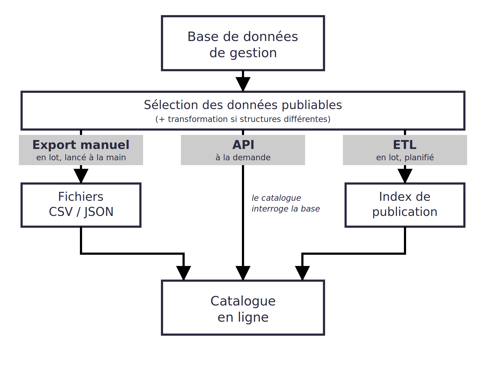
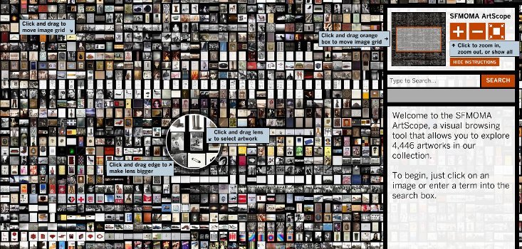
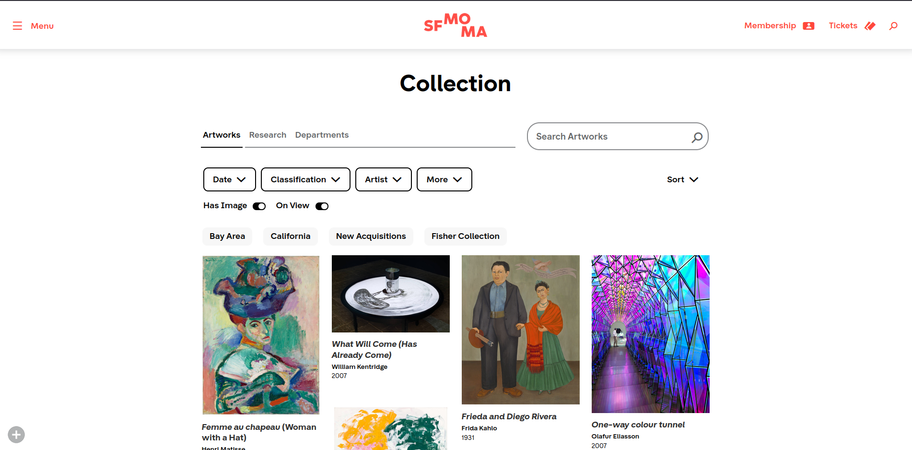
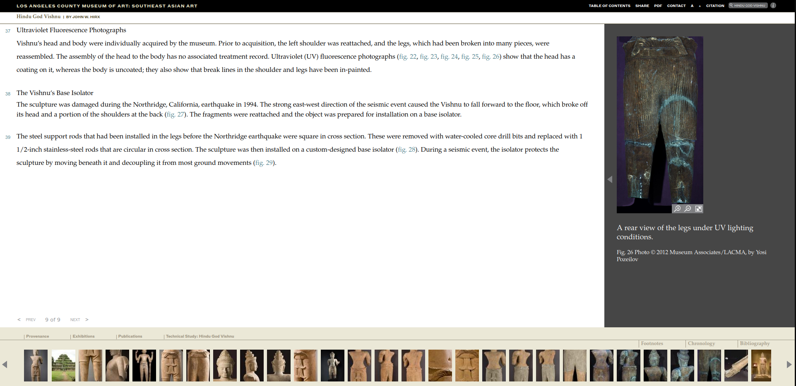
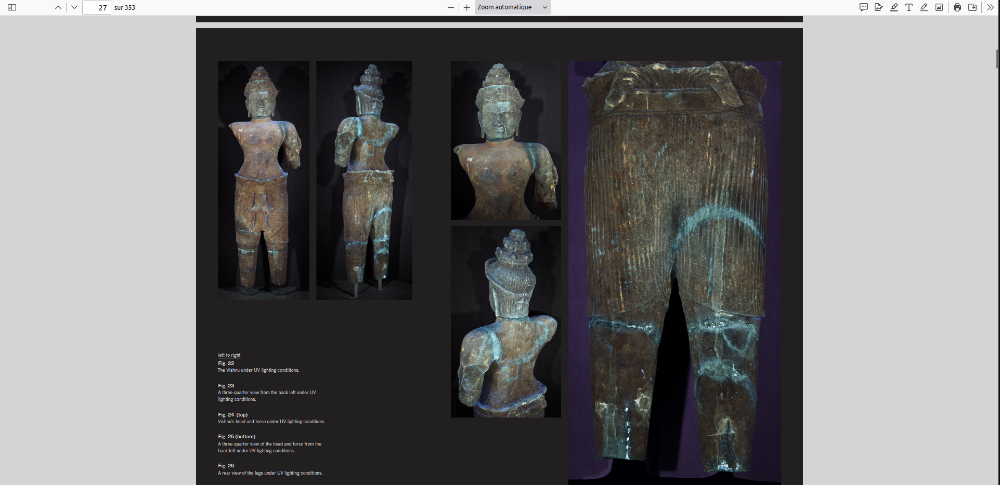
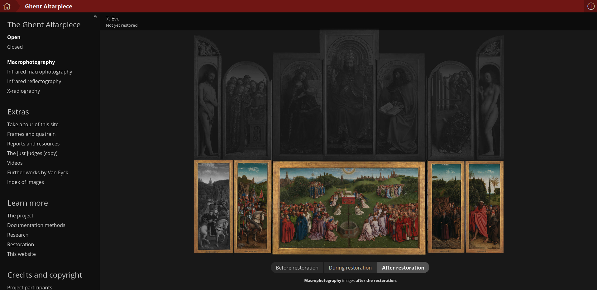

# Inventaire et traitement des données

### MSL6517 – automne 2026

Zoë Renaudie

https://studium.umontreal.ca/course/view.php?id=351279

/** Notes **/
Contenu vient en partie du cours d'Emmanuel Château-Dutier

===vvvvvv===
<!-- .slide: class="text-small" -->
| Semaine  | Séance      | Thème                                                        | TP rendu                    |
| -------- | ----------- | ------------------------------------------------------------ | --------------------------- |
|          |             | ~~Introduction~~                                             | ~~Présentation → 14 sept.~~ |
| 14 sept. | S1          | ~~Présentation générale des enjeux numériques dans les musées~~ | ~~TP1 → 21 sept.~~          |
| 21 sept. | S2          | ~~La documentation muséale~~                                 | ~~TP2 → 28 sept.~~          |
| 28 sept. | S3          | ~~La gestion de collection : inventaire, normes, modèles métiers~~ | ~~TP3 → 05 oct.~~               |
| 05 oct.  | S4 (async.) | Les interfaces publiques et catalogues en ligne              | TP4 → 12 oct.               |
| 12 oct.  | S5 (async.) | La notion de métadonnées                                     | TP5 → 26 oct.               |
| 19 oct.  |             | **Semaine de lecture**                                       |                             |
| 26 oct.  | S6          | Données structurées, langages documentaires et thesaurus     | TP6 → 02 nov.               |
| 02 nov.  | S7          | Open GLAM : Open data et Open Content                        | TP7 → 09 nov.               |
| 09 nov.  | S8          | Modélisation de données                                      | TP8 → 16 nov.               |
| 16 nov.  | S9          | Le modèle relationnel                                        | TP9 → 23 nov.               |
| 23 nov.  | S10         | Les ontologies dans le domaine patrimonial                   | TP10 → 30 nov.              |
| 30 nov.  | S11         | Éthique des données et pérennisation                         |                             |
| 07 déc.  | S12         | L'intelligence artificielle et les enjeux du traitement des données |                             |
| 21 déc.  |             | **Rendu du travail final**                                   |                             |

===vvvvvv===

# Les interfaces publiques et les catalogues en ligne des musées

/** Notes **/

Les systèmes d'information des musées disposent de plus en plus d'interfaces publiques qui donnent à voir la collection. Loin d'être neutre, la conception d'un catalogue en ligne relève de choix importants en termes de structuration des données, de médiation et de rapport au visiteur. Cette séance examine les enjeux de ces interfaces à travers la notion de *generous interfaces* et la question du discours sur la collection que le musée construit en ligne.

La documentarisation généralisée (aussi appelée « documentalité » chez Ferraris, ou « hyperdocumentarisation ») désigne le phénomène contemporain où tous les aspects de notre vie quotidienne, de nos interactions et de notre environnement sont transformés en données et en documents. Elle fournit un cadre pour penser l'explosion documentaire et son inscription dans l'environnement du numérique en réseau. Le catalogue des collections en est un exemple emblématique : pièce maîtresse de la médiation de l'institution patrimoniale en direction des publics, il met aussi en jeu de nouvelles compétences documentaires.

Plan : 
1. Pourquoi des catalogues en ligne ?
2. Repères chronologiques : des OPAC aux interfaces génératives
3. Chercher dans un catalogue : simple, experte, à facettes, sémantique
4. Regarder un catalogue : grille de lecture et exemples
5. Regards critiques : la documentation n'est pas neutre
6. Conclusion, pérennisation et TP4

===vvvvvv===

## L'intérêt des catalogues en ligne

> les informations présentes dans les bases de données communes sont évidemment d'intérêt public. Mais soyons honnêtes : la navigation dans une base de données d'inventaire est aussi intéressante pour le voyageur néophyte qu’une visite dans les réserves d'un musée où il n'y aurait ni signalisation, ni ordre logique, ni mise en contexte, ni même d'éclairage adéquat. Les bases de données d'inventaires sont riches en informations textuelles et iconographiques, mais elles sont muettes pour le grand public parce que ces informations ne sont pas scénarisées 
> (Simard 2001, p. 37)

/** Notes **/

Pour Françoise Simard, la difficulté des bases de données professionnelles à se frayer un chemin vers la diffusion électronique des collections tient à un problème de navigation.

> les informations présentes dans les bases de données communes sont évidemment d'intérêt public. Mais soyons honnêtes : la navigation dans une base de données d'inventaire est aussi intéressante pour le voyageur néophyte qu’une visite dans les réserves d'un musée où il n'y aurait ni signalisation, ni ordre logique, ni mise en contexte, ni même d'éclairage adéquat. Les bases de données d'inventaires sont riches en informations textuelles et iconographiques, mais elles sont muettes pour le grand public parce que ces informations ne sont pas scénarisées 
> (Simard 2001, p. 37)

**Question:** Depuis 2001, les interfaces ont beaucoup évoluées mais, d'après votre utilisation, sont-elles efficaces ? 
Pourquoi les catalogues en ligne des musées sont-ils bien plus que de simples bases de données ?

===vvvvvv===
### Lecture

Welger-Barboza, Corinne. « Les catalogues de collections des musées en ligne, au carrefour des points de vue. De la médiation à la propédeutique de l’image numérique ». In *Numérisation du patrimoine et nouvelles formes de médiation.* Éd. Bernadette Dufrene et Madjid Ihadjadene. Paris : Éditions Hermann, 2012. http://observatoire-critique.hypotheses.org/1423

/** Notes **/

Corinne Welger-Barboza aborde l’effet propédeutique des catalogues en ligne. Pour l’histoire de l’art, le web a permis un rééquilibrage entre institutions patrimoniales et académiques, favorisant un nouveau partage de l’image.

Depuis la fin des années 1990, la numérisation patrimoniale de masse (notamment en Europe) a rendu accessibles des corpus d’images et de ressources. Les composantes essentielles des corpus outillés incluent :
- L’indexation (notamment par sujet).
- Les outils de visualisation et de manipulation des images.

Discussion sur le texte :
1. Quel est, selon vous, l’intérêt principal de cet article ?
2. Pouvez-vous résumer en quelques phrases le propos de l’auteure ?
3. Comment l’auteure invite-t-elle à regarder les catalogues de musée ?
4. Comment envisage-t-elle les rapports entre les musées et l’histoire de l’art ?

- L’indexation oriente la recherche et constitue un dispositif de médiation entre l’autorité de l’institution et les utilisateurs.
- Exemples : *Tate Online*, *LACMA* (modèles revendiqués par la discipline : description et examen visuel des œuvres).
- Contribution des musées aux humanités numériques en histoire de l’art.

===vvvvvv===

### Objectifs des catalogues en ligne

- ### permettre à un utilisateur de trouver une œuvre
  - par son auteur
  - son titre
  - son sujet s’il est connu
- ### présenter les ressources de la collection
  - par auteur
  - par sujet
  - par domaine
- ### assister le choix des œuvres
  - par édition
  - par son genre

Charles Ammi Cutter. 1876. Rules for a Printed Dictionary Catalogue. p.10

/** Notes **/

Ces objectifs reprennent, transposés des livres aux œuvres, ceux formulés par Charles A. Cutter (1876) pour le catalogue de bibliothèque : trouver, rassembler, choisir.

- permettre à un utilisateur de trouver une œuvre
  - par son auteur
  - son titre
  - son sujet s’il est connu
- présenter les ressources de la collection
  - par auteur
  - par sujet
  - par domaine
- assister le choix des ouvres
  - par édition
  - par son genre

**Question:** Voyez vous autre chose ? 

Les tâches utilisateur de l'IFLA LRM (trouver, identifier, sélectionner, obtenir, *explorer*). Le dernier verbe est celui qui distingue le plus les catalogues muséaux actuels (interfaces généreuses, parcours, récits).

===vvvvvv===

### Le lien entre le catalogue en ligne et la base de données de gestion

/** Notes **/

Export manuel :
La base de gestion exporte des fichiers structurés (CSV, XML, JSON) contenant un sous-ensemble des données (ex. : œuvres publiables).
Ces fichiers sont importés et transformés pour le catalogue en ligne.
Avantage : Simple à mettre en place.
Inconvénient : Pas de synchronisation en temps réel.

API interne :
La base de gestion expose une API (REST, GraphQL) pour permettre au catalogue en ligne de requêter les données dynamiquement.
Avantage : Données toujours à jour, flexibilité.
Inconvénient : Nécessite une infrastructure technique solide et une gestion des droits d’accès.

Synchronisation automatique (ETL) :
Un processus ETL (Extract-Transform-Load) extrait les données de la base de gestion, les nettoie (suppression des champs sensibles, adaptation des formats), et les charge dans le catalogue en ligne.
Exemple : Utilisation d’outils comme Apache NiFi, Talend, ou des scripts Python.
Avantage : Automatisation, réduction des erreurs humaines.
Inconvénient : Complexité de mise en place.

Webhooks :
La base de gestion envoie des notifications en temps réel (via webhooks) au catalogue en ligne lorsqu’une œuvre est mise à jour (ex. : changement de localisation, nouvelle image).
Avantage : Réactivité immédiate.
Inconvénient : Nécessite une intégration technique poussée.

Services tiers :
Le catalogue en ligne peut agréger des données depuis des plateformes externes (ex. : Google Arts & Culture, Europeana).
Avantage : Visibilité accrue, interopérabilité.
Inconvénient : Dépendance aux standards des tiers.

===vvvvvv===

## Quelques repères chronologiques sur développement des musées en ligne

### Différences musées / bibliothèque sur le catalogage des collections

/** Notes **/
Pour bien comprendre les enjeux de la documentation des collections, il est utile de recontextualiser le cas des musées par rapport à celui des bibliothèques. Les bibliothèques ont rapidement développé des systèmes d'information partagés pour décrire leurs collections. Le phénomène est plus tardif dans le monde muséal.

- Par leur diversité (pensez aux collections ethnographiques, scientifiques ou artistiques), les collections muséales font appel à des domaines de connaissances plus variés, d'où une plus grande diversité de modèles métiers.
- Les bibliothèques pouvaient espérer des économies en partageant leurs notices bibliographiques. Les musées, qui gèrent le plus souvent des *unica*, avaient moins d'incitation à partager l'information sur leurs collections par voie numérique.
- Ce n'est qu'au cours des dernières années que les musées se sont fortement engagés dans des projets de numérisation, avec un très grand impact sur leurs approches documentaires.

===vvvvvv===

### La révolution des OPACs

#### OPAC** : Online public access catalog (bibliothèques)

- 1968 : finalisation du format MARC (MAchine-Readable Cataloging)
- 1975 : Ohio State University
- 1978 : Dallas Public Library

#### Premiers développements de l'informatique muséale

- 1963 : création du CIDOC
- 1967-1977 : Information Retrieval Group of the Museums Association (IRGMA)
- 1967 : Museum Computer Network

/** Notes **/

Un *Online public access catalog* (OPAC) désigne un catalogue, principalement de bibliothèque, accessible en ligne. Sa mise en place a été permise par le développement du standard MARC pour l'informatisation des collections dans les années 1960. Les OPAC ont dès lors remplacé les fichiers papier.

Les premiers catalogues en ligne développés à grande échelle l'ont été à l'Ohio State University (1975) et à la Dallas Public Library (1978), avec des interfaces textuelles. Depuis la fin des années 1990, les OPAC offrent le plus souvent une interface graphique reposant sur les standards du web. L'OPAC est généralement fourni par le logiciel de gestion de la bibliothèque, le Système intégré de gestion de bibliothèque (SIGB).

Pour aller plus loin : Ross Parry 2007 ; Borgman 1996 

===vvvvvv===

### Les principales évolutions du secteur

- **1970** premiers développements de l'informatique muséale
- **1980** généralisation avec la micro-informatique
- **1990** société de l'information et standardisation
- **2000** numérisation de masse et diffusion sur le web
- **2010** ouverture, interfaces généreuses, participation
- **2020** intelligence artificielle et hyper-personnalisation

/** Notes **/

Le rôle des professionnels de l'information a largement évolué au cours des cinquante dernières années. Les évolutions qui affectent les musées sont principalement liées :

- aux influences du contexte extérieur (commercial, gouvernemental, social) et du contexte interne (organisationnel, professionnel, pression communautaire) ;
- au développement de coordinations nationales et d'initiatives internationales ;
- à la réponse des musées à ces tendances, qui les a conduits à modifier leurs priorités, leur structure organisationnelle et leurs procédures de documentation.

Exemple à partir du cas britannique de 1971 à 2000 : Andrew Roberts, « The Changing Role of Information Professionals in Museums », ICOM-CIDOC, 1999. https://icom-documentation.mini.icom.museum/wp-content/uploads/sites/87/2018/12/4.pdf

===vvvvvv===

### 1970 : les premiers développements de l'informatique muséale

- Pression sur les musées pour démontrer leur responsabilité (*accountability*) envers la conservation des collections.
- Création de services d'audit.
- Émergence des premiers systèmes informatiques dans les universités et les collectivités locales.
- Tendance vers des changements organisationnels et une spécialisation dans le secteur public.

/** Notes **/

C'est la période où émergent les premiers systèmes informatiques de grande ampleur dans les universités et les autorités locales.

- IRGMA, 1967-1977 ; projet de recherche au Sedgwick Museum de Cambridge financé par la British Library, 1974-1977.
- Poursuite des développements de la Museum Documentation Association (MDA), fondée en 1977 : standards, principes de documentation, manuels.
- CIDOC (ICOM), lancé en 1963 : d'abord à petite échelle (20-30 participants agissant comme représentants nationaux), avec un accent sur le développement de standards internationaux à partir des initiatives nationales.

Au sein des musées, la priorité va de plus en plus au catalogage et aux procédures de contrôle garantissant la responsabilité de l'institution sur ses collections. Le personnel concerné est généralement composé de conservateurs, et ces missions relèvent directement de leurs attributions. Quelques spécialistes des sciences de l'information rejoignent alors les institutions.

===vvvvvv===

Dans les musées :

- Renforcement de l'emphase sur l'inventaire, le contrôle et la responsabilité.
- Politiques de gestion active des collections.
- Recours à des services informatiques pour soutenir le catalogage.
- Premières tentatives d'utilisation de la micro-informatique en interne.
- Recrutement accru de spécialistes de l'information.

/** Notes **/

Au Royaume-Uni, accent managérial dans les institutions et transfert des systèmes de gestion du privé vers le secteur public : il faut démontrer son efficacité. Premiers systèmes « maison », généralisation de la micro-informatique, accélération de la spécialisation des rôles.

- La MDA développe de nombreux services et se dote d'une équipe de spécialistes : standards, systèmes de catalogage sur fiches, nouvelles procédures de contrôle, logiciels dédiés (MODES).
- Première conférence sur la gestion des collections dans les musées (*Collections Management in Museums*), 1987.
- Implication active du personnel de la MDA dans le CIDOC, et de même pour le Museum Computer Network (MCN).

===vvvvvv===

### 1990 : société de l'information et standardisation

- Avec la disponibilité des systèmes d'information et le développement des réseaux, les gouvernements et le public prennent conscience de l'importance de l'information.
- Au Royaume-Uni, l'élection du *Labour* en 1997 met l'accent sur l'éducation et l'accès.
- Les visiteurs attendent des services de haute qualité.
- Focalisation sur la standardisation et l'évaluation (enregistrement, planification stratégique, standards de gestion des collections).

/** Notes **/

Convergence croissante entre musées, bibliothèques et archives (GLAM).

- Standards : SPECTRUM (*UK Museum Documentation Standard*), travail sur la terminologie, projet CIMI (*Computer Interchange of Museum Information*).
- Initiatives européennes : *Memorandum of Understanding*, lancement du European Museums' Information Institute (EMII).
- Formation : Museum Training Institute (MTI), puis Cultural Heritage National Training Organisation (CHNTO).
- Systèmes comme MODES désormais maintenus par des sociétés informatiques externes.

Pression de plus en plus grande sur le catalogage, avec un accent sur le choix d'un système informatique et l'emploi de standards. Les systèmes gagnent en performance, en fonctionnalités et en convivialité, et les premiers réseaux externes apparaissent. Ces changements requièrent des compétences accrues : les plus grands musées se dotent de départements de documentation et recrutent des spécialistes de la documentation et du catalogage. Les échanges entre la MDA et le monde professionnel conduisent à une très large adoption de SPECTRUM au Royaume-Uni.

===vvvvvv===

### 2000 : numérisation de masse et diffusion sur le web

- Les gouvernements définissent des politiques tournées vers l'accès.
- L'attente du public envers l'accès à l'information croît.
- Convergence entre musées, bibliothèques et archives (GLAM).
- Collaborations entre universités et institutions patrimoniales.

/** Notes **/

Dans les années 2000, l'usage des systèmes informatiques et des réseaux devient pervasif. Les gouvernements définissent des politiques tournées vers l'accès, et l'attente du public à l'égard de l'information croît.

Au Royaume-Uni : planification stratégique (MLA), intégration des standards bibliothécaires et archivistiques dans les développements internationaux, ressources nationales comme SCRAN, partage d'autorités et de connaissances. Le rôle de l'ICOM et de son comité international est révisé.

Au sein des musées, les investissements informatiques augmentent. On passe d'une focalisation sur l'inventaire à une focalisation sur l'information, avec des ressources centrées sur l'accès, un usage accru des standards syntaxiques et des collaborations entre musées, bibliothèques, archives et secteur académique. Le travail de documentation évolue vers des systèmes d'information actifs tournés vers l'accès, avec une emphase sur l'usage des réseaux par le personnel et les usagers. Les professionnels de l'information sont de plus en plus requis, l'accent est mis sur la formation et la mobilité entre secteurs.

Ross Parry 2007.

===vvvvvv===

### Le développement des musées en ligne

**1992** France, base Joconde sur Minitel

**1994** une vingtaine de musées disposent de sites web

**1995** 70 musées disposent de sites web

**1996** plus de 200 musées en ligne

**2004-2008** émergence du web social

/** Notes **/

Fin 1994, quelques dizaines de musées seulement s'étaient dotés de sites web. En février 1995, ils étaient plus de 70, plus de 130 en mai, et plus de 200 au début de 1996. À partir du développement du World Wide Web, la présence en ligne des musées croît de façon exponentielle. 1996 constitue un point de bascule : l'ensemble des musées nationaux canadiens et la plupart des musées provinciaux disposent alors d'une présence en ligne.

En France, avec la promotion du Minitel, le ministère de la Culture s'est rapidement engagé dans la publication en ligne de sa base de données professionnelle des œuvres des musées de France. Le *3614 Joconde* donnait accès à une base textuelle de plus de 120 000 descriptions de peintures, dessins et gravures conservés dans plus de 60 musées français.

Le web introduit toutefois une rupture dont certains musées s'emparent pour améliorer la diffusion de leurs collections :

- Dès 1994, le musée des Arts et Métiers investit le web.
- 1994 : exposition *Le Siècle des Lumières dans les musées de France* (ministère de la Culture, INRIA). Le site dépasse très vite la simple vitrine, avec une dimension pédagogique pleinement intégrée et l'idée de musée virtuel.
- Multiplication des sites de musées, avec la généralisation de l'informatique personnelle et de l'accès à Internet.

Ces premiers développements interviennent souvent en l'absence de personnel qualifié (cf. l'exemple du Musée des beaux-arts de Bordeaux en 1995, ou celui du musée des Arts décoratifs, où un gardien de nuit s'en charge). Soutiens institutionnels : Direction des musées de France, RMN, plan gouvernemental pour la société de l'information de 1998 qui fait du domaine culturel un axe prioritaire. En 1996, une politique de formation est mise en place à l'INP pour les conservateurs (séminaire pratique de conception de sites web). Un master spécialisé multimédia-hypermédia (ESBA, 1995) et des post-diplômes spécialisés sont également offerts.

Le plus souvent, les musées sont contraints de recourir à des prestataires. L'usage de logiciels *open source* garantit la continuité.

**Web social** depuis 2005-2008 : pionniers en France, les Abattoirs de Toulouse et le Muséum d'histoire naturelle, puis la Cité des sciences et de l'industrie, les musées d'histoire et de civilisations, et les musées des beaux-arts vers 2010.

===vvvvvv===
<!-- .slide: class="text-small" -->

### Le cas du musée du Louvre

- **1994** CD-ROM du Louvre ; le site indépendant Web-Louvre, développé par un jeune polytechnicien, pousse le musée à réagir (problème de nom de domaine)
- **1995** (juillet) ouverture du site [Le Louvre](http://web.archive.org/web/20000620205710/http://www.louvre.fr/)
- **1996** site Louvre.fr et réservations en ligne
- **1999** cyberboutique
- **2000** près de 6 millions de visites en ligne, soit autant que de visiteurs réels
- **2001** crise de croissance, seconde version du site soutenue par le mécénat (projet Cim@ise, coût : [montant à vérifier], hors base de données et salaires des 60 personnes mobilisées)
- **2010** partenariat avec Orange : « communauté Louvre » (site fermé le 18 octobre 2011)
- **2021** (26 mars) collections.louvre.fr : plus de 480 000 notices (plus de 500 000 aujourd'hui), œuvres exposées, réserves, musée Delacroix, sculptures des Tuileries ; refonte du site louvre.fr, pensé d'abord pour le smartphone
- **2026** refonte des outils de gestion des collections en cours

Voir : <https://web.archive.org/web/*/https://www.louvre.fr>

/** Notes **/

Le cas du Louvre permet de suivre, sur trente ans, les étapes de la présence en ligne d'un grand musée : vitrine, service (billetterie, boutique), puis catalogue exhaustif.

Révolution numérique engagée par le Louvre depuis 2006 ; le département des arts de l'islam fait abondamment appel au numérique. Multiplication récente des dispositifs de poche.

Sources : http://observatoire-critique.hypotheses.org/41 ; https://www.connaissancedesarts.com/musees/musee-louvre/musee-du-louvre-un-nouveau-site-web-et-pres-de-500-000-oeuvres-a-decouvrir-en-ligne-11154719/

===vvvvvv===

## 2010 : l'ère de la démocratisation et de l'ouverture

- Les musées adoptent des politiques d'ouverture pour leurs collections numérisées (Open Access, Open Data).
- Standardisation et interopérabilité.
- Interfaces « generous » : des interfaces qui donnent à voir plutôt que de simplement lister. Les catalogues racontent des histoires.
- Les musées impliquent les visiteurs dans l'enrichissement des données (tagging, transcription, annotation).
- Débats sur la propriété intellectuelle des reproductions numériques et remise en question des biais coloniaux dans les catalogues.

/** Notes **/

**Open Access et Open Data.** Objectif : rendre les collections accessibles à tous, y compris les œuvres non exposées.

- 2012-2013 : le Rijksmuseum lance Rijksstudio avec 125 000 images en haute résolution, en usage libre (partage, modification, réutilisation), puis près de 200 000 images vers 2015.
- 2017 : le Metropolitan Museum of Art (Met) lance son programme Open Access, avec 375 000 images du domaine public sous licence CC0.
- 2021 (à cheval sur la décennie suivante) : le Louvre met en ligne plus de 480 000 notices, réserves comprises.

**Standardisation et interopérabilité.**

- Standards ouverts : LIDO, JSON-LD, IIIF pour les images.
- Vocabulaires contrôlés partagés : Getty Vocabularies, Iconclass.
- Agrégateurs : Europeana, Google Art Project (2011, devenu Google Arts & Culture en 2016).

**Enjeux éthiques et juridiques.**

- Clarification des licences (CC0, CC-BY, etc.) pour les images numérisées ; débats sur les droits attachés aux reproductions numériques.
- Remise en question des biais coloniaux dans les catalogues (*Words Matter*) ; projets de restitution numérique pour des collections issues de contextes coloniaux (Benin Dialogue Group).

*Museum Catalogues for the Digital Age.* https://www.getty.edu/publications/osci-report/ (accessed May 16, 2017).

===vvvvvv===

## 2010 : expérience utilisateur et médiation numérique

**Interfaces « generous ».** Concept popularisé par Mitchell Whitelaw (2015) : des interfaces qui donnent à voir plutôt que de simplement lister.

/** Notes **/

**Interfaces « generous ».** Concept popularisé par Mitchell Whitelaw (2015) : des interfaces qui donnent à voir plutôt que de simplement lister.

- Rijksstudio (2012) : collections personnelles, téléchargement en haute définition, réutilisation libre.
- Tate Online : outils de visualisation (zoom, comparaison) et parcours thématiques.
- Google Arts & Culture : visites virtuelles immersives (Street View dans les musées).

**Recherche par facettes.** Généralisation des filtres dynamiques. Exemple : le Victoria & Albert Museum propose des filtres par couleur, période, matériau, etc.

**Storytelling et contextualisation.** Les catalogues ne se contentent plus de lister des œuvres, ils racontent des histoires.

- *Closer to Van Eyck* : exploration interactive du Retable de l'Agneau mystique avec gigapixels et analyses scientifiques.
- *Rethinking Guernica* (Museo Reina Sofía) : environ 2 000 documents organisés en constellation narrative.

**Le catalogue revient dans les salles.** Cleveland Museum of Art, Gallery One (2013), avec son mur de collection interactif ; Cooper Hewitt (2014), avec le stylet et la salle d'immersion.

**Participation et crowdsourcing.** Tagging, transcription, annotation : Zooniverse (annotation d'images), Wikimedia Commons (partage de médias), Brooklyn Museum (*Tag! You're It*), Rijksstudio (collections personnelles partagées).

**Partenariats académiques.** Projets de recherche numérique (analyse d'images par IA, modélisation 3D) : le Met et le MIT en 2019.

**Vision par ordinateur.** Couleurs dominantes, formes, styles : Google Vision API à la Sarjeant Gallery, regroupement par similarité visuelle à la Barnes Foundation (2017), Electronic Swatchbook du Powerhouse Museum (2009), puis explorations par couleur au Cooper Hewitt.

**AR, VR et mobile.** The Kremer Museum (2017), premier musée 100 % VR ; conception *mobile-first* (refonte du site du Louvre en 2021).

===vvvvvv===
## 2020 : l'ère de l'intelligence artificielle et de l'hyper-personnalisation

- La fréquentation en ligne explose avec les restrictions de visite dues à la pandémie (COVID).
- Des algorithmes adaptent les parcours au comportement de l'utilisateur.
- Intégration de moteurs de recherche basés sur l'IA.
- Projets pour pérenniser les catalogues numériques.
- NFT et blockchain.

/** Notes **/

**IA et automatisation.**

- Recherche sémantique et chatbots : Natalie Potter, chatbot du Met pour l'exposition *Sleeping Beauties: Reawakening Fashion* (2024) ; Anna, guide virtuelle du musée des beaux-arts de Reims. Usage du langage naturel pour interroger les catalogues.
- Analyse automatique des collections : classement par style, période ou artiste, détection de motifs, génération de métadonnées (CLIP), traitement automatique du langage pour extraire thèmes et entités nommées dans les textes de catalogue.
- Génération de contenu : descriptions alternatives, visites guidées virtuelles, œuvres générées par IA (Refik Anadol au MoMA).

**Le Met, de l'Open Access à l'IA.** Février 2017 : plus de 375 000 images en CC0, réutilisées par des chercheurs, développeurs et artistes pour entraîner des modèles de reconnaissance d'images. 2019 : projet pilote avec le MIT pour révéler des connexions entre œuvres. 2023 : explorations pour améliorer l'accessibilité de la collection (dont des expériences en réalité augmentée avec Verizon). 2024 : Natalie Potter, personnage d'une socialite d'il y a un siècle, propulsé par un modèle d'OpenAI, avec lequel on converse par SMS depuis un téléphone. Sources : https://www.techradar.com/computing/artificial-intelligence/this-ai-ghost-of-the-past-might-be-your-guide-through-museums-of-the-future ; https://futureofmarketinginstitute.com/openai-debuts-custom-chatbot-at-the-2024-met-gala/ ; https://getcoai.com/news/metropolitan-museum-of-art-and-openai-team-up-on-interactive-ai-fashion-exhibit/

**Hyper-personnalisation et engagement.**

- Parcours adaptés au comportement (temps passé sur une œuvre, clics).
- Gamification : défis, badges et certificats pour les contributions au crowdsourcing.
- Communautés en ligne : Rijksstudio, réseaux sociaux (Instagram, TikTok, Discord), #MuseumFromHome pendant la pandémie.

===vvvvvv===

## 2020 : pérennité, économie et enjeux sociétaux

/** Notes **/

**Durabilité et préservation numérique.**

- Archivage des catalogues : New York Art Resources Consortium (NYARC).
- Blockchain pour certifier l'authenticité d'œuvres numérisées (Verisart).
- Empreinte carbone des données, optimisation des formats (JPEG 2000, AVIF).

**Modèles économiques.** Partenariats avec des entreprises technologiques (Google, Microsoft) pour financer la numérisation ; NFT (les Offices de Florence ont vendu un NFT de leur *Tondo Doni* en 2021).

**Enjeux sociétaux et critiques.**

- Décolonisation des catalogues : révision des métadonnées pour refléter des perspectives autochtones (Te Papa Tongarewa), co-curation avec des communautés (Premières Nations au Canada).
- Accessibilité universelle : descriptions audio, sous-titres, navigation au clavier, visites en langue des signes américaine et descriptions pour malvoyants (Smithsonian). Pour les descriptions d'images, voir aussi Coyote (https://live.coyote.pics/, https://github.com/coyote-team/coyote), utilisé notamment au MCA Chicago.
- Désinformation et deepfakes : manipulation des images numérisées, nécessité de vérifier l'authenticité des données.

===vvvvvv===

### Exemples marquants

**Années 2010**

- 2011 : Google Art Project
- 2012 : Rijksstudio (Rijksmuseum)
- 2017 : Open Access du Met ; nouveaux catalogues de la Barnes Foundation et de la Sarjeant Gallery

**Années 2020**

- 2020 : visites virtuelles pendant la pandémie (ex. : musées du Vatican)
- 2021 : collections.louvre.fr et refonte mobile-first du Louvre ; NFT des Offices de Florence
- 2024 : chatbot Natalie Potter au Met

/** Notes **/

Exemples marquants par période
Années 2010
2012 : Lancement de Rijksstudio (Rijksmuseum).
2014 : Google Arts & Culture agrège des collections de musées du monde entier.
2017 : Le Met lance son programme Open Access.
2018 : Closer to Van Eyck (KIK-IRPA) offre une exploration en gigapixel.
2019 : Le Louvre numérise 480 000 œuvres pour son site collections.louvre.fr.
Années 2020
2020 : Pendant la pandémie, les musées développent des visites virtuelles (ex. : The Vatican Museums).
2021 : Le Louvre lance une refonte mobile-first de son site.
2022 : The Museum of the Future (Dubaï) utilise l’IA pour des parcours personnalisés.
2023 : Le Met intègre un chatbot IA (Natalie Potter) pour une exposition.
2024 : Expérimentations avec le métavers (ex. : The Louvre dans Decentraland).

===vvvvvv===

## Chercher dans un catalogue

### Recherche simple

Recherche sur tous les termes, cf. moteurs de recherche.

### Recherche multicritère (ou experte)

Modèles de requêtes, souvent destinés à un utilisateur expert. Elles permettent de rédiger une requête avancée dans un langage de requête propriétaire ou non. La rédaction suppose une connaissance des structures internes du système d'information : désignation des champs, termes d'indexation, opérateurs.

/** Notes **/

De nombreux efforts ont été conduits ces dernières années pour faciliter l'utilisation de ce type de recherche et l'interfacer :

- opérateurs booléens ET, OU, SAUF ;
- recherche multicritère ;
- auto-complétion.

Si vous n'êtes pas à l'aise avec les opérateurs de recherche, consultez impérativement cette ressource : https://bibliotheque.uqac.ca/sofia/guide/operateurs-de-recherche

===vvvvvv===

### Par facettes

La recherche à facettes, ou navigation à facettes (*faceted navigation*), permet d'accéder à l'information à l'aide d'un système de classification à facettes. L'utilisateur explore une collection en lui appliquant différents filtres.

La recherche à facettes répond à plusieurs faiblesses de la recherche d'information, liées en partie à la rigidité des systèmes de représentation et au chaos des index non structurés. Elle est devenue de plus en plus répandue sur le web.

/** Notes **/

Plusieurs paradigmes de recherche ont été développés depuis l'avènement du web :

- **La navigation dans une structure hiérarchique de type taxonomique**, qui permet de parcourir l'espace informationnel de manière itérative, en raffinant la sélection selon un ordre prédéterminé. Ex. : DMOZ, jusqu'en mars 2017 (cf. http://dmoztools.net, http://curlie.org).
- **La recherche directe**, où l'utilisateur exprime sa recherche sous la forme d'une liste de mots dans un champ de recherche, rendue populaire par les moteurs de recherche. Ce paradigme a acquis une forme de prédominance, l'approche navigationnelle devenant moins populaire.
- **La recherche à facettes**, qui combine les deux approches : elle permet de naviguer dans un espace d'information multidimensionnel en restreignant les choix dans chaque dimension. Ce mécanisme est aujourd'hui privilégié par de nombreux sites d'e-commerce.

Une classification à facettes est un schéma de classification qui organise le savoir de manière systématique. Elle utilise des catégories sémantiques plutôt que des sujets spécifiques, combinées pour créer l'entrée de classification. Chaque élément est classifié selon des dimensions multiples et explicites, les facettes, qui correspondent habituellement à des propriétés des éléments. Elles sont parfois extraites par des techniques d'extraction d'entités dans une base de données. La classification peut alors être parcourue de plusieurs manières, plutôt que dans un ordre taxinomique prédéterminé.

Shiyali Ramamrita Ranganathan (1892-1972), mathématicien indien et l'un des pères de la bibliothéconomie :

- *Cinq lois de la science des bibliothèques* (1931) ;
- premier système de classification à facettes, la Colon Classification (1933) : 42 classes combinées avec des lettres et des chiffres, organisées par facettes (Personality, Matter, Energy, Space, Time) ;
- pour lui, un système de classification rendant compte de chaque dimension du sujet de l'œuvre était préférable.

Les cinq lois (1931) :

1. Books are for use.
2. Every reader his / her book.
3. Every book its reader.
4. Save the time of the reader.
5. The library is a growing organism.

Les interfaces de recherche paramétriques sont pour l'essentiel des interfaces booléennes pour des contenus à facettes. La navigation par facettes est une sorte de guide grâce auquel l'utilisateur élabore progressivement sa requête en voyant les résultats de chaque choix. Les catalogues informatisés de bibliothèques adoptent de plus en plus de telles interfaces, souvent plus intuitives parce qu'elles accompagnent le processus de recherche. Du point de vue de l'utilisateur, la navigation par facettes élimine les « impasses » (*dead ends*) qui résultent d'une combinaison inadéquate de contraintes.

Tunkelang, Daniel. 2009. *Faceted Search*. Morgan & Claypool.

===vvvvvv===

### L'approche classificatoire

- Entrées par grandes catégories : techniques (souvent calquées sur l'organisation du musée), chronologie, écoles et courants.
- Pour l'art moderne et contemporain, la périodisation en décennies remplace les coupes historiques usuelles.
- Exemple : les « filtres » de la collection en ligne du MoMA.

/** Notes **/

@todo compléter la slide (exemple visuel, captures d'écran des filtres du MoMA).

Corinne Welger-Barboza observe que de nombreux catalogues privilégient ces entrées classificatoires. La mise en ordre du patrimoine (Recht 1998, *Penser le patrimoine*) a durablement installé et prolongé ces catégories historiographiques. Elles sont, écrit-elle, « la marque du point de vue historiographique porté par le musée ».

> De nombreux exemples illustrent cette tendance à privilégier les entrées classificatoires ; l’exemple de la la collection en ligne du MoMA (Museum of Modern Art, New-York) rassemble en un système limpide et rationalisé de « filtres », cette tendance majoritaire. La prédilection est donnée au classement par les grandes catégories que sont les techniques – correspondant souvent à l’organisation administrative et scientifique du musée – la chronologie, les époques et les ères chrono culturelles – dans le cas de l’art moderne et contemporain, la périodisation en décades remplace les coupes historiques usuelles – les écoles et courants artistiques. La mise en ordre du patrimoine (RECHT, R., *Penser le Patrimoine – mise en scène et mise en ordre de l’art*, Paris, Editions Hazan, 1998. )) a durablement installé et prolongé ces catégories historiographiques, avec le passage du temps. C’est la marque du point de vue du historiographique porté par le musée.
>

===vvvvvv===

### Recherche sémantique

- Moteurs de recherche en langage naturel, agents conversationnels
- Exemple : Anna, guide virtuelle du musée des beaux-arts de Reims <https://musees-reims.fr/fr/la-vie-des-musees/actus/article/anna-nouvelle-guide-virtuelle-l-intelligence-artificielle-au-service-du>

/** Notes **/

Qu'est-ce qui change dans la recherche en général aujourd'hui, avec les chatbots ?

Si les plateformes intègrent de plus en plus de moteurs à intelligence artificielle ou de recherche sémantique qui comprennent le langage naturel, la maîtrise de la logique booléenne (combinée aux guillemets "" et à la troncature *) demeure la compétence clé des professionnels de l'information pour fouiller de vastes banques de données sans perte de pertinence.

===vvvvvv===
## Regarder un catalogue

### Considérer la force du dispositif

- Quels sont les points d'accès ?
- Comment navigue-t-on dans les ressources ?
- Comment les visualise-t-on ?
- Peut-on les manipuler (tagger, stocker, etc.) ?
- Quel discours sur la collection le catalogue construit-il ?

/** Notes **/

Cette grille est celle utilisée pour le TP4 et pour chacun des exemples qui suivent.

Chacun.e présente son catalogue.

===vvvvvv===

### Les catalogues de la Tate on line

http://www.tate.org.uk

> new technologies and online services, together with the proliferation of high-speed internet connections and mobile internet connectivity,have changed the web radically in the past few years. However, cultural and heritage organisations have been slow, by and large, to respond to these changes.
>
> J. Stack, “Tate Online Strategy 2010-12,” Tate Papers 13 (2010).

/** Notes **/

John Stack, responsable de la stratégie numérique de la Tate, est convaincu que la numérisation a pénétré le cœur de la vie quotidienne dans une société en réseau. Il défend une approche où le numérique devient une dimension de tout ce que fait la Tate : blogs, réseaux sociaux, billetterie, levée de fonds, gouvernance. Cette approche holistique rompt avec la politique initiale, qui considérait le site comme une entité autonome et suffisante au sein du groupe Tate (Stievens 2016 : 16, référence à vérifier).

Site lancé en 1998, relancé en 2000 pour l'ouverture de la Tate Modern (cf. https://www.designweek.co.uk/issues/30-march-2000/tate-gallery-website-to-relaunch/). D'abord conçu comme une cinquième galerie, il est bientôt associé de manière transversale aux activités et prend en compte l'émergence du web social.

**Indexation.** Les descripteurs sont tirés en grande partie de l'ICONCLASS, vocabulaire contrôlé de catégories thématiques. Selon Welger-Barboza, le site satisfait ainsi à l'exercice académique de la description : les catégories et leurs ramifications permettent de rattacher l'œuvre aux courants artistiques, d'identifier les sources et l'iconographie, tandis qu'une forme d'interprétation s'appuie sur des concepts, sentiments et idées.

Trois types de données :

- le cartel ;
- les *highlights* ;
- les entrées par descripteurs (mots-sujets), qui servent à la fois à décrire les œuvres et à naviguer dans le corpus.

Les descripteurs émanent de la pratique scientifique des musées (élaboration de thésaurus, en lien avec les savoirs de l'histoire de l'art), et c'est ce même outil scientifique qui est proposé au public pour naviguer : l'interface est paradoxale, ces termes étant à la fois mots-outils et description savante. La taxonomie est affichée et on peut circuler dans les différents degrés de l'arborescence. C'est un appareil discursif qui permet la lecture et la situation de l'œuvre dans la collection, une lecture informée et savante, propédeutique à l'histoire du musée. Après cette étape, on obtient une liste de résultats plus ou moins nombreuse.

Exemple : http://www.tate.org.uk/art/artworks/calder-mobile-l01686

Plus les musées prennent à cœur l'importance de leur collection en ligne, plus se déploie une pensée de la médiation qui permet aux non-initiés de pratiquer ces bases de données, corpus considérables, puisque le principe est de mettre en ligne toutes les œuvres, y compris celles qui ne sont pas exposées.

===vvvvvv===

### Le cas du Victoria & Alberts museum

http://collections.vam.ac.uk/

/** Notes **/

Le V&A montre plusieurs façons d'entrer dans la collection : une page de suggestions des œuvres les plus recherchées, et une interface beaucoup plus complète pour interagir avec les collections.

https://www.vam.ac.uk/collections?type=featured

https://collections.vam.ac.uk/gallery/europe-1600-1815/THES263060/

===vvvvvv===

### Artscope SFMoMA

/** Notes **/

https://stamen.com/work/sfmoma-artscope/

Le catalogue comme espace d'experimentation. 

===vvvvvv===

### ~~Artscope~~ SFMoMA

/** Notes **/

Aujourd'hui, on revient à des interfaces très classiques et similaires d'un musée à l'autre. Les données, elles, ne sont pas plus interopérables pour autant.

[SFMOMA](https://www.sfmoma.org)

===vvvvvv===

## Rijks Studio

https://www.rijksmuseum.nl/en/rijksstudio

/** Notes **/
Le Rijksmuseum a rouvert en avril 2013 après dix ans de rénovation. Le nouveau site est présenté au public le 30 octobre 2012. Ce projet, lancé avant la réouverture, a constitué une petite révolution dans le secteur muséal. À l'inverse du Centre Pompidou Virtuel, qui fait la part belle au texte et à la recherche sémantique, le Rijksmuseum privilégie l'image : « l'image est l'interface ». Pour Peter Gorgels, il s'agissait de créer une expérience esthétique.

**Un parti pris d'ouverture**

- 125 000 œuvres numérisées, libres de droits, au lancement ; près de 200 000 images environ deux ans et demi plus tard.
- Les visiteurs peuvent partager, modifier, télécharger et créer à partir des collections. Seule une petite partie de la collection (8 000 œuvres sur 1 100 000) est exposée dans le nouveau musée : le reste devait être accessible à tous.
- Au-delà de l'*open content* (Anderson 2009), le musée se lance dans l'*open design*. Campagne d'« ambassadeurs » au lancement : tatouage de Droog d'après une nature morte de Jan Davidsz. de Heem, foulard d'Alexander van Slobbe, installations éphémères au magasin De Bijenkorf.
- Bilan de Martijn Pronk (2015) : environ 15 millions de visites, 200 000 comptes personnels, près d'un demi-million de collections personnelles, plus de 1,3 million d'images téléchargées (environ 1 400 par jour). Pour lui : « nous partons du principe que la collection n'est pas notre propriété personnelle ».

**Une stratégie numérique globale.** Atteindre les publics là où ils se trouvent : toutes les images sont déposées sur Wikimedia Commons pour que les wikipédiens les utilisent eux-mêmes. Pour Pronk, le libre accès est un moyen et non un objectif : un contenu neutre est plus réutilisable. Les collections des utilisateurs sont intégrées au moteur de recherche, et les plus belles présentées en page d'accueil : les visiteurs organisent la collection autrement que le musée.

**Penser en mode « app ».** Constat : nous nageons dans un « océan d'images » (Gorgels) et les musées virtuels de l'époque sont souvent des photothèques à la navigation malaisée et aux restrictions poussées sur le partage. Le site est conçu sur le principe des applications : peu de services, mais pertinents, une information en « millefeuille » accessible rapidement, et un site complètement *responsive*.

Sources : http://www.club-innovation-culture.fr/martijn-pronk-rijksmuseum-le-rijksstudio-a-attire-quelques-15-millions-de-visites-pour-200-000-comptes-personnels-crees/ ; http://culture-communication.fr/fr/rijksstudio-faites-ce-que-vous-voulez-des-grands-maitres-flamands/ ; http://rijksmuseum.github.io

===vvvvvv===

## National Galleries Scotland

2017, https://www.nationalgalleries.org/art-and-artists

/** Notes **/

Depuis 2017, l'ensemble des collections numérisées est en ligne, avec une belle éditorialisation et un site *responsive*, remarquable pour l'époque.

**Contexte.** Transformation du site débutée début 2016, en réponse à la *Digital Engagement Strategy 2014-2018* (publiée en 2013), qui met l'accent sur l'amélioration de l'accès numérique aux collections et aux services. Sur l'ancien site, seuls 6 % des quelque 90 000 objets de la collection permanente étaient disponibles (10 % numérisés) ; aujourd'hui, la totalité est en ligne.

**Approche technique.**

- Développement agile, nouvelles fonctionnalités publiées régulièrement.
- Nouveau système de gestion de contenu (CMS) et architecture sous-jacente fondés sur des technologies open source, avec la flexibilité et la modularité qu'elles apportent.
- Middleware pour gérer les contenus numériques de la collection et alimenter le CMS ; besoin d'une interface de recherche rapide, capable de requêtes sur plus de 92 000 enregistrements et de recherches par facettes personnalisées, avec des pages d'administration belles et simples.
- Drupal pour le middleware (instance séparée du CMS, sur la plateforme Acquia), Drupal Commerce, CiviCRM, Amazon S3 pour la diffusion des images, Apache Solr pour la recherche.
- Extraction de couleurs pour accompagner les œuvres sur les cartels ; approche *mobile* forte.

**Calendrier.**

- 2013 : publication de la stratégie numérique 2014-2018
- juin 2014 : laboratoire de numérisation
- juillet 2016 : lancement de *The Collections* (92 000 notices, 30 000 images, chiffres à vérifier)
- octobre 2016 : fonctionnalités de *story-telling* ; novembre 2016 : boutique ; décembre 2016 : section visite ; mars 2017 : expositions et événements
- octobre 2017 : 55 000 images (on est passé de 6 000 œuvres documentées à 92 000 enregistrements)
- février 2018 : totalité de la collection en ligne ; début du travail sur les sculptures en 2017

Réalisation : Cello Signal, Edinburgh (https://cellosignal.com).

Sources : https://www.nationalgalleries.org/beta ; https://medium.com/nationalgalleries-digital/mass-digitisation-at-the-national-galleries-of-scotland-d32bca6df750 (photos des installations) ; https://medium.com/nationalgalleries-digital/art-for-everyone-the-national-galleries-of-scotland-collections-website-e8e26978374

===vvvvvv===

## Barnes Collection Online

https://collection.barnesfoundation.org

https://github.com/BarnesFoundation/CollectionWebsite

/** Notes **/

Nouveau catalogue publié en novembre 2017, financé par la Knight Foundation, code en open source (extraction depuis TMS, le système de gestion des collections). Le site web est repensé en même temps que celui des collections, et le projet recourt à la vision computationnelle.

Le fondateur Albert Barnes avait organisé la collection en « ensembles » sur des compositions murales, selon des principes formels de lumière, d'espace, de couleur et de ligne plutôt que de chronologie, nationalité, style ou genre. Le catalogue en ligne prolonge ce parti pris :

> In rethinking the presentation of our collection online, we are taking a more experiential and Barnes-like approach. […] we will design an interface that highlights purely visual connections between artworks
>
> https://medium.com/barnes-foundation/rethinking-the-museum-collection-online-e3b864d8bb39

- Volonté d'intégrer des aspects de la présentation physique à la présentation en ligne (ex. : mur d'images du site).
- Vision computationnelle pour grouper les images ou les filtrer par similarité visuelle (cf. Cooper Hewitt Labs et Electronic Swatchbook du Powerhouse Museum, 2009 ; https://labs.cooperhewitt.org/2013/giv-do/).
- *Visually Related* : plus similaire, plus surprenant (curseur).

===vvvvvv===

## Sarjeant Gallery

https://collection.sarjeant.org.nz

2017

/** Notes **/

En 2017, la Sarjeant Gallery utilise la Google Vision API. Le musée voulait un site facile à explorer sans connaissance préalable de la collection, avec trois objectifs : des fonctionnalités innovantes, un site le plus accessible possible, et les meilleures pratiques techniques actuelles (conformité WCAG 2.0 AA).

- Inspiré de l'usage du langage naturel sur le site du Cooper Hewitt : le type d'objet, le lieu et la date de production sont combinés en une phrase sur chaque fiche ; une recherche automatique sur le type d'objet affiche le nombre d'œuvres apparentées, pour donner le sens de l'échelle de la collection. Type d'objet et lieu sont des liens vers toutes les œuvres de la même catégorie.
- La page de résultats offre des filtres : par exemple, tous les paysages, puis leurs couleurs les plus fréquentes.
- Usage de chronologies et analyse automatisée des images pour les couleurs.

Sources : https://medium.com/@armchair_caver/building-an-accessible-online-collection-for-sarjeant-gallery-48cbcac4fdb6 ; https://collection.sarjeant.org.nz/explore

===vvvvvv===

### Exemple du LACMA

https://seasian.catalog.lacma.org/#section/112/p-112-12
Robert L. Brown, Ph.D., "Hindu God Vishnu," South and Southeast Asian Art (Los Angeles: Los Angeles County Museum of Art, 2013)

/** Notes **/
Le LACMA propose le catalogue de ses collections en ligne avec des outils propres au numérique. Le catalogue est interactif, avec un espace dédié à la visualisation (vision rapprochée, combinaison de zooms) qui permet un examen méthodique et comparatif, et un espace de recherche.

===vvvvvv===

### Exemple du LACMA

/** Notes **/
Le catalogue peut aussi être publié en PDF.

https://buddhistartnews.wordpress.com/2013/11/24/lacma-releases-new-online-catalogue-of-southeast-asian-art/

===vvvvvv===

### Closer to Van Eyck

http://closertovaneyck.kikirpa.be

/** Notes **/

*The Ghent Altarpiece Restored.* Voir WELGER-BARBOZA, Corinne. 2012. « L’édition scientifique des musées en ligne – à partir des catalogues de collections. » Billet. L’Observatoire critique, avril 3. https://doi.org/10.58079/shki.

L'édition scientifique des musées en ligne, à partir des catalogues de collections : ici, une ressource impressionnante de rapport de conservation-restauration interactif.

===vvvvvv===

### Cranach Digital Archive

http://lucascranach.org

/** Notes **/

À partir du solide fonds documentaire mutualisé par les musées qui conservent les œuvres de l'artiste, le catalogue est ouvert à la contribution de tous les spécialistes, pour compléter l'information factuelle ou critique et trancher les nombreuses attributions en suspens : la publication prend une dimension de laboratoire transnational (Welger-Barboza 2012).

Le *Cranach Digital Archive* illustre la transformation des modes de production, d'édition et de circulation de la publication scientifique. Les pratiques de lecture se règlent progressivement sur les changements qui affectent les relations texte/image : l'image acquiert une autonomie croissante grâce à la démultiplication des modalités de visualisation. Les problématiques de diffusion deviennent des problématiques d'appropriation, et les publics peuvent se porter protagonistes.

===vvvvvv===

### Rethinking Guernica

http://guernica.museoreinasofia.es/en

/** Notes **/

Le site présente la recherche conduite par le Museo Reina Sofía sur l'œuvre, à travers environ **2 000 documents**, conçu comme une archive d'archives issues d'institutions et d'agences espagnoles et internationales.

- Les documents sont organisés en **constellation non hiérarchique** de récits. Chacun reçoit des étiquettes (chronologiques, géographiques, contextuelles, liées aux expositions, aux auteurs) qui le relient aux récits proposés et suscitent de nouvelles recherches depuis les documents eux-mêmes.
- Le pluralisme des provenances permet de comprendre les contextes (directs ou indirects, physiques ou symboliques) dans lesquels *Guernica* s'est inscrit.
- Au centre : l'étude en gigapixels du tableau, réalisée par un système robotisé (lumière visible, ultraviolet, infrarouge, rayons X, recréation 3D) et cartographie des altérations (abrasions, craquelures, cire, fissures, retouches, dessin sous-jacent). Elle renseigne l'état de conservation et permet une approche plus fine du processus de travail de Picasso.

Étude de cas Drupal : https://www.drupal.org/case-study/rethinking-picassos-guernica

À rapprocher, pour les chronologies et les visualisations temporelles : http://zeitreise.staedelmuseum.de (Städel Museum).

===vvvvvv===

### Rethinking Guernica

<iframe width="800" height="450" src="https://guernica.museoreinasofia.es/cronologia/#" frameborder="0" allow="autoplay; encrypted-media" allowfullscreen></iframe>

===vvvvvv===

### Matériauthèque et table de travail

<<https://www.sitterwerk-katalog.ch/intro>>

Bibliothèque de la Kunstgiesserei, Saint-Gall (Suisse). Don de la bibliothèque de Daniel Rohner.

/** Notes **/

La fondation Sitterwerk possède une matériauthèque (Werkstoffarchiv) et une bibliothèque d'art (Kunstbibliothek) d'environ 30 000 volumes sur l'art, la technique et la science des matériaux. Les fonds sont consultables sur place et s'adressent essentiellement aux chercheurs. Développement : Sitterwerk avec Christian Kern ([InfoMedis AG](http://www.infomedis.ch/)), Boris Brun et Toby Büchel, entre 2006 et 2010.

Sites : <https://www.sitterwerk.ch> et <https://sitterwerk-katalog.ch> (en anglais et en allemand). La consultation du catalogue se fait sur un autre site que celui de l'institution, avec des boutons pour passer de l'un à l'autre.

**Un catalogue qui reproduit l'espace.** La page de consultation, très épurée, offre une visite des rayonnages imitant la réalité : on « se balade » dans les rayons et on consulte les tranches des livres. C'est rendu possible par l'enregistrement quotidien de l'emplacement de chaque livre et matériau grâce à la technologie RFID. Cet inventaire continu positionne les livres dans un ordre dynamique, reproduit visuellement sur le site. Le rangement ne suit pas les logiques conventionnelles des bibliothèques : les livres n'ont pas d'emplacement fixe, et le catalogue devient indispensable pour trouver un élément précis.

**Points d'entrée :**

- une barre de recherche pour un *browsing* classique par mot-clé ;
- une classification en liste déroulante par « livres », « matériaux » et « collections » ;
- des vignettes cartographiées cliquables dans une représentation des rayonnages.

En cliquant, une fenêtre présente les informations textuelles, la position se surligne dans le rayon et les livres voisins deviennent sélectionnables. Le contenu des ouvrages n'est pas consultable en ligne. Les fiches sont sommaires : photo de la couverture et de la tranche (ou de l'objet), informations de base avec un lien vers le catalogue du réseau de bibliothèques suisse (SGBN) pour les livres et vers le Materialarchiv pour les objets, tags sous l'attribut « Topics », position, et collections dans lesquelles l'élément est cité.

**Les « collections » et la table de travail.** Tout consultant sur place peut constituer des « collections ». Les recherches menées sur place sont documentées et sauvegardées grâce à la table de travail interactive, la Werkbank, consultable en ligne sur un site tiers : <http://werkbank.sitterwerk-katalog.ch/table/live>. La sélection ne se fait pas sous forme de « panier » sur le site, mais physiquement sur la table. Le site permet d'intégrer des photos du contenu sélectionné, d'enregistrer les recherches, d'ajouter des éléments extérieurs à la bibliothèque et de déplacer les objets par glisser-déposer et redimensionnement. Les collections en ligne peuvent être éditées sous forme de livret « zine » en PDF.

Proposer une utilisation croisée en ligne et sur place, pour découvrir les collections « physiquement et haptiquement, mais aussi dans l'espace numérique ». Le catalogue devient un outil de travail, utilisable à différents moments de la recherche, au-delà de la simple consultation. Il participe d'une proposition plus générale : utiliser la bibliothèque autrement.

===vvvvvv===

### Museum für Kommunikation (MfK), Berne

https://mfk.rechercheonline.ch/fr/about#info

Une seule recherche dans les collections du musée, le PTT-Archiv et les bibliothèques
Deux côtés qui se répondent : Données (recherche) et Stories (récits)
Titre du portail : « recherchieren, entdecken, mitwirken » (rechercher, découvrir, contribuer)

/** Notes **/

Le portail relie les données du PTT-Archiv (archives de la poste et des télécommunications suisses), des collections du musée et de leurs bibliothèques. Une seule recherche permet de parcourir l'ensemble des fonds. Le système de gestion sous-jacent est MuseumPlus.

Deux colonnes. À gauche, « Données », pour rechercher. La partie droite, « Stories », consacrée à la découverte de récits (blog), est en ligne depuis la seconde version, en février 2024. Les deux côtés communiquent : on voit quel article se rapporte à quels fonds, et inversement quel objet ou quel dossier est mentionné dans un article. Le catalogue n'est donc plus un espace séparé de la médiation.

Affichage des résultats. Le blog du musée montre une page de résultats indiquant pour une recherche le nombre de notices (4 391 dans l'exemple), combien sont empruntables (152) et combien sont exposées (10) : l'interface dit où se trouve l'objet et ce qu'on peut en faire.

Fonds. Environ 3 millions de timbres, 500 000 photographies, 50 000 objets tridimensionnels, 50 000 affiches et plans, 5 000 films. La collection est en grande partie conservée en réserve : le catalogue est la voie d'accès principale.

À vérifier avant le cours : ce que recouvre exactement « mitwirken » (contribuer) sur le portail. Consulter la page « À propos » (lien ci-dessus).

Sources : https://blog.digithek.ch/neues-onlineportal-museum-fuer-kommunikation-und-ptt-archiv/ ; https://www.mfk.ch/fr/rechercher/collection

===vvvvvv===

### Kunsthalle Bern : l'archive en ligne

https://archiv.kunsthalle-bern.ch/en/search?people_all=5242

Archive physique (Helvetiaplatz 1) et archive en ligne depuis 2018
Projet lié au centenaire de l'institution (1918-2018)
Le public parcourt l'archive par des fils de recherche construits par l'institution
Fonds : correspondance, catalogues, photographies, cartons d'invitation, presse

/** Notes **/

L'archive de la Kunsthalle Bern reflète un siècle de production d'expositions qui a façonné l'art contemporain occidental, et constitue une source importante pour l'histoire des expositions du XXe siècle. Elle permet de reconstituer la production des expositions et l'implication de nombreux acteurs (artistes, commissaires, collectionneurs, galeries).

Un projet du centenaire. Depuis 2018, l'institution propose au public une nouvelle manière d'interagir avec l'archive : une plateforme en ligne organisée par la création de research threads (fils de recherche) et de contenus rendus visibles à l'utilisateur. L'URL fournie renvoie à une recherche par personne.

Fonds en ligne (cotes KHB_02_xx) : correspondance (KHB_02_01, le quotidien de la production des expositions), catalogues publiés depuis 1918 (KHB_02_02), photographies (KHB_02_03), cartons d'invitation depuis 1918 (KHB_02_05), presse (KHB_02_06, par ordre chronologique, pour la réception des expositions). La documentation d'avant 1933 n'est pas cataloguée mais accessible sur demande.

Pourquoi ce cas. L'archive est consultable en ligne mais reste ouverte sur rendez-vous : le catalogue prolonge le lieu plutôt qu'il ne le remplace. Il illustre aussi la documentation d'expositions (cf. les expositions de Harald Szeemann, dont When Attitudes Become Form, 1969), sujet proche des travaux de documentation d'expositions et de performances.

Sources : https://kunsthallebern.ch/en/archives ; https://past.kunsthalle-bern.ch/en/-archive/

===vvvvvv===

### SKKG Sammlung digital (Winterthur)

https://digital.skkg.ch/de/intro

Collection estimée à environ 100 000 objets, en ligne depuis mars 2025
63 431 notices au lancement : choix de tout publier, même avec des informations rudimentaires
Filtres et recherche en texte intégral ; plateforme conçue comme un Data Hub
Enquête auprès des utilisateurs (2025) pour orienter les fonctionnalités

/** Notes **/

La Stiftung für Kunst, Kultur und Geschichte (SKKG), fondée en 1980 par Bruno Stefanini, possède une collection d'environ 100 000 objets, de la pierre taillée à nos jours, de l'art à la culture populaire (forte présence de la peinture suisse des XIXe et XXe siècles, mais aussi des documents historiques). La fondation a choisi de ne pas ouvrir de musée : elle ne reçoit pas de visiteurs, et le catalogue en ligne devient le lieu d'accès principal. Une carte indique quels musées exposent actuellement des prêts de la SKKG.

Un parti pris de transparence. Selon le responsable de la collection, Severin Rüegg, la décision de mettre toute la collection en ligne était délibérée, même quand on ne dispose que d'informations rudimentaires sur certains objets. Transparence et accessibilité sont présentées comme des valeurs centrales de la fondation.

Un Data Hub. La plateforme regroupe des informations issues de ressources diverses, dans l'idée de relier objets, informations et savoirs de la recherche. Elle est décrite comme un espace de collaboration, de recherche et de médiation qui invite à « découvrir et co-construire » la collection. Les données restent en amélioration continue (profondeur d'indexation). Un travail préalable de nettoyage et d'enregistrement a mobilisé une équipe d'environ 80 personnes en 2021-2022.

Participation. Une enquête auprès des utilisateurs (juin 2025) demande qui utilise la plateforme, pour quoi, et comment elle est perçue, afin d'orienter son développement. Selon le Tages-Anzeiger, la fiche d'un objet peut afficher, outre les dimensions et la date, le prix payé par le collectionneur : à discuter.

Comparer avec Sitterwerk (catalogue et lieu physique liés), avec le MfK (données et récits) et avec le Rijksmuseum (ouverture maximale).

Sources : https://www.skkg.ch/aktuell/nutzerinnenbefragung-zur-skkg-sammlung-digital ; https://thephilanthropist.ch/skkg-sammlung-digital-zugaenglich-machen/ ; https://www.tagesanzeiger.ch/stiftung-skkg-in-winterthur-was-bruno-stefanini-sammelte-ist-jetzt-online-312784299610

===vvvvvv===

## Agent conversationnel : Mona

[Mona](https://webchat.askmonastudio.com/bot/666e1dc9873d86f0d4aadf1285630bdce47f4a67/?appMode=webapp)

/** Notes **/

À mettre en regard d'Anna (musée de Reims) et de Natalie Potter (Met) : quel est le rapport entre l'agent conversationnel et les données du catalogue ? Que peut-il dire que le catalogue ne dit pas, et inversement ?

===vvvvvv===

### Agréger les collections de plusieurs musées

- Europeana : agrégation institutionnelle, par un réseau d'agrégateurs
- Find an Object (Collections Trust) : plateforme de transfert d'objets que les musées cèdent
- The Last Museum : moteur de recherche sémantique, non institutionnel
- Reciprocal Research Network : réciprocité et la collaboration dans la recherche sur le patrimoine culturel de la côte du Nord-Ouest

/** Notes **/

Quatre exemple de plateformes qui présentent des objets de plusieurs musées, avec trois logiques différentes : l'agrégation institutionnelle, l'échange entre musées, l'indexation externe.

**Question:** Qui décide de ce qui entre ? Avec quelles conditions d'usage ?

===vvvvvv===

### Europeana

https://www.europeana.eu

Données de plus de 2 000 institutions fournisseuses (musées, bibliothèques, archives)
Un réseau d'agrégateurs collecte, vérifie et enrichit les données
Métadonnées publiées en CC0 ; conditions de réutilisation des objets indiquées par la déclaration de droits
Publishing Framework : plus les données et le contenu sont ouverts et de qualité, plus Europeana peut les mettre en valeur

/** Notes **/

Europeana ne travaille pas avec chaque institution individuellement : un réseau d'agrégateurs (nationaux, thématiques) collecte les données, les contrôle et les enrichit (géolocalisation, liens vers des personnes, lieux, sujets). Les services de l'espace de données sont exploités par un consortium dirigé par la Fondation Europeana, sous contrat avec la Commission européenne.

Licensing Framework (développé en 2011) : depuis l'accord d'échange de données (Data Exchange Agreement, en vigueur depuis juillet 2012), Europeana publie les métadonnées reçues sous CC0. Pour chaque objet, le champ edm:rights du modèle de données Europeana (EDM) indique les conditions de réutilisation.
Publishing Framework (« plus vous donnez, plus vous recevez ») : quatre niveaux de participation, du simple moteur de recherche (Europeana comme outil de découverte) à la plateforme de réutilisation libre.
Les déclarations de droits vont de CC0 et domaine public à des mentions plus restrictives (ex. usage éducatif seulement).

À discuter : une notice agrégée perd une partie de son contexte institutionnel (chaîne de description, vocabulaires locaux) au profit de l'interopérabilité. Lien avec S5 (métadonnées) et S6 (vocabulaires).

Source : https://pro.europeana.eu/page/europeana-licensing-framework ; https://pro.europeana.eu/post/the-europeana-publishing-framework-the-more-you-give-the-more-you-get

===vvvvvv===

### Find an Object (Collections Trust)

https://findanobject.collectionstrust.org.uk/objects-for-disposal/?_object_category=industry

Plateforme des objets que les musées souhaitent céder (déaccessionnés), à transférer à un autre musée ou à une organisation du domaine public

Catalogue de sorties de collection, par catégorie (industrie, art et design, etc.), avec carte, demandes et offres
Reprise en 2026 par Collections Trust, après une quinzaine d'années sous la Museums Association

/** Notes **/

Ce n'est pas un catalogue de collections, mais un outil de la procédure de déaccession et de cession (cf. S3 : SPECTRUM, « Deaccessioning and disposal »). Les musées y annoncent des objets, pour une durée minimale de deux mois, et les autres musées peuvent faire des demandes ou répondre à des offres. Le dépôt est gratuit, avec une inscription.

Données : téléversement en masse depuis le Museum Data Service, avec images et descriptions (localisation, état).
Nouvelles fonctionnalités (2026) : nouvelle recherche, carte des objets proposés près de chez soi.
Cadre éthique : code d'éthique de la Museums Association et Toolkit for Ethical Transfer (liens sur le site).

Pourquoi l'inclure ici : ce type de plateforme ne vaut que si les données décrivant les objets sont structurées, à jour et partageables. Il montre un usage de l'agrégation où la donnée sert la gestion du patrimoine, et non la diffusion au public.

Sources : https://findanobject.collectionstrust.org.uk/ ; https://www.museumsassociation.org/museums-journal/news/2026/04/collections-trust-takes-on-find-an-object-service/

===vvvvvv===

### The Last Museum

https://lastmuseum.com (à vérifier : l'adresse transmise est thelastmuseum.com)

Moteur de recherche qui indexe environ 6 millions d'œuvres issues de milliers de musées
Recherche sémantique : thème, style, sujet, « vibes », description libre
Créateurs anonymes ; indexe les images que les musées ont déjà publiées sur le web ouvert
Les créateurs reconnaissent de nombreuses données inexactes

/** Notes **/

Le site se présente comme « le plus grand moteur de recherche de l'art des musées ». Les chiffres varient selon les articles de presse (3 679 musées et 270 000 artistes dans l'un, 4 903 musées et 290 000 artistes dans un autre, de 5 à 6,3 millions d'œuvres), signe que l'index évolue vite et n'est pas documenté de façon stable.

Les fiches reprennent l'artiste, le titre, la date et un lien vers la collection du musée d'origine.
Statut des images : œuvres du domaine public, et pour les autres, un usage qualifié de fair use (faible résolution, consultation éducative et non commerciale, pas de reproduction). C'est une revendication des créateurs, pas une licence.
Ne possède ni les œuvres ni les images ; fonctionne indépendamment des musées indexés.

À discuter :

Un catalogue sans institution : qui répond de la qualité, de la provenance, des conditions d'usage ?
La recherche sémantique (S4) sépare l'image de son contexte de description : qu'est-ce qui est gagné, qu'est-ce qui est perdu ?
Ce service n'existe que parce que les musées ont publié leurs images en ligne (Open Access). Les musées ont-ils un droit de regard sur l'indexation ?

Sources : https://lastmuseum.com/about ; https://www.thisiscolossal.com/2026/08/the-last-museum-art-search-engine/ ; https://www.artnews.com/art-news/news/last-museum-search-engine-images-1234794774/

===vvvvvv===
### Reciprocal Research Network

<iframe src="https://www.rrncommunity.org/items/643964" width="800" height="400px">

/** Notes **/

Le Reciprocal Research Network est une composante du projet de renouvellement du Museum of Anthropology de l'Université de la Colombie-Britannique. C'est un outil en ligne qui facilite la réciprocité et la collaboration dans la recherche sur le patrimoine culturel de la côte du Nord-Ouest. Communautés, institutions et chercheur·ses peuvent créer des projets, téléverser des fichiers, discuter et bâtir des réseaux. La documentation n'est plus produite seulement par le musée, elle est co-construite avec les communautés d'origine. 
https://www.rrncommunity.org/items Reciprocal Research Network v1.8.3 launched November 22, 2014

===vvvvvv===

### Ouverture : de l'agrégation à l'open data (S7)

Sans données ouvertes, pas d'agrégation : métadonnées CC0 (Europeana), images déjà publiées sur le web ouvert (The Last Museum)
Ouvert n'est pas sans conditions : déclarations de droits (Europeana), étiquettes Local Contexts (Manaaki Whenua), usage déclaré au téléchargement
Qui contrôle la réutilisation quand la donnée circule hors de l'interface du musée ?
Open GLAM : ouvrir les métadonnées, les images, ou les deux ?

/** Notes **/

Cette diapositive prépare S7 (Open GLAM : Open data et Open Content).

Trois niveaux à distinguer :

Les métadonnées (la description) : souvent publiées en CC0, ce qui permet l'agrégation et le moissonnage.
Les contenus (images, textes) : soumis à des licences variables, du domaine public à la licence restrictive.
Les conditions d'usage : déclarées (droits, étiquettes), mais pas toujours respectées hors de l'interface du musée.

Un même paysage contient donc des plateformes qui cherchent à organiser l'ouverture (Europeana, avec ses niveaux de publication), des outils qui l'utilisent pour la gestion (Find an Object) et des services qui l'exploitent sans accord explicite des musées (The Last Museum).

===vvvvvv===

## Systematics Collections Data (Manaaki Whenua, Aotearoa Nouvelle-Zélande)

- Base de données ouverte de spécimens biologiques (collections nationales)
- Filtrage des spécimens par **rohe** (territoire) et par carte
- **Notices BC** (Biocultural) sur tous les enregistrements
- **Étiquettes BC** apposées par les iwi sur les spécimens issus de leur territoire

https://scd.landcareresearch.co.nz/Specimen/CHR%20469903

/** Notes **/

Local Contexts est une initiative mondiale qui fournit aux communautés autochtones des outils (Étiquettes et Notices) pour réaffirmer leur autorité culturelle sur les collections patrimoniales et leurs données. Manaaki Whenua (Landcare Research) a été, en 2023, la première institution à les appliquer à une base de données ouverte sur la biodiversité, via le Local Contexts Hub et son API.

Deux objets à distinguer :
- **Notice** : posée par l'institution sur tous les enregistrements (plus de 675 000 spécimens en 2023). Elle signale que des droits et intérêts autochtones peuvent exister.
- **Étiquette** : posée par la communauté elle-même, pour dire les conditions d'usage.

État en avril 2023 (trois iwi) :
- Te Whakatōhea : Provenance (Nā wai / Nō hea), Research Use (Rangahau), Open to Collaboration (Kotahitanga), Open to Commercialization (Umanga), sur 1 166 spécimens ;
- Ngāti Maru (Taranaki) : Provenance et Consent Verified, sur 860 spécimens ;
- Te Roroa : Provenance et Consent Verified, sur 3 983 spécimens.

Exemple : la fiche CHR 469903 affiche 4 étiquettes de Te Whakatōhea et 1 notice, dans la section « Permissions ». Les étiquettes portent des termes en te reo māori.

===vvvvvv===

### Ce que montre ce cas

- Les droits et conditions d'usage font partie de la fiche, pas d'un document à part
- L'autorité passe à la communauté : elle étiquette, l'institution n'est plus seule à décrire
- Le formulaire de téléchargement demande l'usage prévu (conservation, recherche, éducation, etc.)

/** Notes **/

Le porte-parole de Whakatōhea, Māui Hudson, rappelle que le savoir autochtone, développé sur de longues périodes, échappe aux protections habituelles de la propriété intellectuelle : le droit d'auteur revient au chercheur ou à l'institution, et le savoir traditionnel tombe sous les droits d'autrui. Les étiquettes répondent à ce problème au niveau de la donnée.

Question : cette approche est-elle transposable à un catalogue d'art ?

Ce qui se transpose : le principe d'une couche d'autorité communautaire, structurée et visible dans l'interface.

Les Étiquettes TK (Traditional Knowledge) existent déjà pour les collections culturelles : la transposition est directe pour les collections ethnographiques, les archives et l'art autochtone.
Le schéma est réutilisable : notice institutionnelle sur tous les enregistrements, étiquettes posées par la communauté, le tout lisible par machine via une API, avec une condition d'usage déclarée au téléchargement.

Ce qui résiste dans un catalogue d'art : le dispositif, qui suppose un territoire, une communauté identifiable et une gouvernance.

Qui est la communauté ? Un spécimen se rattache à un territoire (filtrable par carte). Une œuvre a un auteur nommé, parfois vivant, avec un droit d'auteur individuel. Les droits collectifs des étiquettes s'articulent mal avec la volonté de l'artiste, y compris autochtone.
Le statut des étiquettes. Elles sont éthiques et éducatives, pas juridiques. Elles coexistent avec le droit d'auteur, les licences (CC0, CC-BY) et les politiques d'Open Access, qui poussent en sens inverse.
Le moissonnage. La condition d'usage n'est respectée que si les données passent par l'interface : les dépôts ouverts, les API et IIIF la contournent.
La charge de travail. Elle repose sur des communautés, avec un choix de granularité. Faisable sur 6 000 spécimens, plus difficile sur des centaines de milliers d'œuvres.
La classification reste à traiter. Les étiquettes s'ajoutent au vocabulaire sans corriger une hiérarchie comme celle du CHIN : les deux chantiers sont complémentaires.

Ouverture vers S7 (Open GLAM). Qu'est-ce qu'une politique d'ouverture qui tient compte des restrictions ? Les licences ouvertes (CC0) et les étiquettes de conditions d'usage peuvent-elles coexister sur une même donnée ? Ouvrir c'est aussi décider qui fixe les conditions, et comment elles voyagent avec la donnée.

Sources : https://localcontexts.org/bc-labels-and-notice-on-manaaki-whenua/ ; https://www.landcareresearch.co.nz/news/connecting-data-back-to-tangata-whenua

https://scd.landcareresearch.co.nz/Specimen/NZAC03026251
https://scd.landcareresearch.co.nz/About/SearchSyntax 
https://scd.landcareresearch.co.nz/Specimen/CHR%20469903

===vvvvvv===

### Lectures

Canning, Erin. 2026. « Structuring critical cataloguing in museums ». Museum & Society, publication en ligne anticipée. https://doi.org/10.29311/mas.v24i1.5001. 

/** Notes **/

Les notices de catalogage des collections muséales contiennent fréquemment des termes offensants, biaisés, obsolètes ou réifiants, qualifiés globalement de « langage problématique ». Pour répondre à ces enjeux, les institutions muséales développent des pratiques dites de « catalogage critique » (critical cataloguing), une démarche axée sur la justice sociale, l'empathie radicale et le soin apporté à la gestion de l'information.

Erin propose une taxonomie complète du « catalogage critique » dans les musées, développée par Erin Canning pour combler le manque de documentation sur cette pratique spécifique.

L'analyse révèle un écart significatif entre la littérature académique, qui se concentre souvent sur la révision linguistique, et la réalité du terrain, où le travail inclut des adaptations techniques complexes des logiciels de gestion de collections, la rédaction de déclarations d'éthique et un plaidoyer institutionnel continu. Cette approche vise à remplacer les termes obsolètes ou biaisés par des descriptions plus justes, transparentes et respectueuses des communautés concernées, tout en documentant explicitement les processus décisionnels via des para-données.

===vvvvvv===

## Conclusion

/** Notes **/

Manovich (*Le langage des nouveaux médias*, repris dans l'anthologie de Ross Parry) voit dans la base de données une forme symbolique, comme Panofsky pour la perspective à la Renaissance. Avec les mises en ligne massives, l'historien de l'art doit acquérir l'habileté de circuler dans des corpus par plusieurs moyens et de regarder les images dans ce contexte renouvelé.

La numérisation promet de dépasser la fragmentation du musée et de ses collections, mais elle crée des tensions entre fonction scientifique documentaire et médiation. La disponibilité immédiate rompt les hiérarchies entre objets et les différenciations temporelles. Seuls les spécialistes savent replacer chaque objet dans le corpus; la promesse d'exhaustivité renforce la perception d'une équivalence des œuvres et d'un stock documentaire. L'autonomie des œuvres reproduites favorise la confusion entre œuvre et document, et un musée virtuel qui prolonge le musée imaginaire de Malraux.

Elle traduit une crise du jugement esthétique : numérisation accompagnant une rationalisation entrepreneuriale du musée (produits dérivés, marketing), avec l'exposition comme pivot (Haskell), la culture événementielle et la « compulsion patrimoniale » à la présentation exhaustive et indifférenciée. Le musée devient une médiathèque de consultation à la demande.

===vvvvvv===

## Travail pratique 04 : Description selon Spectrum

Consignes :

- Faire la description de votre objet de la collection MSL en vous appuyant sur la procédure Spectrum pour le catalogage.
- Comparez les descripteurs du catalogue en ligne que vous avez étudié (TP03) avec les catégories d'informations proposées par Spectrum. Identifiez les correspondances et les différences.
- Évaluer la qualité des métadonnées : Trouvez des notices d'objets similaires dans une collection publique et analysez la qualité de la description que vous avez produite. Prenez des notes sur ces objets pour plus tard.

Partagez vos résultats sur le Pad : https://annuel.framapad.org/p/mBJwa87CO5042_fMwcde

===vvvvvv===

## Bibliographie

**Catalogues en ligne et interfaces**

- Borgman, Christine L. 1996. « Why Are Online Catalogs Still Hard to Use? ». *Journal of the American Society for Information Science* 47 (7) : 493-503.
- Lopatovska, Irene. 2015. « Museum Website Features, Aesthetics, and Visitors' Impressions: A Case Study of Four Museums ». *Museum Management and Curatorship* 30 (3) : 191-207. https://doi.org/10.1080/09647775.2015.1042511
- *Museum Catalogues for the Digital Age*. https://www.getty.edu/publications/osci-report/
- Simard, Françoise. 2001. « Les inventaires virtuels : pourquoi et pour qui ? ». *La lettre de l'OCIM*, n° 78.
- Tunkelang, Daniel. 2009. *Faceted Search*. Synthesis Lectures on Information Concepts, Retrieval, and Services. Morgan & Claypool.
- Welger-Barboza, Corinne. 2012. « Les catalogues de collections des musées en ligne, au carrefour des points de vue ». In *Numérisation du patrimoine et nouvelles formes de médiation*. Paris : Hermann.
- Welger-Barboza, Corinne. « Quelques réflexions sur l'effet propédeutique des catalogues des collections des musées en ligne ». *DH2010*.
- Welger-Barboza, Corinne. 2001 (?). *Le patrimoine à l'ère du document numérique*. Paris : L'Harmattan.
- Whitelaw, Mitchell. 2015. « Generous Interfaces for Digital Cultural Collections ». *Digital Humanities Quarterly* 9 (1).

**Histoire de l'informatique muséale**

- Husain, S. et M. Alam Ansari. 2006. « From Card Catalog to Web OPACs ». *DESIDOC Bulletin of Information Technology* 26 (2) : 41-47.
- MacDonald, George F. et Stephen Alsford. 1991. « The Museum as Information Utility ». *Museum Management and Curatorship* 10 (3) : 305-311. https://doi.org/10.1080/09647779109515282
- Parry, Ross. 2007. *Recoding the Museum: Digital Heritage and the Technologies of Change*. London et New York : Routledge. http://atrium.umontreal.ca/UM:UM-ALEPH001446591
- Roberts, Andrew (à vérifier). « The Changing Role of Information Professionals in Museums ». ICOM-CIDOC, 1999.

**Documentarisation**

- Collectif Pédauque, Roger T. 2006. *Le document à la lumière du numérique*. Paris : C&F Éditions.
- Ferraris, Maurizio. 2021. *Documentalité : Pourquoi il est nécessaire de laisser des traces*. Trad. Pierre Musso. Paris : Éditions du Cerf.
- Ferraris, Maurizio. 2021. *Documanità. Filosofia del mondo nuovo*. Rome et Bari : Laterza.
- Frohmann, Bernd. 2012. « The Documentality of Mme Briet's Antelope ». *Journal of Documentation* 68 (1) : 41-55.
- Ihadjadene, Madjid, Amélie Coulbaut et Claire Scopsi. 2011. « La redocumentarisation des récits de vie ». *Document numérique* 14 (3) : 121-140.
- Leonelli, Sabina. 2019. *La recherche scientifique à l'ère des Big Data*. Trad. Christian Jeanneret. Paris : Éditions de la Maison des sciences de l'homme.
- Perret, Arthur. 2019. « Documentarité et données ». *Arthur Perret* (blog), 9 octobre. https://www.arthurperret.fr/articles/2019-10-09-documentarite-et-donnees.html
- Salaün, Jean-Michel. 2009. « La redocumentarisation, un défi pour les sciences de l'information ». *Études de communication* 32 : 13-24.
- Salaün, Jean-Michel. 2012. *Vu, lu, su. Les architectes de l'information face à l'oligopole du Web*. Paris : La Découverte.
- Zuboff, Shoshana. 2020. *Le capitalisme de surveillance*. Trad. Bee Formentelli et Anne-Sylvie Homassel. Paris : Zulma.

**Regards critiques**

- Canning, Erin. 2026. « Structuring critical cataloguing in museums ». *Museum & Society*. https://doi.org/10.29311/mas.v24i1.5001
- Jones, Mike. 2022. *Artefacts, archives, and documentation in the relational museum*.
- Turner, Hannah. 2020. *Cataloguing Culture: Legacies of Colonialism in Museum Documentation*. Vancouver : UBC Press.

===vvvvvv===
# Annexes
### Online Scholarly Catalogue

https://www.artic.edu/digital-publications/48/monet-paintings-and-drawings-at-the-art-institute-of-chicago-2

/** Notes **/

Ce volume numérique sur l'œuvre de Claude Monet est le premier de la série *Paintings and Drawings by Artists of the Impressionist Circle at the Art Institute of Chicago*.

L'*Online Scholarly Catalogue*, produit par l'Art Institute of Chicago avec le soutien de la Getty Foundation, représente une approche innovante de la publication de recherche primaire en histoire de l'art par les médias numériques. Vidéo de présentation du catalogue (Art Institute of Chicago, 2011).

===vvvvvv===

## Des projets de conservation numérique

New York Art Resources Consortium http://www.nyarc.org

/** Notes **/

Rodrigo Guzmán. Archivage expositions interactives du Moma. New York Art Resources Consortium. http://www.nyarc.org Programme d'archivage de ressources en histoire de l’art.

The New York Art Resources Consortium (NYARC) consists of the research libraries of three leading art museums in New York City: [The Brooklyn Museum](http://www.nyarc.org/content/brooklyn-museum-libraries-archives), [The Frick Collection](http://www.nyarc.org/content/frick-art-reference-library), and [The Museum of Modern Art](http://www.nyarc.org/content/museum-modern-art-library). With funding from The Andrew W. Mellon Foundation, NYARC was formed in 2006 to facilitate collaboration that results in enhanced resources to research communities. Our goals include to:

- Improve access to art research resources through technology
- Advance the scholarly, educational and cultural enrichment missions of the three museums 
- Provide leadership in the development of innovative and model information services programs

https://www.apollo-magazine.com/cezanne-goes-digital-catalogue-raisonne-launches-online/

http://www.collectrium.com/

