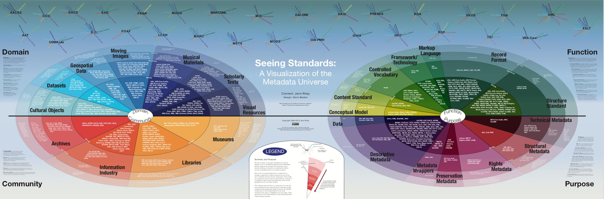
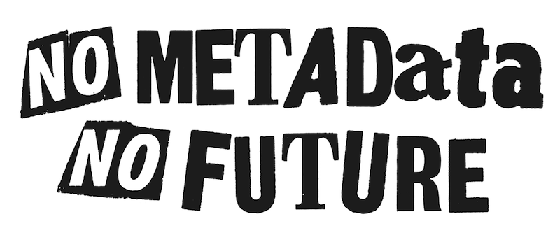

# Inventaire et traitement des données

### MSL6517 – automne 2026

Zoë Renaudie

https://studium.umontreal.ca/course/view.php?id=351279

/** Notes **/
Contenu vient en partie du cours d'Emmanuel Château-Dutier

===vvvvvv===

<!-- .slide: class="text-small" -->
| Semaine  | Séance      | Thème                                                        | TP rendu                    |
| -------- | ----------- | ------------------------------------------------------------ | --------------------------- |
|          |             | ~~Introduction~~                                             | ~~Présentation → 14 sept.~~ |
| 14 sept. | S1          | ~~Présentation générale des enjeux numériques dans les musées~~ | ~~TP1 → 21 sept.~~          |
| 21 sept. | S2          | ~~La documentation muséale~~                                 | ~~TP2 → 28 sept.~~          |
| 28 sept. | S3          | ~~La gestion de collection : inventaire, normes, modèles métiers~~ | ~~TP3 → 05 oct.~~               |
| 05 oct.  | S4 (async.) | ~~Les interfaces publiques et catalogues en ligne~~              | TP4 → 12 oct.               |
| 12 oct.  | S5 (async.) | La notion de métadonnées                                     | TP5 → 26 oct.               |
| 19 oct.  |             | **Semaine de lecture**                                       |                             |
| 26 oct.  | S6          | Données structurées, langages documentaires et thesaurus     | TP6 → 02 nov.               |
| 02 nov.  | S7          | Open GLAM : Open data et Open Content                        | TP7 → 09 nov.               |
| 09 nov.  | S8          | Modélisation de données                                      | TP8 → 16 nov.               |
| 16 nov.  | S9          | Le modèle relationnel                                        | TP9 → 23 nov.               |
| 23 nov.  | S10         | Les ontologies dans le domaine patrimonial                   | TP10 → 30 nov.              |
| 30 nov.  | S11         | Éthique des données et pérennisation                         |                             |
| 07 déc.  | S12         | L'intelligence artificielle et les enjeux du traitement des données |                             |
| 21 déc.  |             | **Rendu du travail final**                                   |                             |

===vvvvvv===

# La notion de métadonnées dans le domaine culturel

/** Notes **/

Les métadonnées sont littéralement partout aujourd’hui, dans ce qu’on appelle l’informatique ubiquitaire, c’est-à-dire une informatique présente à chaque instant de nos vies, comme le rappelle Jeffrey Pomerantz en 2015.

Elles sont longtemps restées en arrière-plan, invisibles, mais elles sont devenues un enjeu public majeur en 2013. Cette année-là, Edward Snowden révèle au *Guardian* l’existence d’un vaste programme de surveillance mondiale mené par la National Security Agency. La fuite médiatique met en lumière un aspect fondamental : les métadonnées, qu’on pourrait croire anodines, constituent en réalité un instrument stratégique de collecte et de contrôle.

Derrière chaque appel, chaque courriel, chaque clic, il y a des traces numériques qui nourrissent le big data. C’est un révélateur de l’importance cruciale des métadonnées dans l’infrastructure moderne : elles structurent, ordonnent et relient nos informations quotidiennes, tout en échappant souvent à notre perception.

On pourrait presque dire qu’elles sont invisibles et omniprésentes. Pour donner quelques exemples : quand nous cherchons un livre dans une bibliothèque numérique, ce sont les métadonnées qui permettent de le retrouver ; quand nous faisons une recherche sur Google, ce sont elles qui hiérarchisent les résultats ; quand une photo circule sur nos téléphones, ce sont encore elles qui indiquent la date, le lieu, l’appareil utilisé.

Dans le champ qui nous intéresse, celui de la documentation muséale, nous sommes également dans un monde de métadonnées. Bien sûr, il ne s’agit pas de surveillance de masse ou de big data au sens commercial, mais les enjeux sont loin d’être neutres : organiser, standardiser et décrire les collections muséales implique de choisir ce que l’on met en avant, ce que l’on relie, ce que l’on invisibilise. En d’autres termes, si les métadonnées sont un outil technique, elles restent aussi profondément politiques et culturelles.

Ce cours propose une exploration des métadonnées, à la fois dans leur dimension théorique et dans leurs applications concrètes en muséologie et dans le secteur culturel.

===vvvvvv===

### Des données aux connaissances

> Des données à l'information, aux connaissances, le cheminement est logique.

(Abiteboul 2012)

Données : éléments collectés, avant tout traitement
Information : données organisées et structurées pour en dégager du sens
Connaissances : informations mises en relation et interprétées
Les systèmes de gestion de bases de données traduisent les données en informations

/** Notes **/

Avant de définir les métadonnées, il faut situer la notion de donnée. Dans sa leçon inaugurale au Collège de France (chaire d'informatique et sciences numériques, 8 mars 2012), Serge Abiteboul distingue trois niveaux : les données, l'information et les connaissances. À partir de données collectées, l'information s'obtient en les organisant et en les structurant pour en dégager du sens. Les systèmes de gestion de bases de données relationnels, qu'il présente comme des médiateurs entre l'humain et la machine, traduisent les données en informations. Le cheminement va ensuite de l'information vers les connaissances, jusqu'à la « Toile des connaissances » qu'il imagine pour demain (nous y reviendrons en S10 avec les ontologies).

Ce cadre éclaire la notion de métadonnée. Une métadonnée est elle-même une donnée : ce qui la définit, c'est sa fonction. Elle décrit, situe ou structure d'autres données pour qu'elles deviennent de l'information exploitable. Sans elle, une collection numérisée reste un ensemble de fichiers (des données) sans organisation (sans information).

Metadata can come in different layers: This physical herbarium record of Cenchrus ciliaris consists of the specimens as well as metadata about them, while the barcode points to a digital record with metadata about the physical record.https://en.wikipedia.org/wiki/Metadata#/media/File:Cenchrus_ciliaris_L._438045083.jpg

"Des mesures de température relevées chaque jour dans une station météo, ce sont des données. Une courbe donnant l’évolution dans le temps de la température moyenne dans un lieu, c’est une information. Le fait que la température sur Terre augmente en fonction de l’activité humaine, c’est une connaissance. Ces trois notions sont très proches les unes des autres. Grossièrement, voici le sens que nous leur donnerons5 :

    Une donnée est une description élémentaire, typiquement numérique pour nous, d’une réalité. C’est par exemple une observation ou une mesure.
    
    À partir de données collectées, de l’information est obtenue en organisant ces données, en les structurant pour en dégager du sens.
    
    En comprenant le sens de l’information, nous aboutissons à des connaissances, c’est-à-dire à des « faits » considérés comme vrais dans l’univers d’un locuteur, et à des « lois » (des règles logiques) de cet univers."

===vvvvvv===

## Discussion autour de la lecture

Baca, Murtha, éd. 2016. Introduction to Metadata. 3e éd. Los Angeles : Getty Research Institute. http://www.getty.edu/publications/intrometadata/.

/** Notes **/

L'ouvrage Introduction to Metadata (troisième édition), sous la direction de Murtha Baca et publié par le Getty Research Institute, constitue un ouvrage de référence pour les professionnels de l'information. Initialement paru en 1998, ce guide propose une vue d'ensemble complète sur la nature, les types, les rôles et les caractéristiques des métadonnées.

Cette troisième édition révisée intègre les évolutions technologiques et juridiques récentes, notamment les normes de données ouvertes liées (linked open data), les évolutions du droit de la propriété intellectuelle et les nouvelles technologies informatiques. L'ouvrage fournit des méthodes, des outils, des normes et des protocoles pour la publication et la diffusion de collections numériques, complétés par un glossaire enrichi de termes essentiels.

===vvvvvv===

## Définitions et origines des métadonnées

> "The word *metadata* emerged in the late 1960s from the information technology sector, and has become ever more inescapable with the advance of digital technology. It is often defined, not particularly helpfully, as “data about data.” This means that metadata provides information about content — in the museum context probably a document or work, or group of the same — that may exist in analog or digital form. Metadata may be defined as information by means of which we hope to not only identify and describe, but also to control and continue to exploit our collections, both analog and digital."

(Baca, Coburn, Hubbard 2008 : 107)

/** Notes **/

Selon Murtha Baca, Erin Coburn et Sally Hubbard (2008 : 107), le terme *metadata* est apparu à la fin des années 1960 dans le secteur des technologies de l’information. Le terme apparaît dans les dictionnaires anglais en 1968. Il est construit à partir du préfixe grec *meta* (« au-delà ») et désigne littéralement des « données à propos de données ». C’est une définition simple, mais qui reste ambiguë : quelles données ? et « à propos » dans quel sens ? Pour les sciences de l’information, il s’agit avant tout d’informations structurées qui permettent d’identifier, de décrire, de gérer ou d’exploiter une ressource.

Dans le domaine culturel, les métadonnées prennent souvent la forme de notices ou de catalogues qui permettent de décrire des collections. Mais la notion est beaucoup plus large : elle inclut les informations nécessaires à la gestion administrative, à la conservation, à l’interopérabilité technique et même à la diffusion numérique.

===vvvvvv===
> "Ensemble structuré de données accompagnant un ouvrage et servant notamment à en décrire le contenu et le format, à assurer son indexation dans les moteurs de recherche et les bases de données, et à faciliter la gestion des droits d’auteur qui y sont liés. [...] Dans la perspective des entrepôts de données, les métadonnées sont un élément primordial et sont destinées à diverses catégories d’utilisateurs. Elles permettent notamment de connaître l’origine et la nature des données stockées dans l’entrepôt, de comprendre comment elles sont structurées, de savoir comment y avoir accès et comment les interpréter, de connaître les différents modèles de données en présence et les règles de gestion de ces données."

> "Donnée qui renseigne sur la nature de certaines autres données et qui permet ainsi leur utilisation pertinente."

(Office québécois de la langue française. « Métadonnées», dans Le grand dictionnaire terminologique, <www.granddictionnaire.com/ficheOqlf.aspx?Id_Fiche=8869869>)

> "des ensembles de données structurées pour décrire, expliquer, localiser les ressource et en faciliter la recherche, l’usage et la gestion"

(NISO, 2004-1)

/** Notes **/

Si l’usage du mot est récent, l’idée est ancienne. Jack Goody mentionne que les premières civilisations, comme les Sumériens, utilisaient déjà des systèmes d’indexation sur des tablettes d’argile pour inventorier des stocks et consigner des dettes (Goody 1986 [1978], p. 75 édition angl.). De même, au IIIᵉ siècle avant notre ère, Callimaque de Cyrène créait au sein de la bibliothèque d’Alexandrie le *Pinakes*, un catalogue des ouvrages par auteur et par sujet. On retrouve ainsi un principe commun : organiser l’information pour faciliter son repérage et sa transmission.

Une métaphore courante aide à comprendre : les métadonnées sont comme une carte par rapport au territoire. Elles ne remplacent pas l’objet ou la ressource, mais elles offrent un moyen simplifié et structuré d’y accéder. Comme l’étiquette sur une boîte de conserve, elles donnent accès à l’essentiel sans qu’il soit nécessaire d’ouvrir le contenu (Pomerantz 2015).

===vvvvvv===

### Catégories fonctionnelles de métadonnées

* **Métadonnées descriptives** 
* **Métadonnées administratives** 
* **Métadonnées juridiques** 
* **Métadonnées d’enrichissement** 
* **Métadonnées techniques** 
* **Métadonnées d’usage**
* **Identifiants uniques**
* **Paradonnées**

/** Notes **/

Pour bien saisir leur utilité, on classe les métadonnées selon leurs fonctions. Les principales catégories décrite dans l'Observatoire de la culture et des communications du Québec de 2017, souvent utilisées dans le secteur culturel, sont les suivantes :

* Métadonnées descriptives : elles décrivent le contenu de la ressource (titre, auteur, sujet, genre, matériaux, date de création…). Elles sont centrales pour le catalogage, la recherche et la découvrabilité.
* Métadonnées administratives : elles concernent la gestion de la ressource (date de création ou de numérisation d’un fichier, logiciel utilisé, provenance, version…). Elles sont essentielles pour la préservation et la gestion interne. 
* Métadonnées juridiques : elles indiquent le statut légal d’une ressource (droits d’auteur, licences, mentions obligatoires). Elles sont indispensables dans un contexte de diffusion numérique.
* Métadonnées d’enrichissement : elles apportent des informations complémentaires, parfois subjectives, comme des biographies, des notes, des images associées, ou encore des liens vers des réseaux sociaux.
* Métadonnées techniques : elles concernent les caractéristiques des fichiers numériques (format, résolution, taille, mode de compression). Elles sont généralement intégrées au fichier lui-même (par ex. Exif d’une photo).
* Métadonnées d’usage : elles sont générées automatiquement par l’activité des usagers (nombre de vues, téléchargements, recommandations). Elles sont centrales dans l’économie numérique, car elles permettent d’analyser les comportements.
* Identifiants uniques : il s’agit de codes normalisés et stables qui assurent l’identification des ressources (ISBN pour un livre, ISNI pour une personne, DOI pour un article scientifique, etc.).
* Les paradonnées fournissent des renseignements supplémentaires sur la qualité des données d'enquête recueillies. Couper (1998) a créé le terme « paradonnées » pour désigner les données de processus générées automatiquement à partir de la collecte des données. https://www150.statcan.gc.ca/n1/pub/12-001-x/2019003/article/00002/01-fra.htm

Cette typologie montre que les métadonnées dépassent largement la simple description. Elles constituent une infrastructure invisible qui relie les contenus, assure leur gestion et permet leur circulation.

Bon, Hugo. 2016. « Les métadonnées, un enjeu crucial pour la vidéo ». INA Global. [En ligne]. www.inaglobal.fr/numerique/article/les-metadonnees-un-enjeu-crucial-pour-la-video-8819.

===vvvvvv===

## Enjeux et usages des métadonnées

- Diffusion et mise en marché
- Gestion des droits d’auteur
- Conservation et catalogage
- Contrôle de l’information

/** Notes **/

L’importance des métadonnées se mesure à travers les enjeux qu’elles soulèvent. Trois grandes dimensions sont aujourd’hui au cœur des débats :

- dans un environnement saturé d’informations, la visibilité d’une ressource dépend directement de la qualité et de la normalisation de ses métadonnées. Des métadonnées précises, multilingues et interopérables facilitent l’accès à une œuvre, que ce soit par un moteur de recherche, une plateforme numérique ou un catalogue collectif.
- dans l’industrie culturelle, les métadonnées juridiques sont essentielles pour identifier les créateurs, producteurs ou éditeurs et assurer la gestion des droits. Sans métadonnées fiables, la redistribution des revenus (par ex. en musique ou en audiovisuel) devient impossible ou injuste.
- les métadonnées d’usage (vues, clics, téléchargements) permettent d’analyser les comportements des publics et d’orienter les stratégies de diffusion. Mais elles soulèvent aussi des enjeux éthiques liés à la vie privée et au profilage des usagers.

Au-delà de ces trois enjeux centraux, les métadonnées jouent aussi un rôle clé dans la conservation (préserver l’accès à long terme), le catalogage (organiser les ressources), la gestion interne (suivi administratif), et même le contrôle de l’information (filtrage, hiérarchisation, mise en avant de certains contenus).

En résumé, les métadonnées ne sont pas neutres, elles reflètent des choix techniques, économiques et politiques. Elles influencent ce qui est visible, ce qui est valorisé et ce qui, parfois, reste invisible.

===vvvvvv===

### Structuration, standards et interopérabilité des métadonnées

> Broadly speaking, structured, semantically-controlled, and machine-readable metadata is simply information that is not generated *ad hoc*, according to the idiosyncratic needs of a given project or individual. Rather, it uses the vocabulary, granularity, syntax, organization, and other elements set out in documented and shared standards.
>
> *(Baca, Coburn, Hubbard 2008 : 107)*

/** Notes **/

Les métadonnées n’ont de valeur que si elles sont compréhensibles et exploitables, aussi bien par les humains que par les machines. Pour cela, il est nécessaire qu’elles soient structurées, normalisées et interopérables.

Structuration et contrôle sémantique :

Une métadonnée produite *ad hoc*, sans règles partagées, peut être utile localement, mais elle perd de sa valeur lorsqu’on souhaite l’échanger ou la comparer. D’où l’importance de :

* **la structure** : organiser l’information en champs clairement définis (par ex. *Titre*, *Auteur*, *Date de création*).
* **le contrôle sémantique** : utiliser des vocabulaires normalisés (thésaurus, classifications, listes d’autorité) pour éviter les ambiguïtés.
* **la lisibilité machine** : adopter des formats permettant aux systèmes de reconnaître automatiquement la signification des métadonnées.

C’est grâce à cette structuration que les métadonnées deviennent un véritable langage commun, facilitant la communication entre systèmes.

===vvvvvv===

### Trois grands types de standards

On distingue :

- les standards de structure de données (*data structure standards*)
- les standards de valeurs de données (*data value standards*)
- les standards de contenus de données (*data content standard*)

/** Notes **/

Dans le monde des bibliothèques, des archives et des musées, on distingue généralement trois familles de standards complémentaires :

- **Standards de structure de données** (*data structure standards*)
  → définissent les éléments de métadonnées à utiliser.
  *Exemples* : Dublin Core (DC), Categories for the Description of Works of Art (CDWA), VRA Core.
- **Standards de valeurs de données** (*data value standards*)
  → définissent les vocabulaires ou référentiels à utiliser pour remplir les champs.
  *Exemples* : Art & Architecture Thesaurus (AAT), Library of Congress Subject Headings (LCSH).
- **Standards de contenus de données** (*data content standards*)
  → définissent les règles de saisie et de présentation des informations.
  *Exemples* : Anglo-American Cataloguing Rules (AACR), Cataloging Cultural Objects (CCO).

À ces trois catégories, on peut ajouter les formats d’échange technique (*data format standards*) qui assurent la circulation des métadonnées entre systèmes (ex. MARC21, MODS, RDF/XML, JSON-LD).

===vvvvvv===

## Stockage et partage des métadonnées

- Système d’information (bases de données relationnelles, bases de données orientées document)
- API (Rest, OAI-PMH, etc.)
- Fichiers *standalone* ou encapsulés

Rôle du standard XML (eXtensible Markup Language)

- validation des fichiers (technologie de schéma)
- outils puissants pour la manipulation des données

/** Notes **/

Alors, comment les métadonnées sont-elles stockées et partagées ?
La plupart du temps, elles sont intégrées dans des systèmes d’information. Cela peut prendre la forme de bases de données relationnelles, où chaque métadonnée est enregistrée sous forme de champs et de tables. C’est le modèle classique des bases structurées. Mais il existe aussi des bases orientées documents, plus souples, qui stockent les données sous forme de fichiers complets, par exemple en JSON ou en XML, ce qui permet une organisation moins rigide et mieux adaptée à certains usages comme les collections numériques.

Ensuite, pour les rendre accessibles, on passe souvent par des API, c’est-à-dire des interfaces de programmation. Les plus connues sont REST, qui permet d’accéder aux données via le web, et OAI-PMH, qui est très utilisé dans le domaine documentaire et patrimonial pour le moissonnage et l’échange automatisé de métadonnées entre institutions.

Les métadonnées ne circulent pas seulement dans des bases ou via des API : elles peuvent aussi être fournies comme des fichiers indépendants, par exemple des fichiers XML ou JSON livrés séparément, ou encore être encapsulées directement dans un fichier. C’est le cas par exemple des images ou des PDF, qui peuvent contenir leurs propres métadonnées intégrées dans le format du fichier.

Un point central dans ce domaine, c’est le rôle du standard XML, eXtensible Markup Language. Pourquoi est-il si utilisé ?
D’abord parce qu’il est validable : grâce aux technologies de schémas (comme DTD, XML Schema, RELAX NG, etc.), on peut vérifier automatiquement qu’un fichier respecte bien une structure et une syntaxe précises. Cela garantit la qualité et la cohérence des métadonnées échangées.
Ensuite, XML est associé à toute une panoplie d’outils puissants de manipulation des données : on peut transformer un fichier XML, le convertir, l’indexer ou l’afficher différemment grâce à des langages comme XSLT ou XPath. C’est ce qui explique sa longévité et son omniprésence dans les environnements patrimoniaux et documentaires, même si d’autres formats, comme JSON, se sont imposés dans le monde du web.

En résumé, les métadonnées circulent entre institutions ou systèmes grâce à un ensemble d’infrastructures (bases, API, fichiers) et elles s’appuient sur des standards comme XML pour assurer leur interopérabilité et leur fiabilité.

===vvvvvv===

Jenn Riley et Devin Becker. Seeing standards, A visualisation of the metadata universe. 2009-2010. https://jennriley.com/seeing-standards-a-visualization-of-the-metadata-universe/

/** Notes **/

Jenn Riley et Devin Becker ont produit une visualisation du « univers des métadonnées » dans le domaine du patrimoine culturel, un projet qui couvre la période 2009-2010. L’idée centrale de leur travail est de montrer à quel point le nombre de standards de métadonnées est écrasant, et combien leurs interrelations peuvent rendre complexe la sélection et l’application de ces standards.

Cette carte visuelle a été conçue pour aider les planificateurs et les professionnels à naviguer dans ce paysage dense, en choisissant les standards les plus adaptés à leurs besoins. L’approche adoptée est systématique : chaque standard, au nombre de 105 dans la visualisation, est évalué selon quatre axes :

Communauté: quelle est la communauté qui adopte ou recommande ce standard ;
Domaine: le secteur spécifique de l’application (musées, bibliothèques, archives, etc.) ;
Fonction: le rôle ou la fonction pour laquelle le standard est conçu ;
Finalité: l’objectif ou l’usage principal du standard.

La force d’un standard dans une catégorie donnée est déterminée par un mélange de son adoption réelle, de son intention de conception et de sa pertinence pour cette catégorie.

Même si la carte ne couvre pas tous les standards existants, elle met en avant ceux qui sont les plus utilisés ou les plus médiatisés dans le milieu du patrimoine culturel. Certains standards particulièrement connus ou discutés apparaissent en surbrillance sur la visualisation, permettant de repérer rapidement ceux qui sont les plus influents ou reconnus.

En résumé, cette visualisation rend tangible l’ampleur et la complexité des standards de métadonnées, et constitue un outil précieux pour quiconque souhaite planifier ou implémenter des métadonnées dans des projets culturels, en offrant une représentation claire de l’interconnexion entre normes, communautés et usages.

===vvvvvv===

## Découvrabilité 

> Capacité, pour un contenu culturel, à se laisser découvrir aisément par le consommateur qui le cherche et à se faire proposer au consommateur qui n’en connaissait pas l’existence. 
>

*(Observatoire de la culture et des communications du Québec, 2017)*

/** Notes **/

Qualité des métadonnées

Interopérabilité des métadonnées

Partage d’une vision globale du domaine

===vvvvvv===

### Interopérabilité

> "Capacité d’échanger des données entre systèmes multiples disposant de différentes caractéristiques en termes de matériels, logiciels, structures de données et interfaces, avec le minimum de perte d’informations et de fonctionnalité." 

/** Notes **/

L’interopérabilité est la capacité d’échanger et de comprendre des données entre systèmes différents, avec un minimum de perte d’information. Elle repose sur :

* l’utilisation de schémas communs (ex. Dublin Core, MARC21) ;
* l’adoption de langages structurés informatiquement (XML, RDF) ;
* le recours à des protocoles standardisés (OAI-PMH, HTTP, REST API).

On distingue plusieurs niveaux :

* sémantique (même compréhension des concepts, ex. « créateur » ≈ « auteur ») ;
* syntaxique (formats compatibles) ;
* technique (protocoles d’échange) ;
* organisationnel (accords institutionnels et politiques).

Sans interopérabilité, chaque institution travaille en silo et les données ne circulent pas. Avec des standards partagés, les collections deviennent visibles à l’échelle nationale et internationale, intégrables dans des plateformes comme Europeana, Artefacts Canada ou des environnements du web sémantique.

Enjeux de l’interopérabilité

* Découvrabilité : rendre les contenus accessibles sur le web.
* Pérennité : garantir l’accès à long terme malgré l’évolution technologique.
* Équité : permettre à de petites institutions de contribuer à des réseaux communs.
* Pouvoir : les standards sont aussi des espaces de négociation et de domination, celui qui impose son modèle influence la manière dont l’information sera organisée et diffusée.

En somme, les standards et l’interopérabilité sont la clé pour que les métadonnées ne soient pas de simples descriptions locales, mais deviennent un levier collectif de visibilité, de partage et de préservation du patrimoine.

===vvvvvv===

## Exemple de jeu de données : le MoMA

- Dépôt GitHub [MuseumofModernArt/collection](https://github.com/MuseumofModernArt/collection)
- Deux jeux : Artworks (œuvres) et Artists (producteurs)
- Formats : CSV et JSON, en UTF-8
- Licence CC0 (images non incluses)
- Champs : titre, artiste, date, matière, dimensions, date d'acquisition

https://github.com/MuseumofModernArt/collection

/** Notes **/

Le MoMA publie sur GitHub un jeu de données de recherche qui recense les œuvres entrées dans sa collection et cataloguées dans sa base, ainsi qu'un jeu distinct sur les artistes. Les deux sont disponibles en CSV et en JSON, encodés en UTF-8, et placés dans le domaine public par une licence CC0. Les images ne font pas partie du jeu. Le musée demande néanmoins que son attribution soit mentionnée et que l'on ne présente pas faussement le jeu. D'après le dépôt, le jeu contenait plus de 150 000 notices au dernier relevé (à vérifier, le nombre évolue).

Activité suggérée. Télécharger le fichier des œuvres, l'ouvrir dans un tableur et repérer :

les champs (colonnes) et ceux que SPECTRUM demande pour le catalogage ;
les cellules vides et les valeurs hétérogènes (dates, dimensions) ;
l'identifiant qui relie le fichier des œuvres à celui des artistes ;
ce que le jeu ne dit pas : par exemple le contexte d'entrée des œuvres dans la collection.

Regard critique. Une analyse de l'UCLA sur ce jeu note que le champ « genre » du fichier des artistes reflète une classification inconsistante et marquée par l'institution (https://womeninmoma.humspace.ucla.edu/?p=111).

Autres jeux ouverts pour l'exercice. Le Metropolitan Museum of Art (CSV, GitHub), la Tate (métadonnées en CC0, GitHub) et le Carnegie Museum of Art (CSV et JSON, CC0) publient des jeux comparables. Ils permettent de trouver des notices d'objets similaires à votre objet.

===vvvvvv===

### Collection as data

Padilla, Thomas. 2017. On a Collections as Data Imperative. février 15. https://escholarship.org/uc/item/9881c8sv. 

Padilla, Thomas G. 2018. « Collections as Data: Implications for Enclosure ». College & Research Libraries News 79 (6): 296. https://doi.org/10.5860/crln.79.6.296.

/** Notes **/

Discussion sur la lecture.

Les bibliothèques et institutions patrimoniales soutiennent traditionnellement la création de sens en conservant et en donnant accès aux traces de l'activité humaine. L'initiative « collections sous forme de données » (collections as data) s'inscrit dans cette continuité en proposant de recadrer l'ensemble des objets numériques, qu'il s'agisse de cylindres de cire, de manuscrits sur vélin, de sites web, de partitions de musique ou de tweets, comme des données computationnelles.

Ce changement de paradigme ne consiste pas seulement à utiliser des ordinateurs pour traiter ou visualiser des documents, mais à développer une perception critique de la nature composite des environnements numériques. Il s'agit de redonner de l'autonomie et de la capacité d'action aux usagers face au pouvoir concentré entre les mains des entreprises, des gouvernements et des forces de l'ordre qui adoptent une approche axée en priorité sur les données.

À la suite du symposium organisé en septembre 2016 par l'équipe National Digital Initiatives (NDI) de la Bibliothèque du Congrès, trois cadres conceptuels (Générativité, Lisibilité, Créativité) et trois recommandations stratégiques ont été formulés pour guider les institutions :

- Former des partenariats de données (internes et externes, diversifiés et équitablement rémunérés).
- Favoriser l'engagement envers les données (développer des méthodes, des logiciels libres et des infrastructures à bas seuil d'accès).
- Procéder par itérations pour fournir des collections sous forme de données (en agissant sur l'accès, la diversité des formats et la qualité des données).

En 2018 Padilla developpe le concept de « collections en tant que données » vise à transformer la manière dont les collections numérisées et natives numériques sont appréhendées : plutôt que de les traiter comme de simples substituts d'objets physiques ou de simples représentations statiques, ce paradigme préconise leur exploitation computationnelle (fouille de textes et de données, apprentissage automatique, analyse de réseaux).

Tout en reconnaissant le potentiel génératif de cette approche pour la recherche, la pédagogie et la création artistique, le document alerte contre la menace croissante d'accaparement (enclosure) portée par les acteurs commerciaux à but lucratif. Cet accaparement se manifeste à trois niveaux interconnectés :

- Les collections elles-mêmes : Restreintes par des coûts prohibitifs, des licences opaques et des partenariats commerciaux discutables conclus par les institutions culturelles.
- L'infrastructure de recherche : Verrouillée par les éditeurs privés qui développent des environnements fermés (walled gardens), surveillent les requêtes des chercheurs et limitent l'interopérabilité.
- Le rôle des professionnels (bibliothécaires et archivistes) : Menacé de marchandisation par des services commerciaux automatisés qui remplacent l'expertise humaine locale (formation, conseil, conservation des données).

Face à ces dérives, le document préconise le développement d'infrastructures ouvertes contrôlées par la communauté, une gestion éthique des données évitant la surveillance ou l'appropriation coloniale, ainsi que la valorisation active de l'expertise des professionnels de l'information.

===vvvvvv===

## Constats et défis au Québec

- Une compréhension limitée et inégale
- Un usage essentiellement descriptif
- Des pratiques en silo
- Manque de plateformes fédératrices
- Terminologie et ressources en français
- Contraintes financières et humaines
  

Observatoire de la culture et des communications du Québec. 2017. État des lieux sur les métadonnées relatives aux contenus culturels. Québec : Institut de la statistique du Québec. https://bdso.gouv.qc.ca/docs-ken/multimedia/PB01600FR_MetadonneesCulturel2017H00F00.pdf.

/** Notes **/

L’étude de la situation québécoise révèle une série de forces, mais aussi plusieurs défis qui freinent encore le développement et l’harmonisation des pratiques en matière de métadonnées.

Une compréhension limitée et inégale

Le terme même de métadonnées reste souvent flou pour plusieurs professionnel·le·s de la culture. Dans de nombreux musées et institutions patrimoniales, il est encore associé uniquement à la description d’objets, sans prise en compte des dimensions administratives, juridiques, techniques ou d’usage. Cette vision partielle limite la reconnaissance de l’importance stratégique des métadonnées.

Un usage essentiellement descriptif

La majorité des métadonnées produites dans les musées québécois sont descriptives (titre, auteur, matériaux, dimensions, etc.). Les autres catégories, comme les métadonnées juridiques (droits d’auteur) ou techniques (formats de numérisation), sont moins systématiquement documentées. Cette situation fragilise la gestion numérique à long terme et la participation aux grands réseaux de diffusion.

Des pratiques en silo

Chaque institution a développé ses propres méthodes et outils. Même lorsqu’elles utilisent des logiciels de gestion de collections, l’absence de normes partagées rend l’échange difficile. Le résultat :

* des données hétérogènes,
* une faible interopérabilité,
* un travail souvent redondant.

Manque de plateformes fédératrices

Contrairement à l’Europe (ex. Europeana) ou à certains pays qui centralisent leurs données patrimoniales, le Québec souffre d’un manque d’infrastructure commune permettant d’agréger et de valoriser les métadonnées des institutions culturelles à grande échelle. Les bases existantes (Artefacts Canada, Info-Muse) n’ont pas atteint la visibilité ou l’usage massif espéré.

Terminologie et ressources en français

Un autre obstacle est l’absence de terminologie normalisée en français. Beaucoup de standards (Dublin Core, CIDOC-CRM, SPECTRUM) sont d’abord élaborés en anglais, et leur traduction n’est pas toujours disponible ou à jour. Cela crée une barrière pour les professionnel·le·s francophones et limite l’appropriation des normes.

Contraintes financières et humaines

Le développement et l’implémentation de normes demandent du temps, des compétences et des ressources. Or, nombre de musées québécois sont de petite taille, avec des équipes réduites, et peinent à investir dans la formation ou dans l’adaptation des outils.

Initiatives récentes : le Plan culturel numérique du Québec (PCNQ)

Pour répondre à ces défis, le gouvernement a mis en place le Plan culturel numérique du Québec (PCNQ). Ce plan soutient :

* la numérisation des collections,
* la découvrabilité des contenus,
* la standardisation des métadonnées,
* et le développement de plateformes collaboratives.

Il vise à créer un environnement où les institutions pourront partager leurs données, améliorer leur visibilité et rejoindre les grandes initiatives internationales.

===vvvvvv===

### Bilan critique

* une fragmentation des pratiques,
* un retard dans l’adoption des standards internationaux,
* une sous-valorisation des métadonnées comme outil stratégique de diffusion et de conservation.

/** Notes **/

Le Québec, comme de nombreux autres pays, dispose donc d’un potentiel considérable grâce à la richesse de ses collections et à l’engagement de ses professionnel·le·s. Mais il reste confronté à :

* une fragmentation des pratiques,
* un retard dans l’adoption des standards internationaux,
* une sous-valorisation des métadonnées comme outil stratégique de diffusion et de conservation.

Ces constats soulignent l’importance d’un travail collectif pour harmoniser les pratiques, renforcer la formation et développer des infrastructures partagées.

En résumé, au Québec, la documentation muséale est riche mais dispersée. L’enjeu majeur est de passer d’un fonctionnement en silos à un écosystème collaboratif et interopérable, capable d’assurer la visibilité et la pérennité des collections à l’ère numérique.

===vvvvvv===

## Conclusion et ouverture prospective

/** Notes **/

Les métadonnées sont au cœur de la gestion, de la préservation et de la diffusion du patrimoine culturel. Elles constituent une **infrastructure invisible**, mais essentielle, qui permet aux ressources d’exister dans l’espace numérique. Sans métadonnées, les objets restent muets, invisibles, introuvables.

Le rôle central des métadonnées

* Elles **garantissent la découvrabilité** des contenus, en rendant les collections visibles sur les moteurs de recherche, les plateformes et les catalogues partagés.
* Elles assurent une **meilleure gestion interne**, en facilitant l’organisation, la traçabilité et la préservation des ressources à long terme.
* Elles permettent la **juste reconnaissance et rémunération des ayants droit**, en documentant clairement les créateurs et les conditions d’utilisation.
* Elles offrent un levier pour **analyser les usages** et comprendre les publics.

Les défis actuels

Malgré leur importance, les métadonnées demeurent sous-valorisées. On les perçoit encore comme une tâche technique ou secondaire, alors qu’elles devraient être considérées comme un **enjeu stratégique** pour les institutions culturelles.

* La complexité et la diversité des standards peuvent décourager leur adoption.
* Les ressources humaines et financières manquent souvent dans les petites institutions.
* Le poids croissant des grandes plateformes numériques (Google, Spotify, Netflix) montre que la maîtrise des métadonnées devient aussi un **enjeu de pouvoir** : celui qui contrôle la description et la circulation des données contrôle en partie la visibilité des contenus.

===vvvvvv===

/** Notes **/

Dans le domaine du patrimoine numérique, une formule circule : « No Metadata, No Future ».
Elle rappelle que sans métadonnées fiables, normalisées et interopérables, il n’y a pas d’accès, pas de visibilité, pas de transmission possible.

Ainsi, les métadonnées ne sont pas seulement des outils techniques : elles sont des vecteurs de mémoire, de circulation culturelle et de citoyenneté numérique. Elles conditionnent la manière dont notre patrimoine sera perçu, partagé et transmis aux générations futures.

« No Metadata, No Future » : sans métadonnées fiables, correctement normalisées et interopérables, la mémoire, la visibilité et l’accès aux collections seront compromis. Pour le Québec, cela signifie qu’il ne faut pas seulement produire des métadonnées, mais le faire de manière stratégique, collaborative, durable et inclusive.

Une ouverture vers l’avenir

Les perspectives offertes par le web sémantique, les liens de données (Linked Open Data) et l’interopérabilité internationale invitent à penser les métadonnées comme un espace de collaboration. Les musées, bibliothèques et archives peuvent participer à un réseau mondial où leurs collections ne sont plus isolées, mais reliées et enrichies par d’autres institutions.

L’avenir des métadonnées passe aussi par une dimension critique et éthique :

* Comment garantir la diversité des voix et éviter que certains contenus restent invisibles ?
* Comment protéger la vie privée tout en exploitant les métadonnées d’usage ?
* Comment assurer la pérennité et l’accessibilité des données dans un environnement technologique en constante évolution ?

===vvvvvv===

## Exercice de description

/** Notes **/

Chacun.e présente ses descriptions

===vvvvvv===

## Reparative description 

> n. remediation of practices or data that exclude, silence, harm, or mischaracterize marginalized people in the data created or used by archivists to identify or characterize archival resources 
> adj. relating to remediation of practices or data that exclude, silence, harm, or mischaracterize marginalized people in the data created or used by archivists to identify or characterize archival resources In Archives Terminology.

Dictionary.archivists.org/entry/reparative-description.html

/** Notes **/

===vvvvvv===

## Décrire avec intention

Exercice d'écriture créative pour le catalogage, inspiré de Kara Krmpotich (2025). Plutôt qu'une simple description, on rédige une **introduction** à l'objet, comme on présenterait un parent :

- donner une histoire vivante ;
- mentionner où l'objet « réside actuellement », par exemple dans un musée ;
- évoquer la saisonnalité.

/** Notes **/

Décrire avec intention

Exercice d'écriture créative pour le catalogage, inspiré de Kara Krmpotich (2025). Plutôt qu'une simple description, on rédige une **introduction** à l'objet, comme on présenterait un parent :

- donner une histoire vivante ;
- mentionner où l'objet « réside actuellement », par exemple dans un musée ;
- évoquer la saisonnalité.

La liberté d'écriture créative ouvre des possibilités. Exemple : un sac à dos sur une étagère, celui d'un enfant ayant survécu à la traversée entre le Mexique et les États-Unis. On écrit la biographie de l'objet, pas seulement l'énumération de ses matériaux.

**Consigne.** Reprenez l'objet que vous avez décrit et réécrivez sa notice en décrivant avec intention.

===vvvvvv===
## Bibliographie

Abiteboul, Serge. 2012. *Sciences des données : de la logique du premier ordre à la Toile*. Leçon inaugurale, 8 mars 2012. Paris : Collège de France / Fayard. [https://doi.org/10.4000/books.cdf.506](https://doi.org/10.4000/books.cdf.506).

Baca, Murtha, éd. 2016. *Introduction to Metadata*. 3e éd. Los Angeles : Getty Research Institute. [http://www.getty.edu/publications/intrometadata/](http://www.getty.edu/publications/intrometadata/).

Baca, Murtha, Erin Coburn et Sally Hubbard. 2008. « Metadata and Museum Information ». Dans *Museum Informatics*, p. 107.

Bon, Hugo. 2016. « Les métadonnées, un enjeu crucial pour la vidéo ». INA Global. [En ligne]. www.inaglobal.fr/numerique/article/les-metadonnees-un-enjeu-crucial-pour-la-video-8819.

Cummins, Jewel, Alexander Soto, Jane Anderson, Ulia Gosart, Alexander Ward et Stephanie Russo Carroll. 2023. « Enhancing Stewardship of Indigenous Peoples' Data, Information, and Knowledges in Libraries and Archives through Indigenous Data Governance ». *Library Trends* 72 (1) : 13-47. [https://dx.doi.org/10.1353/lib.2023.a938211](https://dx.doi.org/10.1353/lib.2023.a938211).

Goody, Jack. 1986. The Logic of Writing and the Organization of Society. Avec Internet Archive. Cambridge [Cambridgeshire] ; New York : Cambridge University Press. http://archive.org/details/logicofwritingor0000good.

Institut de l'Information Scientifique et Technique. 2024. *DoRANum-Métadonnées, standards, formats : fiche synthétique*. [https://doi.org/10.13143/VBJS-6288](https://doi.org/10.13143/VBJS-6288)

Krmpotich, Cara. 2026. « Critical Cataloguing: Reperative Approaches to Heritage Documentation ». Conférence. Causeries d’AS2, UdeM, février 4.

Observatoire de la culture et des communications du Québec. 2017. *État des lieux sur les métadonnées relatives aux contenus culturels*. Québec : Institut de la statistique du Québec. [https://bdso.gouv.qc.ca/docs-ken/multimedia/PB01600FR_MetadonneesCulturel2017H00F00.pdf](https://bdso.gouv.qc.ca/docs-ken/multimedia/PB01600FR_MetadonneesCulturel2017H00F00.pdf).

Organization (U.S.), National Information Standards. 2004. Understanding Metadata. NISO Press. https://digitalhistorywsu.wordpress.com/wp-content/uploads/2017/11/niso_2004_understandingmetadata.pdf

Musen, Mark A., Martin J. O’Connor, Josef Hardi, et Marcos Martinez-Romero. 2025. « Knowledge engineering for open science: Building and deploying knowledge bases for metadata standards ». arXiv:2507.22391. Prépublication, arXiv, juillet 30. https://doi.org/10.48550/arXiv.2507.22391.

Padilla, Thomas. 2017. *On a Collections as Data Imperative*. [https://escholarship.org/uc/item/9881c8sv](https://escholarship.org/uc/item/9881c8sv).

Padilla, Thomas G. 2018. « Collections as Data: Implications for Enclosure ». *College & Research Libraries News* 79 (6) : 296. [https://doi.org/10.5860/crln.79.6.296](https://doi.org/10.5860/crln.79.6.296).

Pomerantz, Jeffrey. 2015. Metadata. The MIT Press. https://doi.org/10.7551/mitpress/10237.001.0001.

Riley, Jenn et Devin Becker. 2009-2010. *Seeing Standards: A Visualization of the Metadata Universe*. [https://jennriley.com/seeing-standards-a-visualization-of-the-metadata-universe/](https://jennriley.com/seeing-standards-a-visualization-of-the-metadata-universe/).

**Ressources complémentaires**

- Cornell University, *Metadata*, [https://data.research.cornell.edu/data-management/storing-and-managing/metadata](https://data.research.cornell.edu/data-management/storing-and-managing/metadata)
- Réseau canadien d'information sur le patrimoine, *Guide des normes muséales : métadonnées et structure de données*, [https://www.canada.ca/en/heritage-information-network/services/collections-documentation-standards/chin-guide-museum-standards/metadata-data-structure.html](https://www.canada.ca/en/heritage-information-network/services/collections-documentation-standards/chin-guide-museum-standards/metadata-data-structure.html)
- Atlan, *Metadata standards*, [https://atlan.com/metadata-standards](https://atlan.com/metadata-standards)
- *Metadata Encoding and Transmission Standard* (METS), [https://en.wikipedia.org/wiki/Metadata_Encoding_and_Transmission_Standard](https://en.wikipedia.org/wiki/Metadata_Encoding_and_Transmission_Standard)
- DOCAM, *Intelligent preservation of media artworks*, [https://www.docam.ca/en/uploads/intelligent_preservation_of_media_artworkstlavallee.pdf](https://www.docam.ca/en/uploads/intelligent_preservation_of_media_artworkstlavallee.pdf)
- Wikipédia, Metadata Encoding and Transmission Standard : https://en.wikipedia.org/wiki/Metadata_Encoding_and_Transmission_Standard